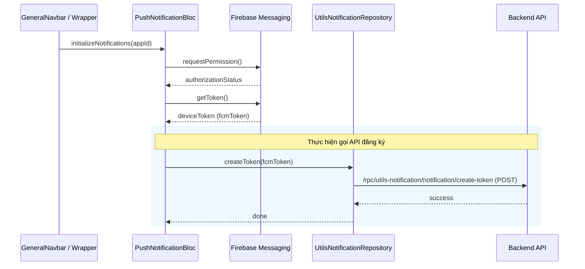
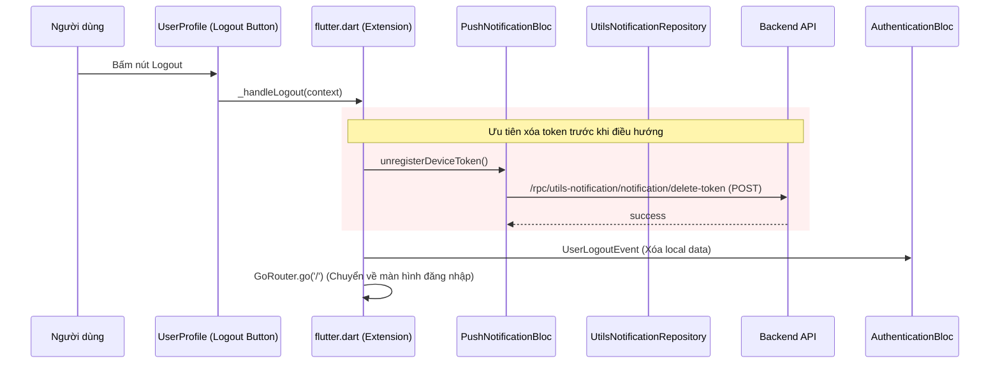

# Vòng đời của Thông báo đẩy (Push Notification Lifecycle)

Tài liệu này mô tả luồng hoạt động của hệ thống thông báo đẩy (FCM) trong ứng dụng, bao gồm quá trình đăng ký khi người dùng đăng nhập và xóa token khi người dùng đăng xuất.

## 1. Luồng Đăng ký Token (Registration)

Quá trình đăng ký diễn ra khi người dùng bắt đầu một phiên làm việc có xác thực (Authenticated).

### Thời điểm kích hoạt:
1.  **Lúc khởi động ứng dụng:** Khi có phiên đăng nhập cũ được lưu lại.
2.  **Lúc đăng nhập thành công:** Sau khi người dùng chọn Tenant (Công ty) và vào trang dashboard.

### Các bước thực hiện:

### Logic chi tiết:
- **Authentication Guard:** Hệ thống chỉ gọi đăng ký token nếu người dùng đang ở trạng thái đã đăng nhập (`UserAuthenticatedWithSelectedTenantState`). Điều này ngăn việc đăng ký nhầm token khi người dùng đã đăng xuất nhưng trang giao dịch chính (`GeneralNavbar`) vẫn còn lưu lại trong cây widget.
- **Quyền thông báo:** Hệ thống chỉ gọi API `create-token` nếu người dùng đã cấp quyền thông báo.
- **Bỏ qua Simulator/MacOS:** Theo thiết kế hiện tại, ứng dụng bỏ qua việc khởi tạo thông báo trên Simulator iOS và MacOS (chỉ chạy trên thiết bị thật).

---

## 2. Luồng Xóa Token khi Đăng xuất (Removal / Logout)

Quá trình này quan trọng để đảm bảo người dùng cũ không nhận được thông báo của người dùng sau trên cùng một thiết bị.

### Thời điểm kích hoạt:
1.  **Đăng xuất thủ công:** Người dùng nhấn nút "Đăng xuất" trong trang Profile.
2.  **Chuyển công ty:** Khi người dùng đổi công ty từ màn hình lựa chọn (đối với multi-tenant).

### Các bước thực hiện:

### Các cải tiến quan trọng (Cập nhật 02/04/2026):
1.  **Thứ tự ưu tiên:** Hệ thống sẽ gọi lệnh xóa token **trước** khi thực hiện lệnh chuyển trang (`GoRouter.go('/')`) và xóa thông tin phiên đăng nhập để đảm bảo API được gọi thành công với ngữ cảnh bảo mật hiện tại.
2.  **Khả năng phục hồi (Resilience):** Ngay cả khi biến token trong máy bị null, hệ thống vẫn thử lấy lại từ Firebase trong bước cuối cùng trước khi đăng xuất để xóa triệt để trên Server.
3.  **Bỏ kiểm tra quyền:** Bước gọi `delete-token` không còn yêu cầu trạng thái quyền thông báo phải là `Authorized`. Chỉ cần ứng dụng có token, nó sẽ yêu cầu Server xóa token đó.

---

## 3. Các Thành phần liên quan

| Thành phần | Vai trò |
| :--- | :--- |
| **PushNotificationBloc** | Quản lý trạng thái thông báo, lấy token từ Firebase và điều phối việc đăng ký/xóa với Repository. |
| **UtilsNotificationRepository** | Chịu trách nhiệm thực thi các yêu cầu API `create-token` và `delete-token`. |
| **GeneralNavbar / Wrapper** | Nơi kích hoạt việc khởi tạo thông báo đẩy mỗi khi ứng dụng chuyển vào trạng thái đã đăng nhập. |
| **ExtendedWidgetState (Extension)** | Chứa logic `_handleLogout` dùng chung cho toàn bộ ứng dụng, đảm bảo luồng dọn dẹp (cleanup) luôn nhất quán. |

---

## 4. Trường hợp Ngoại lệ (Exception)

- **Lỗi 401 (Session Expired):** Nếu người dùng bị đăng xuất tự động do hết hạn phiên, ứng dụng sẽ chuyển thẳng về màn hình đăng nhập. Trong trường hợp này, thông báo đẩy có thể không được xóa ngay lập tức (do không còn token hợp lệ để xác thực với API).
- **Mất kết nối mạng:** Nếu việc xóa token thất bại do mất mạng khi đăng xuất, hệ thống sẽ in log cảnh báo (`Failed to unregister device token`) nhưng vẫn cho phép người dùng đăng xuất khỏi ứng dụng để đảm bảo trải nghiệm.

---

## 5. Kiểm thử (Testing)

### Kiểm thử thủ công (Manual Test):
1.  **Đăng nhập (Login)**:
    *   Mở Debug Console / Network Log.
    *   Thực hiện đăng nhập -> Chọn công ty.
    *   Xác nhận log: `[PushNotification] Calling repository.createToken...` và phản hồi HTTP 200 cho API `create-token`.
2.  **Đăng xuất (Logout)**:
    *   Nhấn Đăng xuất.
    *   Xác nhận thứ tự log:
        1. `[PushNotification] Attempting to unregister device token...`
        2. `[PushNotification] Calling repository.deleteToken...`
        3. Phản hồi HTTP 200 cho API `delete-token`.
        4. Chuyển trang về màn hình Đăng nhập.
3.  **Hậu đăng xuất (Post-Logout)**:
    *   Ở màn hình đăng nhập, xác nhận **không có** yêu cầu `create-token` nào được gửi đi nhờ **Authentication Guard**.

### Unit Test:
Bộ test tự động được viết tại: `packages/supa_architecture/test/blocs/push_notification/push_notification_bloc_test.dart`
Các test case bao gồm:
- Khởi tạo thông báo thành công.
- Hủy đăng ký token thành công (gọi API xóa).
- Hủy đăng ký token ngay cả khi token trong cache bị null (fallback lấy từ Firebase).
