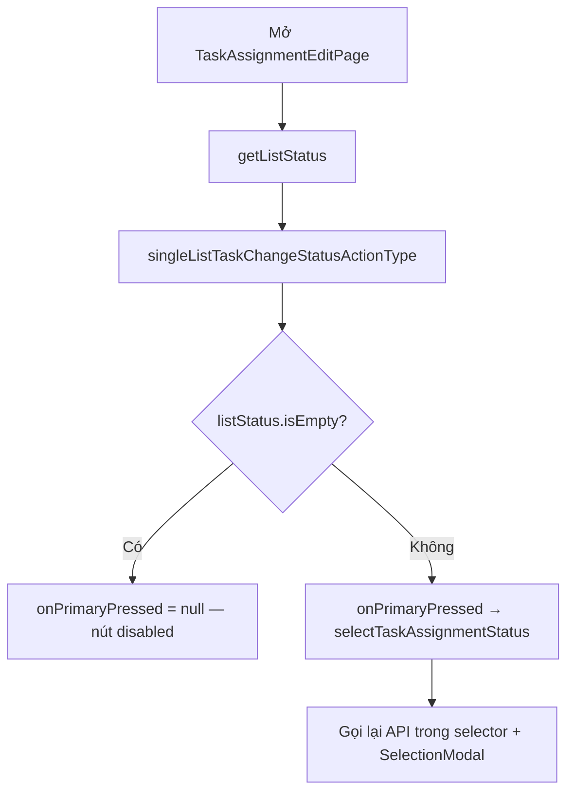

# Chi tiết / sửa công việc — Task Assignment Edit

| Mục | Giá trị |
|-----|---------|
| **Tên màn (UI)** | Chi tiết công việc (panel sửa + chat) |
| **Class chính** | `TaskAssignmentEditPage` |
| **Package** | `supa_work` → `packages/supa_work/lib/pages/task_assignment/` |
| **Route** | `resolveWorkPath('/task-assignment/edit')` — `TaskAssignmentEditPage.location`, `locationWithId(id, cid: …)` |
| **Số dòng** | **2540** (`task_assignment_edit_page.dart`), **974** (`utils/task_assignment_edit_selectors.dart`), **67** (`utils/task_assignment_status_utils.dart`) |
| **Cập nhật lần cuối** | **2026-06-30** — Quyền **đổi trạng thái** dùng API `singleListTaskChangeStatusActionType` (không dùng `canUpdate`). |

---

## Giới thiệu

Màn chi tiết/sửa một task assignment: panel thu gọn chứa thông tin + form sửa, kèm chat GetStream phía dưới.

**Vào màn từ:** danh sách Công việc (tap item), deep link `taskAssignmentId`, notification.

**Liên quan:** danh sách tab Công việc — [`docs/cong-viec/README.md`](../cong-viec/README.md).

---

## Cây thư mục (phần liên quan)

```text
packages/supa_work/lib/pages/task_assignment/
├── task_assignment_edit_page.dart
├── utils/task_assignment_edit_selectors.dart
├── widgets/task_assignment_detail_collapsible_panel.dart
└── widgets/form_change_status/form_change_status.dart

packages/supa_work/lib/utils/
└── task_assignment_status_utils.dart   # canChangeTaskStatus(...)
```

---

## Route & điều hướng

| Mục | Giá trị |
|-----|---------|
| Route | `TaskAssignmentEditPage.location` = `resolveWorkPath('/task-assignment/edit')` |
| Tham số | `id` (bắt buộc), `cid` (GetStream channel, tùy chọn), `taskAssignment` (prefetch) |
| Màn con | `InspectionDetailNewPage`, `TaskAssignmentHistoryPage`, bottom sheet comment |

---

## Quyền đổi trạng thái (quan trọng)

### Không dùng `canUpdate`

Nút status trên panel (**FilledButton** — label từ `taskAssignmentSelfStatus` hoặc `taskAssignmentStatus`) **không** bị chặn bởi `taskAssignment.canUpdate`.

Các field khác (tên, mô tả, due date, frequency, assignee, attachment, …) **vẫn** dùng `canUpdate` / `canDelete` như trước.

### Dùng API action list

| Bước | Mô tả |
|------|--------|
| 1 | `initState` / sau cập nhật task → `getListStatus()` |
| 2 | Gọi `MobileTaskAssignmentRepository().singleListTaskChangeStatusActionType(taskId)` |
| 3 | RPC: `POST /rpc/work/task-assignment/single-list-task-change-status-action-type` |
| 4 | Lưu vào state `listStatus` |
| 5 | `TaskAssignmentStatusUtils.canChangeTaskStatus(listStatus)` → `true` nếu list **không rỗng** |
| 6 | Nút status: `onPrimaryPressed` = callback **chỉ khi** `canChangeTaskStatus == true` và có `statusLabel` |



### Khi user tap nút status

`TaskAssignmentEditSelectors.selectTaskAssignmentStatus(...)`:

1. Kiểm tra có assignee (`taskAssignmentAppUserCoWorkings` không rỗng) — nếu không → toast `changeStatusPermission`.
2. Gọi lại `singleListTaskChangeStatusActionType` (loading dialog).
3. List rỗng → toast không có quyền.
4. List có phần tử → `SelectionModal` chọn status → `_onUpdateStatus` → `updateStatus` API.

### Ví dụ BE

Task có `canUpdate: false` nhưng user được phép hoàn thành (`canComplete: true`):

- Nếu API action list **có** phần tử → nút status **bấm được**.
- Nếu API trả **rỗng** → nút status **không bấm được** (dù `canUpdate` true).

---

## State & data liên quan status

| State / field | Vai trò |
|---------------|---------|
| `listStatus` | Cache kết quả `singleListTaskChangeStatusActionType` |
| `isFormRequired` | Derived từ `listStatus` + questionnaire chưa FINISHED (`getConfigWarning`) |
| `getListStatus()` | Gọi lại sau `onUpdate`, đổi coworker, `_refreshTaskAssignmentStatus` |

---

## Test cases

Unit (`packages/supa_work/test/utils/task_assignment_status_utils_test.dart`):

| # | Given | Then |
|---|--------|------|
| 1 | `canChangeTaskStatus([])` | `false` |
| 2 | `canChangeTaskStatus([status])` | `true` (không phụ thuộc `canUpdate`) |
| 3 | `canChangeTaskStatus([s1, s2])` | `true` |

Widget (`packages/supa_work/test/pages/task_assignment/widgets/task_assignment_detail_collapsible_panel_status_test.dart`):

| # | Given | Then |
|---|--------|------|
| 4 | `onPrimaryPressed: null` | `FilledButton.onPressed == null`, tap không gọi callback |
| 5 | `onPrimaryPressed` có callback | Tap tăng counter |

Chạy test:

```bash
cd packages/supa_work && flutter test test/utils/task_assignment_status_utils_test.dart test/pages/task_assignment/widgets/task_assignment_detail_collapsible_panel_status_test.dart
```

---

## Lưu ý khi sửa

- **Đừng** gắn lại `canUpdate` cho nút đổi status — BE phân quyền qua action list (`CanComplete`, `CanTodo`, `IsAssignee`, …).
- Sau khi đổi assignee / status, nhớ gọi `getListStatus()` để nút sync với BE.
- `TaskAssignmentStatusIcon` trên **danh sách** cũng dùng cùng API khi tap (luôn mở tap, API quyết định).
- `InspectionTaskAssignmentEditPage` vẫn hardcode `isEdit: true` cho status chip — **khác** với edit page chính; cân nhắc đồng bộ nếu sửa inspection.

---

## Liên kết

- Tab danh sách: [`docs/cong-viec/README.md`](../cong-viec/README.md)
- Panel layout chung: [`docs/chi-tiet-checklist/README.md`](../chi-tiet-checklist/README.md) (`EntityDetailCollapsiblePanel`)
- Quy ước doc: [`docs/HUONG-DAN-VIET-DOC.md`](../HUONG-DAN-VIET-DOC.md)
