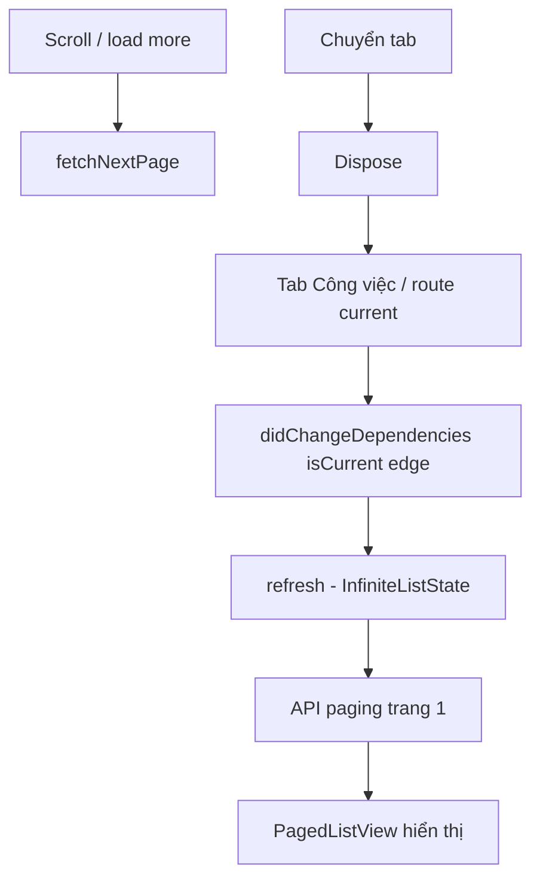

# Công việc — Task Assignment (navbar tab)

| Mục | Giá trị |
|-----|---------|
| **Tên màn (UI)** | Công việc (`work.tabs.tasks` / tương đương) |
| **Class chính** | `TaskAssignmentPage` |
| **Package / module** | `supa_work` — `packages/supa_work/lib/pages/task_assignment/` |
| **Route** | `resolveWorkPath('/task-assignment/task-assignment-master')` |
| **Tổng số dòng** | **530** (`task_assignment_page.dart`), **965** (`task_assignment_form_page.dart`), **2540** (`task_assignment_edit_page.dart`), **426** (`widgets/task_assignment_detail_collapsible_panel.dart`), **447** (`widgets/task_assignment_filter/task_assignment_filter_scroll.dart`), **309** (`work_filter_widgets.dart`) |
| **Cập nhật lần cuối** | **2026-06-30** — Chi tiết edit page: quyền đổi status dùng `singleListTaskChangeStatusActionType` (xem [`docs/chi-tiet-cong-viec/README.md`](../chi-tiet-cong-viec/README.md)). Trước đó **2026-06-18**: panel metric Due date/Frequency tap-to-edit. |

---

## Giới thiệu

Tab **Công việc** hiển thị danh sách task assignment (view `TASK_MASTER_DEFAULT`), có header list mới, filter bottom sheet, tìm kiếm, chuyển calendar/list, infinite scroll paging.

**Vào màn từ:** tab navbar Công việc → `GoRouter.go(TaskAssignmentPage.location)`.

**Kiến trúc tab:** `ShellRoute` + `go()` dispose khi chuyển tab; `didChangeDependencies` gọi lại `refresh()` khi route current (kể cả pop từ chi tiết task).

---

## Cây thư mục source (chính)

```text
packages/supa_work/lib/pages/task_assignment/
├── task_assignment_page.dart        (530) — InfiniteListState + header/filter chips/list UI
├── task_assignment_edit_page.dart
└── widgets/
    ├── task_assignment_filter/task_assignment_filter_scroll.dart (447) — bottom sheet filter Task
    └── ...                          — item, skeleton, empty, detail widgets
```

---

## Route & điều hướng

| File | Nội dung |
|------|----------|
| `task_assignment_page.dart` | `static final location = resolveWorkPath('/task-assignment/task-assignment-master')` |
| `lib/config/main_tabs.dart` | Tab Công việc → `TaskAssignmentPage` |
| Tạo mới | `TaskAssignmentFormPage` (`resolveWorkPath('/task-assignment/form')`) |
| Chi tiết / sửa | `TaskAssignmentEditPage` (deep link `taskAssignmentId` optional) |

---

## State & logic tải dữ liệu

| Thành phần | Mô tả |
|------------|--------|
| Base class | `InfiniteListState<TaskAssignment, TaskAssignmentFilter, …>` (`supa_architecture`) |
| Repository | `MobileTaskAssignmentRepository` |
| Filter mặc định | `TaskAssignmentFilter()..viewCode = 'TASK_MASTER_DEFAULT'` |
| **Reload khi vào màn** | `didChangeDependencies`: `isCurrent` edge `false → true` → `refresh()` (reset paging + gọi API) |
| Pull-to-refresh | `RefreshIndicator` → `refresh()` |

### Header & filter list

`TaskAssignmentPage` dùng shared widgets trong `packages/supa_work/lib/widgets/filters/work_filter_widgets.dart`:

| Widget | Vai trò |
|--------|---------|
| `WorkListHeader` | Header title/subtitle + action buttons của màn Công việc |
| `WorkHeaderActionButton` | Nút đổi List/Calendar, mở filter, mở search |
| `WorkHeaderProfileButton` | Avatar profile trong cùng kích thước action 40×40, tap mở `showProfileBottomSheet` |
| `WorkAppliedFilterChip` | Chip filter đang áp dụng, xoá nhanh từng filter |
| `WorkFilterRow`, `WorkFilterSheetFooter` | Row và footer dùng trong `TaskAssignmentFilterScroll` |

`TaskAssignmentFilterScroll` hiện là bottom sheet filter mới, không còn chip ngang trong body. Sheet giữ các filter Task hiện tại: kiểu xem, địa điểm, người dùng, trạng thái, mức độ quan trọng, ngày tới hạn và nhãn dán. Bấm **Áp dụng** mới gọi `onChanged`, bấm **Đặt lại** đưa `viewCode` về `TASK_MASTER_DEFAULT` và xoá các filter còn lại.

### Form tạo task

`TaskAssignmentFormPage` dùng `TaskAssignmentFormService` + `TaskAssignmentFormSelectors` để gom các picker. Trong nhóm **Detail Information**, trường **Dự án** nằm trước **Địa điểm**:

| Trường | API / service | Ghi dữ liệu |
|--------|---------------|-------------|
| Dự án | `TaskAssignmentFormService.getProjects()` → `MobileTaskAssignmentRepository.singleListProject(ProjectFilter)` → `POST /rpc/work/task-assignment/single-list-project` | `taskAssignment.project`, `taskAssignment.projectId` |
| Địa điểm | `TaskAssignmentFormService.getSites()` → `POST /rpc/work/task-assignment/single-list-site` | `taskAssignment.site`, `taskAssignment.siteId` |

Cả hai picker đều dùng `SelectionSearchModal` để hỗ trợ search và initial list.

Nhóm **Ảnh đã tải lên / Bằng chứng** của `TaskAssignmentFormPage` dùng lại `AddAttachmentButton`. Bottom sheet hỗ trợ chọn ảnh/video/file, chụp ảnh, quay video tối đa 3 phút và **Gắn link**. Link dùng `TaskAssignmentAttachedLinkDialog` để validate tên + URL và lưu tạm trong draft; badge của expansion tính cả file lẫn link. Khi submit, `TaskAssignmentFormService.createTaskAssignment(...)` trả đúng task response có ID, rồi form gọi `createTaskAssignmentAttachedLink(...)` với `taskAssignmentId` đó để lưu link vào BE. User có thể tap để mở link bằng ứng dụng ngoài hoặc xoá link trước khi tạo task. File media vẫn được upload trước qua `TaskAssignmentFormService.uploadFile(...)`.

Ở `TaskAssignmentEditPage`, row **Dự án** trong Detail Information chỉ render khi task đã có `taskAssignment.project`. Khi user đổi dự án, `TaskAssignmentEditSelectors.selectProject()` cập nhật local state rồi gọi `onUpdate(context, taskAssignment)` để đi qua `performSave` và hiển thị autosave indicator.

Khi đổi trạng thái cần attachment, `FormChangeStatus` đổi CTA thành **Thêm bằng chứng**. Bottom sheet chọn bằng chứng gồm các lựa chọn file/media sẵn có và option **Gắn link**; popup link validate tên + URL có scheme/host và lưu tạm trong sheet, không gọi API riêng. Khi bấm **Chuyển**, link cuối cùng đã gắn được đưa tiếp vào payload `updateStatus` qua `TaskAssignment.attachedName` và `TaskAssignment.attachedLink`. `TaskAssignment` cũng map list BE `taskAssignmentAttachLinks` để đọc các link đã lưu. Trong `TaskAssignmentEditPage`, section attachment đổi title thành **Bằng chứng**, badge count tính cả link, và nếu task có `taskAssignmentAttachLinks` hoặc `attachedLink` thì hiển thị tên link dưới ảnh/tệp; tap link mở bằng browser ngoài app.

**Không có** cache singleton cho danh sách task. `StreamChannelCidCache` chỉ cho chat CID.

---

## Luồng chính



---

## Ghi chú maintainer

- `refresh()` được kế thừa từ `InfiniteListState` — đừng duplicate fetch trong `initState` nếu đã reload qua `didChangeDependencies`.
- Form tạo task chưa có `taskAssignmentId` trước submit. Luôn chờ API create trả entity có ID rồi mới gọi `createTaskAssignmentAttachedLink`; không gọi endpoint link trước khi task được tạo.
- Dashboard có section task nhỏ (`dashboard_task_section`) — logic riêng trên `GeneralDashboardPage`, không dùng chung state với tab này.
- Calendar mode (`isCalendar`) dùng `TaskCalendarView` — reload list vẫn qua `refresh()` khi quay lại route master.
- **Edit page (`task_assignment_edit_page.dart`)** — toàn bộ UI sửa task nằm trong **`TaskAssignmentDetailCollapsiblePanel`** adapter, adapter này gọi layout chung **`EntityDetailCollapsiblePanel`** trong `pages/inspection/widget_ui_new/entity_detail_collapsible_panel.dart`. Không còn `Container` ngoài; `messageListHeaderBuilder` chỉ trả `_buildSummaryPanel(context, hasUpdatePermission)`.
  - **Layout panel** (luôn render đủ, không auto-hide phần nào):
    1. Title (`taskAssignment.name.value`) là inline `TextField` khi user có quyền sửa; blur hoặc nhấn done sẽ autosave qua `onUpdate(...)` và gửi chat cập nhật tên công việc kèm value. Không mở modal riêng cho tên.
    2. `summaryLine` "X Attachments • Y Templates"
    3. Metrics row — Due date / Frequency / Priority (giá trị dùng `labelMedium`, icon 14px để 3 cột vừa khít, "Moderate" không xuống dòng). Cả ba metric đều là entry point chỉnh sửa khi có quyền: Due date → `_selectors.changeDate(...)`, Frequency → `_selectors.selectFrequency(...)`, Priority → `_selectors.selectImportantLevel(...)`.
    4. Action row — `FilledButton` **status indicator** (label = `taskAssignmentSelfStatus.name.value` (fallback `taskAssignmentStatus`), background/foreground/border = `SupaExtendedColorScheme.getBackgroundColor/getTextColor/getBorderColor(status.color.value)`, icon = `FluentIcons.checkmark_circle_20_regular`; tap = `selectTaskAssignmentStatus(...)` khi `TaskAssignmentStatusUtils.canChangeTaskStatus(listStatus)` — list từ API `singleListTaskChangeStatusActionType`, **không** dùng `canUpdate`) + `_AssigneeAvatars` (max 5 ảnh + chip `selected/total`). Khi `hasUpdatePermission` (`canUpdate`), tap cụm avatar mở `_selectors.selectUser(taskAssignment)` để thêm/xoá người thực hiện; nếu chưa có user thì hiển thị chip `work.taskAssignment.addAssignee`.
    5. `secondaryHeader` (nếu non-null) — gói trong padding 16×12×16×0
    6. `infoRows` — do `EntityDetailCollapsiblePanel` wrap trong container `surface` (không có border) + bo `AppRadius.value`, hairline divider giữa các row
  - **`secondaryHeader` ở edit page** chỉ chứa **non-duplicate context**: cảnh báo `formRequired` (đỏ, conditional) + dòng `completeType` + nút "Đổi" (`_confirmChangeCompleteType`). Editable name / status chip / assignee selector / code text **đã được ẩn** vì trùng với title / Mark complete button / avatars / (code chờ định nghĩa lại chỗ đặt).
  - **`infoRows`** (5 expandable rows phân cách bằng hairline divider) — build bởi `_buildPanelInfoRows(...)`:
    1. **Description** — `DetailExpandableInfoRow` bọc `_buildTextField('description', ...)` trong `Container` nền `theme.colorScheme.surfaceContainerLowest` + bo `AppRadius.value` + padding compact `fromLTRB(10, 8, 10, 0)` để khu vực nhập text nổi bật so với nền `surface` của info-row group nhưng không chiếm quá nhiều chiều cao.
    2. **Attachments / status / autosave chat mirror** — `TaskAssignmentAttachmentsSection` (giữ logic upload / edit / delete / pick attachment cũ). Khi user thêm bằng chứng mới (`onAddAttachments`), UI tạo placeholder `id=-1` trong lúc upload, sau đó thay placeholder trùng tên bằng `File` backend từ `_selectors.selectFileMappings(...)` để preview dùng URL server thay vì local temp path. Page gọi tiếp `_sendEvidenceFilesToChat(files)` với `XFile` gốc để đẩy attachments vào chat task; nếu user gắn link bằng chứng, `createAttachedLink(...)` gọi `_sendEvidenceLinkToChat(input)` sau khi `createTaskAssignmentAttachedLink(...)` thành công; nếu user xoá ảnh/file, `deleteImage(...)` gọi `_sendEvidenceRemovedToChat()` không truyền tên file; nếu user xoá link, `deleteAttachedLink(...)` gọi `_sendEvidenceRemovedToChat(name, url)` sau API xoá thành công. Khi user đổi trạng thái, `_sendStatusChangeToChat(...)` được gọi sau `updateStatus(...)` thành công ở cả nhánh không cần form và nhánh `FormChangeStatus`; nếu có `file` thì upload từng `XFile` qua `GetStreamConversationRepository.uploadStreamFile(...)`, nếu có `attachedLink` thì append tên + URL link vào text message. Khi autosave gọi `onUpdate(...)` và API update task thành công, `_sendTaskUpdatedToChat(updatedField: ..., updatedValue: ...)` gửi message `work.taskAssignment.updateFieldValue.chatMessage` (`{user} đã cập nhật {field}: {value}`) nếu biết value, field-only nếu chỉ biết field, hoặc fallback generic nếu không có field. Attachment được build giống chat input thường (`AttachmentType.image` + `imageUrl` + `AttachmentFile(bytes: ...)` cho ảnh), set `type` theo MIME hoặc MIME suy luận từ extension. Best-effort, không throw — review account, CID chưa resolve, hoặc client offline đều no-op.
    3. **Detail Information** — `DetailExpandableInfoRow`. Body `_buildPanelDetailInformationBody(...)` được bọc trong `Container` nền `theme.colorScheme.surfaceContainerLowest` + bo `AppRadius.value` + padding compact `symmetric(horizontal: 10, vertical: 2)`. Nội dung không lặp lại Due date/Frequency/Assignee/Priority vì các field này đã chỉnh trực tiếp ở metrics/avatar header; phần còn lại gồm expectedStartedAt (NO_LOOP), durationTime, alertType1/2, supporter chips, startAt/endAt (DAILY|WORKING_DAY), location, tag chips, project.
    4. **Form** (khi `taskType.enableLinkQuestionnaireWithInspection`) — `DetailExpandableInfoRow` với badge số questionnaire + trailing chip `X/100` (averageScorePercentage). Body được bọc trong `Container` nền `theme.colorScheme.surfaceContainerLowest` + bo `AppRadius.value` + padding compact `symmetric(horizontal: 10, vertical: 8)`; nội dung: `CustomSlider` tiến độ trả lời, `TaskAssignmentEditFormAdded`, nút "Thêm form".
    5. **Related Inspection** (khi `inspectionQuestion.isNotNull`) — `DetailExpandableInfoRow` (subtitle = tên inspection), body có `OutlinedButton` "Mở đánh giá" (push `InspectionDetailNewPage`) + `RelatedWork` list.
  - **State liên quan**: `_isSummaryPanelExpanded` (panel), `_isAttachmentsExpanded`, `_isDetailExpanded` (truyền `initiallyExpanded` / `onExpansionChanged` cho từng row).
  - **Callback chính**: Mark complete dùng `_selectors.selectTaskAssignmentStatus(...)` (cùng flow status chip); navigate inspection dùng `GoRouter.of(context).push(InspectionDetailNewPage.location.withId(...))`.
- Shared widgets nằm ở `packages/supa_work/lib/widgets/detail_panel/` — xem [docs/chi-tiet-checklist/README.md](../chi-tiet-checklist/README.md) để biết toàn bộ thành phần.
- Shared panel layout nằm ở `packages/supa_work/lib/pages/inspection/widget_ui_new/entity_detail_collapsible_panel.dart`; các wrapper entity-specific (`InspectionDetailCollapsiblePanel`, `TaskAssignmentDetailCollapsiblePanel`) chỉ nên chứa mapping model/callback/formatter riêng.

---

## Liên kết

- Chi tiết / sửa task: [`docs/chi-tiet-cong-viec/README.md`](../chi-tiet-cong-viec/README.md)
- Dashboard (section công việc): [`docs/cua-toi/README.md`](../cua-toi/README.md)
- Quy ước doc: [`docs/HUONG-DAN-VIET-DOC.md`](../HUONG-DAN-VIET-DOC.md)
