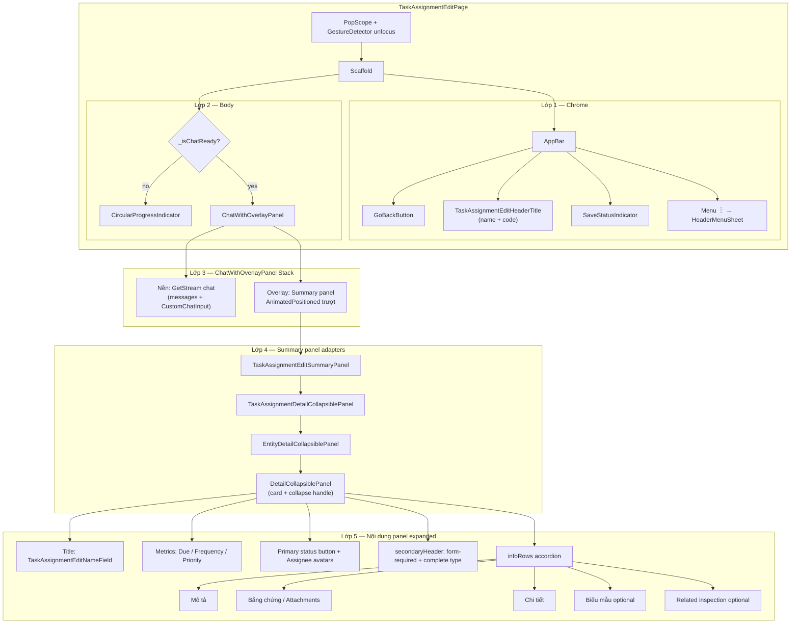
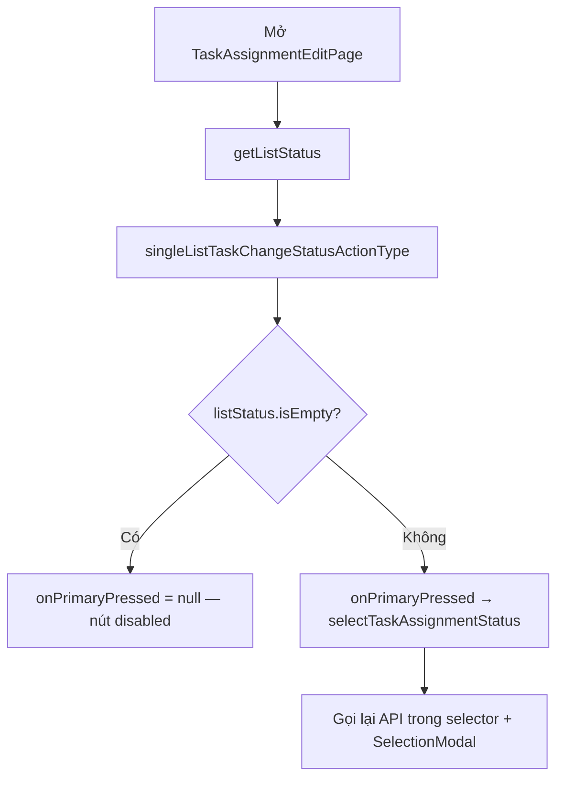

# Chi tiết / sửa công việc — Task Assignment Edit

| Mục | Giá trị |
|-----|---------|
| **Tên màn (UI)** | Chi tiết công việc (panel sửa + chat) |
| **Class chính** | `TaskAssignmentEditPage` |
| **Package** | `supa_work` → `packages/supa_work/lib/pages/task_assignment/` |
| **Route** | `resolveWorkPath('/task-assignment/edit')` — `TaskAssignmentEditPage.location`, `locationWithId(id, cid: …)` |
| **Số dòng** | **~1910** (`task_assignment_edit_page.dart`); panel shared: `ChatWithOverlayPanel` (~252), `DetailCollapsiblePanel` (~263), `EntityDetailCollapsiblePanel` (~396) |
| **Cập nhật lần cuối** | **2026-07-28** — Doc các lớp giao diện (AppBar → chat overlay → summary panel); panel expand full sát ô chat + animation trượt collapse. |

---

## Giới thiệu

Màn chi tiết/sửa một task assignment: panel thu gọn chứa thông tin + form sửa, kèm chat GetStream phía dưới.

**Vào màn từ:** danh sách Công việc (tap item), deep link `taskAssignmentId`, notification.

**Liên quan:** tổng quan [`README.md`](./README.md); danh sách [`danh-sach.md`](./danh-sach.md).

---

## Các lớp giao diện

UI xếp từ ngoài vào trong. Body là **Stack**: chat làm nền, summary panel overlay phía trên (trượt expand/collapse).



### Bảng lớp

| Lớp | Widget | Vai trò |
|-----|--------|---------|
| **1. Shell** | `Scaffold` + `AppBar` | Header cố định: back, tên/mã task, autosave, menu `︙` |
| **2. Body** | Loading hoặc `ChatWithOverlayPanel` | Toàn bộ vùng dưới AppBar |
| **3a. Chat (nền)** | GetStream messages + `CustomChatInput` | Luôn chiếm body; composer ở đáy |
| **3b. Panel (overlay)** | `TaskAssignmentEditSummaryPanel` | Card đè lên chat; collapse/expand có slide ~300ms |
| **4. Panel adapters** | Detail → Entity → `DetailCollapsiblePanel` | Map data task → UI panel chung (dùng chung với checklist) |
| **5. Panel content** | Name, metrics, status, info rows | Form edit task trong panel |

### Hai trạng thái panel

| Trạng thái | Layout |
|------------|--------|
| **Expanded** | Full từ dưới AppBar xuống **sát mép trên ô chat** (`AnimatedPositioned` + `fillWhenExpanded`); scroll nội dung + footer “Chạm để thu gọn” |
| **Collapsed** | Strip trên cùng (~`kChatOverlayCollapsedReservedHeight` = 64); chat hiện full phía dưới |

### Chuỗi widget panel

```text
TaskAssignmentEditSummaryPanel          # đếm attachment, wire status/callbacks
  └─ TaskAssignmentDetailCollapsiblePanel   # map TaskAssignment → metrics/avatars
       └─ EntityDetailCollapsiblePanel      # layout chung (inspection + task)
            └─ DetailCollapsiblePanel       # card, AnimatedPadding/radius, fill body
```

Shared overlay: `packages/supa_communication/.../chat_with_overlay_panel.dart`  
Shared shell: `packages/supa_work/.../detail_panel/detail_collapsible_panel.dart`

### Luồng tương tác UI

- Gõ trong panel (name / description / cost) → **không** auto-collapse khi keyboard mở (`skipKeyboardCollapseWhen`).
- Focus ô chat / keyboard từ chat → panel **collapse**.
- Expand trong lúc keyboard đang mở → unfocus keyboard (panel hiện full tới ô chat).
- Tap metrics / assignee / status → selector / đổi status (xem section quyền bên dưới).

---

## Cây thư mục (phần liên quan)

```text
packages/supa_work/lib/pages/task_assignment/
├── task_assignment_edit_page.dart          # coordinator (~1910 dòng)
├── utils/task_assignment_edit_selectors.dart
└── widgets/
    ├── detail/header/task_assignment_detail_collapsible_panel.dart
    ├── edit/
    │   ├── task_assignment_edit_header_title.dart
    │   ├── task_assignment_edit_header_menu_sheet.dart
    │   ├── task_assignment_edit_name_field.dart
    │   ├── task_assignment_edit_summary_panel.dart
    │   ├── task_assignment_edit_panel_editable_header.dart
    │   ├── task_assignment_edit_description_row.dart
    │   ├── task_assignment_edit_detail_info_*.dart
    │   ├── task_assignment_edit_form_info_row.dart
    │   ├── task_assignment_edit_related_inspection_row.dart
    │   └── form_change_status.dart / related_work.dart / …
    ├── attachments/task_assignment_attachments_section.dart
    └── common/task_notification_item.dart

packages/supa_communication/lib/widgets/
└── chat_with_overlay_panel.dart            # Stack chat + AnimatedPositioned panel

packages/supa_work/lib/
├── widgets/detail_panel/detail_collapsible_panel.dart
├── pages/inspection/widget_ui_new/entity_detail_collapsible_panel.dart
└── utils/task_assignment_status_utils.dart  # canChangeTaskStatus(...)
```

---

## Route & điều hướng

| Mục | Giá trị |
|-----|---------|
| Route | `TaskAssignmentEditPage.location` = `resolveWorkPath('/task-assignment/edit')` |
| Tham số | `id` (bắt buộc), `cid` (GetStream channel, tùy chọn), `taskAssignment` (prefetch) |
| Màn con | `InspectionDetailNewPage`, `TaskAssignmentHistoryPage`, bottom sheet comment |

---

## Quyền đổi trạng thái (quan trọng)

### Không dùng `canUpdate`

Nút status trên panel (**FilledButton** — label từ `taskAssignmentSelfStatus` hoặc `taskAssignmentStatus`) **không** bị chặn bởi `taskAssignment.canUpdate`.

Các field khác (tên, mô tả, due date, frequency, assignee, attachment, …) **vẫn** dùng `canUpdate` / `canDelete` như trước.

### Dùng API action list

| Bước | Mô tả |
|------|--------|
| 1 | `initState` / sau cập nhật task → `getListStatus()` |
| 2 | Gọi `MobileTaskAssignmentRepository().singleListTaskChangeStatusActionType(taskId)` |
| 3 | RPC: `POST /rpc/work/task-assignment/single-list-task-change-status-action-type` |
| 4 | Lưu vào state `listStatus` |
| 5 | `TaskAssignmentStatusUtils.canChangeTaskStatus(listStatus)` → `true` nếu list **không rỗng** |
| 6 | Nút status: `onPrimaryPressed` = callback **chỉ khi** `canChangeTaskStatus == true` và có `statusLabel` |



### Khi user tap nút status

`TaskAssignmentEditSelectors.selectTaskAssignmentStatus(...)`:

1. Kiểm tra có assignee (`taskAssignmentAppUserCoWorkings` không rỗng) — nếu không → toast `changeStatusPermission`.
2. Gọi lại `singleListTaskChangeStatusActionType` (loading dialog).
3. List rỗng → toast không có quyền.
4. List có phần tử → `SelectionModal` chọn status → `_onUpdateStatus` → `updateStatus` API.

### Ví dụ BE

Task có `canUpdate: false` nhưng user được phép hoàn thành (`canComplete: true`):

- Nếu API action list **có** phần tử → nút status **bấm được**.
- Nếu API trả **rỗng** → nút status **không bấm được** (dù `canUpdate` true).

---

## State & data liên quan status

| State / field | Vai trò |
|---------------|---------|
| `listStatus` | Cache kết quả `singleListTaskChangeStatusActionType` |
| `isFormRequired` | Derived từ `listStatus` + questionnaire chưa FINISHED (`getConfigWarning`) |
| `getListStatus()` | Gọi lại sau `onUpdate`, đổi coworker, `_refreshTaskAssignmentStatus` |

---

## Test cases

Unit (`packages/supa_work/test/utils/task_assignment_status_utils_test.dart`):

| # | Given | Then |
|---|--------|------|
| 1 | `canChangeTaskStatus([])` | `false` |
| 2 | `canChangeTaskStatus([status])` | `true` (không phụ thuộc `canUpdate`) |
| 3 | `canChangeTaskStatus([s1, s2])` | `true` |

Widget (`packages/supa_work/test/pages/task_assignment/widgets/task_assignment_detail_collapsible_panel_status_test.dart`):

| # | Given | Then |
|---|--------|------|
| 4 | `onPrimaryPressed: null` | `FilledButton.onPressed == null`, tap không gọi callback |
| 5 | `onPrimaryPressed` có callback | Tap tăng counter |

Chạy test:

```bash
cd packages/supa_work && flutter test test/utils/task_assignment_status_utils_test.dart test/pages/task_assignment/widgets/task_assignment_detail_collapsible_panel_status_test.dart
```

---

## Xử lý 401 / 403 (tập trung ở app)

**HTTP 401** và **403** được xử lý **toàn app** tại tầng `lib/`, không nằm trong `supa_foundation`:

| HTTP | Thành phần | Hành vi |
|------|------------|---------|
| **401** | `SafeRefreshInterceptor` → `onUnauthorized()` → `UnauthorizedNavigationService` | Refresh fail → logout + `go(LoginPage.location)` ngay (không phụ thuộc đổi state bloc) |
| **403** | `ForbiddenInterceptor` + `HttpForbiddenNotifier` + `AppForbiddenPage` | Overlay toàn màn “không có quyền”; nút **Quay lại** đóng overlay |

Repository / `ApiClient` trong các package dùng `HttpBaseRepository` / `HttpApiClient` (`supa_foundation/api_client`). **Không sửa** package `supa_architecture`.

`TaskAssignmentEditPage` **không** tự render trang 403; khi `getById` trả 403, overlay global hiển thị. `getData()` **không** `pop` màn khi **401/403** (deep link không có stack); các lỗi khác chỉ `pop` khi `Navigator.canPop`.

`_resolveChatChannelByRequest()` chỉ gọi `get-stream/get` khi `taskAssignment.getStreamRequest` có giá trị (không dùng fallback `TaskAssignment:{id}`).

---

## Chọn địa điểm (dạng cây)

Field **Địa điểm** trong panel chi tiết gọi `TaskAssignmentEditSelectors.selectSite`:

| Mục | Chi tiết |
|-----|----------|
| UI | `TaskAssignmentSiteSearchModal` — cùng modal cây với filter danh sách Công việc |
| Widget nền | `TreeSelectionSearchModal` (`singleSelect: true` — **radio** tròn; tap chọn & đóng ngay, không cần ✓) |
| API | `MobileTaskAssignmentRepository.filterListSite` → `POST /rpc/work/task-assignment/filter-list-site` |
| Hierarchy | `resolveSiteTreeParentId` (`packages/supa_work/lib/utils/site_tree_utils.dart`) |
| Lưu | Gán `taskAssignment.site` + `siteId`, rồi `onUpdate` (autosave) |
| Multi (filter) | `singleSelect: false` (mặc định) — checkbox + nút ✓ xác nhận |

Trước đây dùng `SelectionSearchModal` + `singleListSite` (danh sách phẳng).

---

## Lưu ý khi sửa

- **Đừng** gắn lại `canUpdate` cho nút đổi status — BE phân quyền qua action list (`CanComplete`, `CanTodo`, `IsAssignee`, …).
- Sau khi đổi assignee / status, nhớ gọi `getListStatus()` để nút sync với BE.
- `TaskAssignmentStatusIcon` trên **danh sách** cũng dùng cùng API khi tap (luôn mở tap, API quyết định).
- `InspectionTaskAssignmentEditPage` vẫn hardcode `isEdit: true` cho status chip — **khác** với edit page chính; cân nhắc đồng bộ nếu sửa inspection.
- Địa điểm trên form **tạo mới** (`task_assignment_form_selectors.selectSite`) dùng cùng modal cây + `singleSelect: true`.
- Package **Project** cũng đã đồng bộ: `task_form_selectors`, `task_assignment_edit_selectors`, `project_task_assignment_form_selectors`, `project_task_assignment_edit_selectors`.
- Sửa layout overlay / animation: đồng bộ `ChatWithOverlayPanel` + `DetailCollapsiblePanel` (`fillWhenExpanded`, `expandedBottomReservedHeight` ≈ chiều cao `CustomChatInput`). Thay đổi ảnh hưởng luôn **Chi tiết checklist**.
- Khi tách widget UI: giữ page làm coordinator (state + callbacks); không nhét business logic vào `widgets/edit/`.

---

## Liên kết

- Tổng quan: [`README.md`](./README.md)
- Danh sách: [`danh-sach.md`](./danh-sach.md)
- Tạo mới: [`tao-moi.md`](./tao-moi.md)
- Lịch sử: [`lich-su.md`](./lich-su.md)
- Bình luận: [`binh-luan.md`](./binh-luan.md)
- Tệp đính kèm: [`tep-dinh-kem.md`](./tep-dinh-kem.md)
- Panel layout chung: [`chi-tiet-checklist`](../chi-tiet-checklist/README.md)
- Quy ước: [`HUONG-DAN-VIET-DOC.md`](../HUONG-DAN-VIET-DOC.md)
