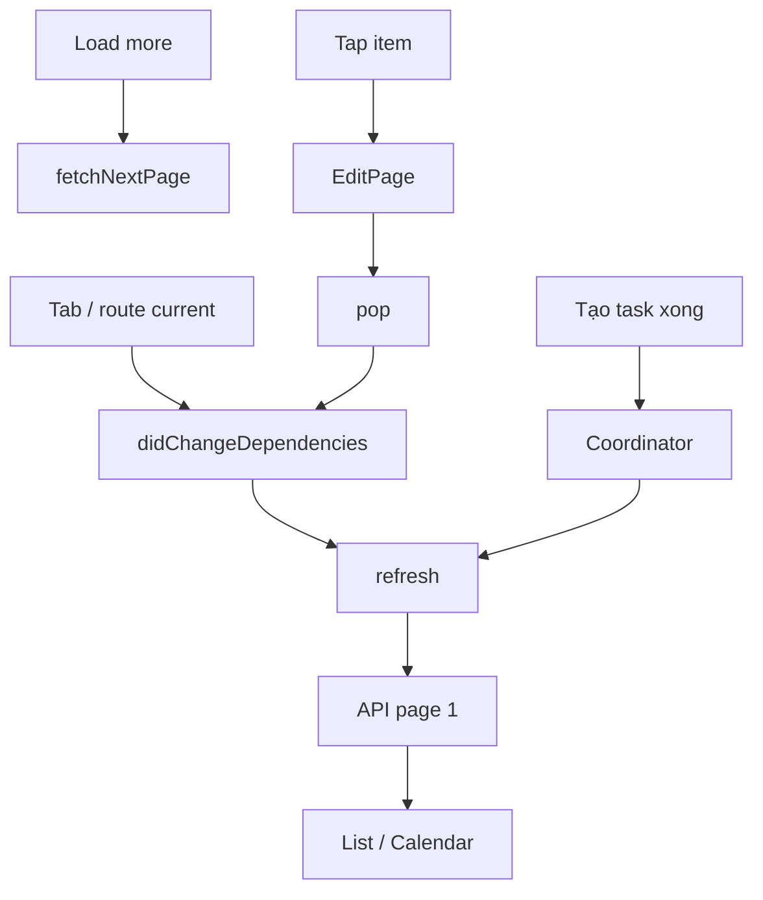

# Danh sách công việc — Task Assignment Master

| Mục | Giá trị |
|-----|---------|
| **Tên màn (UI)** | Công việc (tab navbar) |
| **Class chính** | `TaskAssignmentPage` |
| **Package** | `supa_work` → `packages/supa_work/lib/pages/task_assignment/` |
| **Route** | `resolveWorkPath('/task-assignment/task-assignment-master')` |
| **Tổng số dòng** | **598** (`task_assignment_page.dart`); filter sheet **484** (`task_assignment_filter_scroll.dart`) |
| **Cập nhật lần cuối** | **2026-07-28** — Tách khỏi tổng quan `cong-viec`; doc màn danh sách riêng. |

---

## Giới thiệu

Tab **Công việc**: danh sách task assignment (view `TASK_MASTER_DEFAULT`), header, filter bottom sheet, tìm kiếm, list/calendar, infinite scroll.

**Vào màn từ:** navbar → `GoRouter.go(TaskAssignmentPage.location)`; deep link `/task-assignment` không có id.

**Kiến trúc tab:** `ShellRoute` + `go()` dispose khi chuyển tab; `didChangeDependencies` → `refresh()` khi route current.

**Tổng quan nhóm:** [`README.md`](./README.md).

---

## Cây thư mục source

```text
packages/supa_work/lib/pages/task_assignment/
├── task_assignment_page.dart
└── widgets/
    ├── list/          # TaskAssignmentItem, skeleton, item_old
    ├── filter/        # TaskAssignmentFilterScroll + search modals
    └── common/        # status icon/chip, avatar, importance…

packages/supa_work/lib/widgets/filters/
└── work_filter_widgets.dart   # WorkListHeader, chips, sheet footer
```

---

## Route & điều hướng

| Mục | Chi tiết |
|-----|----------|
| Khai báo | `TaskAssignmentPage.location` |
| Tab | `lib/config/main_tabs.dart` |
| Router | `packages/supa_work/lib/router/router.dart` |
| Tap item | `push(TaskAssignmentEditPage.locationWithId(...))` |
| Tạo task | → [`tao-moi.md`](./tao-moi.md) |
| Sau tạo | `TaskCreatedRefreshCoordinator` → `refresh()` |

---

## Widget & component

| Widget | File | Vai trò |
|--------|------|---------|
| `WorkListHeader` | `work_filter_widgets.dart` | Title/subtitle + actions |
| `WorkHeaderActionButton` | cùng file | List↔Calendar, filter, search |
| `WorkHeaderProfileButton` | cùng file | Avatar → profile |
| `WorkAppliedFilterChip` | cùng file | Chip filter đang áp dụng |
| `TaskAssignmentFilterScroll` | `widgets/filter/` | Bottom sheet filter |
| `TaskAssignmentItem` | `widgets/list/` | Row task |
| `TaskAssignmentSkeletonItem` | `widgets/list/` | Skeleton |
| `TaskCalendarView` | `pages/calendar/` | Calendar mode |
| `WorkTaskAssignmentEmptyState` | `widgets/organisms/` | Empty |

---

## State & data

| Thành phần | Mô tả |
|------------|--------|
| Base | `InfiniteListState<TaskAssignment, TaskAssignmentFilter, …>` |
| Repository | `MobileTaskAssignmentRepository` |
| Filter mặc định | `viewCode = 'TASK_MASTER_DEFAULT'` |
| Reload | `didChangeDependencies` edge `isCurrent` → `refresh()` |
| Pull-to-refresh | `RefreshIndicator` → `refresh()` |
| Race guard | `_loadEpoch`, `_page0RequestSeq` |

### Filter sheet

**Áp dụng** mới `onChanged`; **Đặt lại** → `TASK_MASTER_DEFAULT` + xoá filter khác.

Nhóm: kiểu xem, địa điểm, người dùng, trạng thái, mức quan trọng, hạn, nhãn.  
Địa điểm: `TaskAssignmentSiteSearchModal` (cây, multi-select).

---

## Logic chính

1. `initState` — `TaskCreatedRefreshCoordinator`, scroll listener.
2. `didChangeDependencies` — route current → `refresh()`.
3. `handlePageRequest` — paging; bỏ response nếu epoch lệch.
4. Chuyển tab → dispose.

---

## Luồng đặc biệt



| Flow | Hành vi |
|------|---------|
| List ↔ Calendar | `isCalendar`; vẫn `refresh()` khi quay lại master |
| Search | `GenericSearchDelegate` |
| Status trên item | `TaskAssignmentStatusIcon` — xem [`chi-tiet.md`](./chi-tiet.md) |

---

## Lưu ý khi sửa

- Đừng duplicate fetch trong `initState` nếu đã `refresh` qua `didChangeDependencies`.
- Dashboard task section ≠ state màn này.
- Filter mới: sheet + chip + `hasFilter()`.

---

## Liên kết

- Tổng quan: [`README.md`](./README.md)
- Tạo: [`tao-moi.md`](./tao-moi.md)
- Chi tiết: [`chi-tiet.md`](./chi-tiet.md)
- Quy ước: [`HUONG-DAN-VIET-DOC.md`](../HUONG-DAN-VIET-DOC.md)
