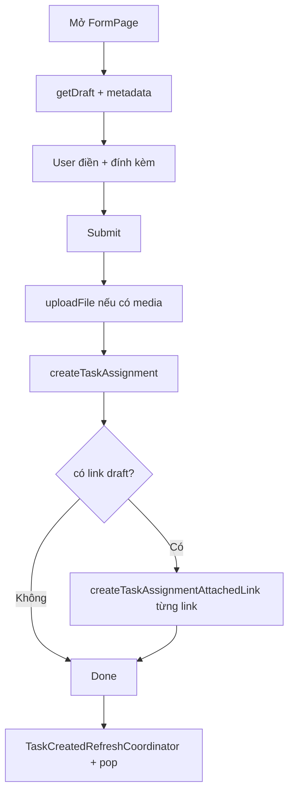

# Tạo công việc — Task Assignment Form

| Mục | Giá trị |
|-----|---------|
| **Tên màn (UI)** | Tạo công việc |
| **Class chính** | `TaskAssignmentFormPage` |
| **Package** | `supa_work` → `packages/supa_work/lib/pages/task_assignment/` |
| **Route** | `resolveWorkPath('/task-assignment/form')` — `TaskAssignmentFormPage.location` |
| **Tổng số dòng** | **973** (`task_assignment_form_page.dart`) |
| **Cập nhật lần cuối** | **2026-07-28** — Doc màn riêng (tách khỏi `cong-viec`). |

---

## Giới thiệu

Form tạo task assignment mới: draft từ BE, chọn loại/người làm/địa điểm/dự án, đính kèm file hoặc link, submit tạo task.

**Vào màn từ:** tab Công việc (action tạo mới), hoặc deep link form.

**Sau tạo thành công:** pop về list; `TaskCreatedRefreshCoordinator` kích hoạt refresh danh sách.

---

## Cây thư mục source

```text
packages/supa_work/lib/pages/task_assignment/
├── task_assignment_form_page.dart
├── service/task_assignment_form_service.dart
├── utils/task_assignment_form_selectors.dart
└── widgets/
    ├── form/
    │   ├── add_attachment_button.dart
    │   ├── assignee_selection/
    │   └── search_tab_auto_save/
    ├── attachments/task_assignment_attached_link_dialog.dart
    ├── common/task_importance_item.dart, task_notification_item.dart
    └── tag/
```

---

## Route & điều hướng

| Mục | Giá trị |
|-----|---------|
| Route | `TaskAssignmentFormPage.location` |
| Router | `packages/supa_work/lib/router/router.dart` |
| Quay lại | Pop về `TaskAssignmentPage` |

---

## Widget & component

| Widget / service | Vai trò |
|------------------|---------|
| `TaskAssignmentFormService` | Draft, upload file, create task, create attached link, list pickers |
| `TaskAssignmentFormSelectors` | Mở modal chọn site/project/user/frequency/… |
| `AddAttachmentButton` | Bottom sheet chọn ảnh/video/file/camera/link |
| `TaskAssignmentAttachedLinkDialog` | Validate tên + URL (scheme/host) |
| `TaskAssignmentAssigneeSlection` | Chọn người thực hiện |
| `TaskImportanceItem` / `TaskNotificationItem` | UI mức độ / thông báo |

---

## State & data

| State | Vai trò |
|-------|---------|
| `taskAssignment` | Draft đang soạn |
| `medias` | `List<XFile>` local trước upload |
| Attached links (draft) | Lưu tạm; sau create mới gọi API link |
| `_controllers` | `name`, `description` |

### API chính

| Thao tác | Endpoint / method |
|----------|-------------------|
| Draft | `MobileTaskAssignmentRepository.getDraft()` |
| Tạo task | `createTaskAssignment(...)` |
| Upload file | `WorkFileRepository.uploadXFiles` (nén ảnh jpg/png) |
| Gắn link | `createTaskAssignmentAttachedLink` — **sau** khi task đã có ID |
| Dự án | `singleListProject` → `POST .../single-list-project` |
| Địa điểm | `filterListSite` → `POST .../filter-list-site` (cây, `singleSelect: true`) |

---

## Logic chính

1. `initState` — load draft + danh sách urgent/alert/frequency.
2. User điền form; picker qua `_selectors`.
3. Submit:
   - Upload media (nếu có) → gán file mappings.
   - `createTaskAssignment` → nhận entity có ID.
   - Với mỗi link draft → `createTaskAssignmentAttachedLink(taskAssignmentId)`.
4. Celebration / toast → pop; coordinator refresh list.

---

## Luồng đặc biệt



| Lưu ý | Chi tiết |
|-------|----------|
| Thứ tự Detail Information | **Dự án** trước **Địa điểm** |
| Link trước create | Chỉ lưu local; **không** gọi API link khi chưa có `taskAssignmentId` |
| Video | Quay tối đa 3 phút (AddAttachmentButton) |

---

## Lưu ý khi sửa

- Luôn chờ create trả ID rồi mới gọi `createTaskAssignmentAttachedLink`.
- Địa điểm: dùng `TaskAssignmentSiteSearchModal` + radio (`singleSelect: true`), không dùng list phẳng cũ.
- Nén ảnh qua `ImageCompressUtils` trước upload.
- Không nhầm với `InspectionTaskAssignmentFormPage` (flow checklist).

---

## Liên kết

- Tổng quan: [`README.md`](./README.md)
- Danh sách: [`danh-sach.md`](./danh-sach.md)
- Chi tiết / sửa: [`chi-tiet.md`](./chi-tiet.md)
- Quy ước: [`HUONG-DAN-VIET-DOC.md`](../HUONG-DAN-VIET-DOC.md)
