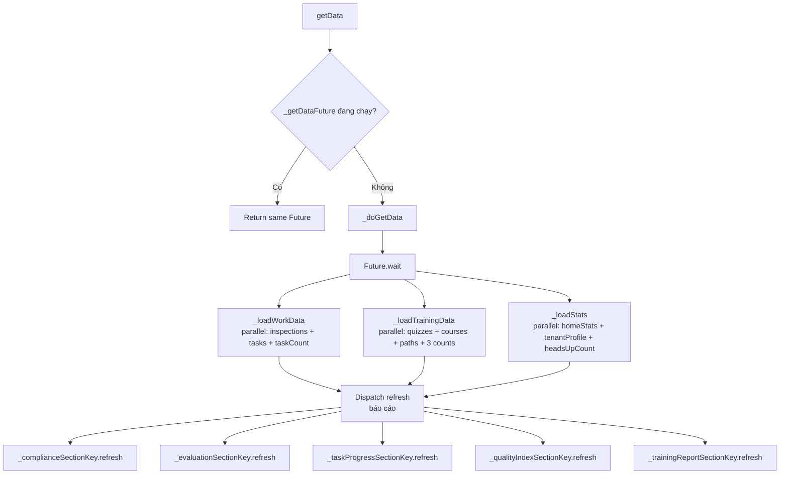
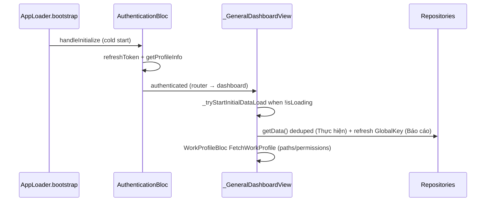
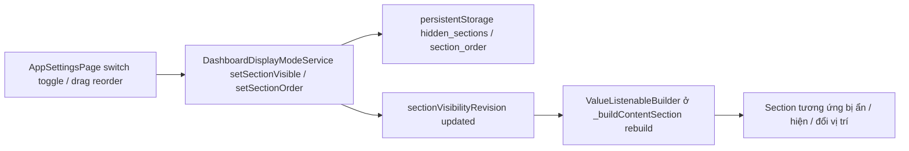
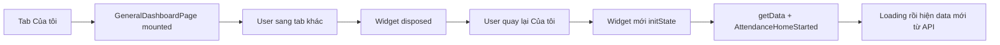
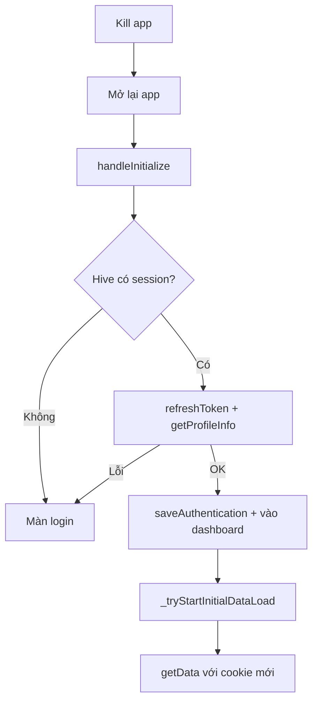
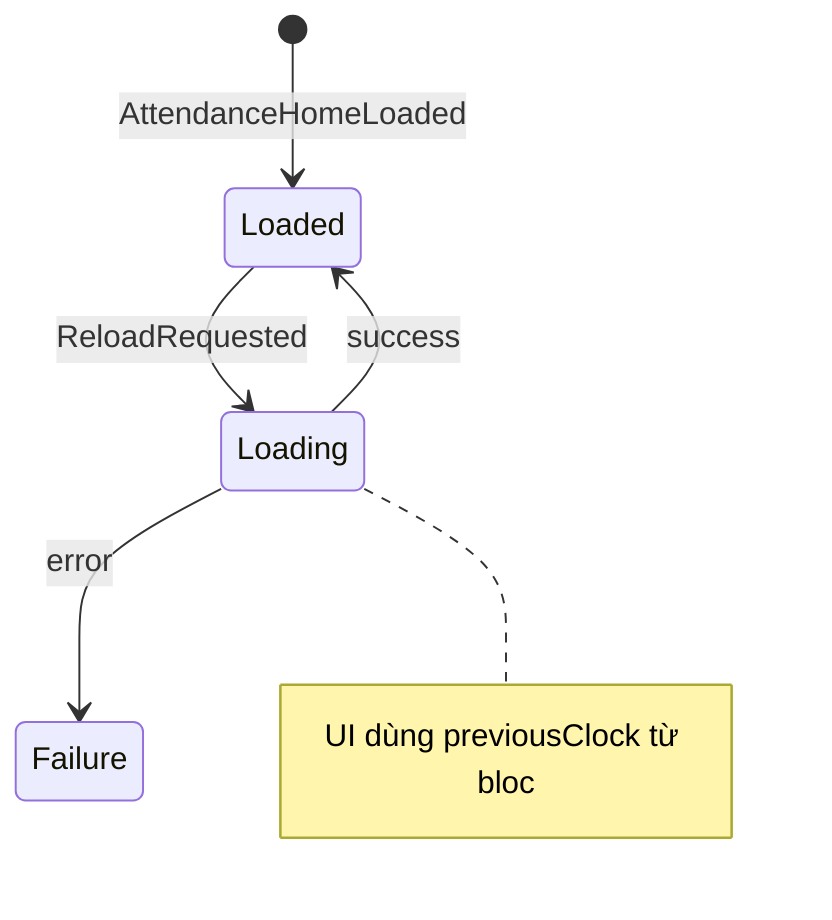
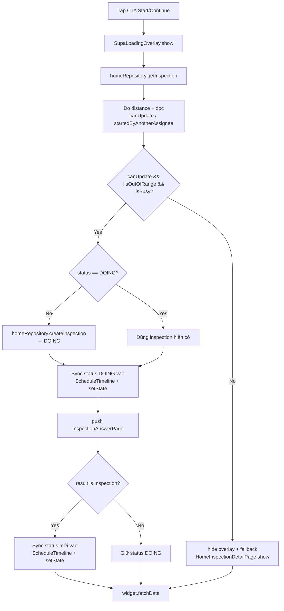

# Của tôi — General Dashboard

| Mục | Giá trị |
|-----|---------|
| **Tên màn (UI)** | Của tôi (`general.tabs.mytasks`) |
| **Class chính** | `GeneralDashboardPage` → `_GeneralDashboardView` |
| **Package / module** | `supa` — `lib/modules/general/pages/general_dashboard/` |
| **Route** | `/supa/dashboard` (`GeneralDashboardPage.location`) |
| **Tổng số dòng (module)** | **13.918** dòng (toàn bộ folder `general_dashboard/`) |
| **File page chính** | `general_dashboard_page.dart` — **1.636** dòng; `dashboard_compliance_today_section.dart` — **1.409** dòng; `dashboard_evaluation_section.dart` — **370** dòng; `packages/supa_work/lib/utils/compliance_site_rate_utils.dart` — **246** dòng; `dashboard_quality_index_section.dart` — **742** dòng; `quality_index_detail_page.dart` — **1.081** dòng; `training_report_detail_page.dart` — **1.465** dòng; `dashboard_training_report_section.dart` — **876** dòng; `dashboard_home_report_filter.dart` — **123** dòng; `packages/supa_work/lib/pages/analytics/widgets/home_report_filter_sheet.dart` — **498** dòng; `site_compliance_details_list_page.dart` — **2.229** dòng; `packages/supa_work/lib/pages/analytics/site_report/widgets/compliance_site_detail_sheet.dart` |
| **Cập nhật bổ sung** | **2026-06-16 (v61)** — Force update popup chỉ hiện khi `/rpc/portal/list-app-version` trả `forceUpdate`/`isForceUpdate` cho version mới hơn app hiện tại; bỏ optional `SupaUpgradeAlert` theo App Store để không tự hiện popup khi BE không yêu cầu. |
| **Cập nhật lần cuối** | **2026-07-24 (v87)** — Evaluation card chuyển sang API riêng `POST /rpc/work/report/evaluation-report/summary` (`WorkEvaluationReportRepository` + `HomeReportEvaluationSummary`). Filter `HomeReportFilter` giữ như Compliance. Hiển thị giống Compliance: Settings `evaluation_report` + `hasAnyReportPermission`; `summary == null` → ẩn; `countTotal == 0` vẫn show. Path permission `rpc/work/report/evaluation-report/*` thêm vào `AnalyticsPermissions.allReports`. |
| **Cập nhật trước đó** | **2026-07-24 (v86)** — Tách card **Evaluation / Đánh giá** thành `DashboardEvaluationSection` (section riêng `evaluation_report`). Trước đó: **2026-07-23 (v85)** — Compliance dashboard: metric 4 ô khung → progress (headline % + bar + list status); màu 3 nấc site tile dùng `successText` `#52C41A`, `colorScheme.error` `#BA1A1A`, local `#FA8C16` (chưa có trong theme). Logic count/% giữ nguyên. Trước đó: **2026-06-24 (v79)** — Trial banner: chỉ hiển thị khi tài khoản thuộc tenant admin / sub admin (trường `isAdmin` trong `get-info` API / `persistentStorage.appUser?.isAdmin`). Trước đó: **2026-06-22 (v78)** — Task progress detail: bấm user mở bottom sheet `TaskProgressUserTasksSheet` (thay expand/collapse inline); danh sách task dùng `TaskAssignmentItem`, tap → `TaskAssignmentEditPage`. Trước đó: **2026-06-22 (v77)** — Task progress detail: task trong expand user dùng `TaskAssignmentItem`; tap mở `TaskAssignmentEditPage`; map DTO qua `task_progress_task_assignment_mapper.dart`; reload list sau khi quay lại. Trước đó: **2026-06-22 (v76)** — `TaskProgressDetailsListPage`: bấm user expand/collapse danh sách `taskAssignments` từ `/task-overal-progress/list` (code, tên, site, hạn `dueAt`, badge trạng thái); model `HomeReportTaskOveralProgressTaskAssignment`. Trước đó: **2026-06-22 (v75)** — `TrainingReportDetailPage`: filter UI giống compliance/quality/task progress — icon filter + badge trên AppBar, chip active `WorkAppliedFilterChip` (ngày + địa điểm), mở `DashboardHomeReportFilterSheet` (ẩn tag/biểu mẫu); bỏ hàng chip ngang `MultipleSelectChip` cũ. Logic filter/API giữ nguyên. Trước đó: **2026-06-22 (v74)** — `TaskProgressDetailsListPage`: sửa empty state (hiện summary khi `totalTask > 0` dù list user rỗng); dùng `general.common.noData` thay key lỗi `work.analytics.noData`; filter UI giống compliance/quality (icon + badge AppBar, chip active `WorkAppliedFilterChip`); truyền filter từ dashboard qua `GoRouter.extra`. Trước đó: **2026-06-22 (v73)** — Tab **Chất lượng theo địa điểm** (`QualityBySiteTab`): drill-down cây site theo `parentId`/`hasChildren`; điểm site cha = trung bình điểm các con (`quality_index_site_tree_utils.dart`). Trước đó: **2026-06-22 (v72)** — `QualityIndexDetailPage`: filter UI giống báo cáo tuân thủ (icon filter + badge trên AppBar, chip active `WorkAppliedFilterChip`); tab con nhận `parentFilter`, không có UI filter riêng; mở từ dashboard truyền `initialFilter` qua `GoRouter.extra`. Trước đó: **2026-06-22 (v71)** — Tab **Đánh giá** đọc trực tiếp `data.countTotal` / `countPassed` / `countFailed` / `countRemaining` từ `/compliance-report/list` (BE đã aggregate cả site cha); bỏ tổng hợp đệ quy từ `contents[]`. Model `HomeReportSiteReportData` parse thêm các field evaluation. Fallback `contents[]` chỉ khi BE chưa trả count trên `data`. Trước đó: **2026-06-22 (v70)** — Tab **Đánh giá** card site/region: khi list API không gửi `countPassed`/`countFailed`/`countNotEvaluate` trên `contents[]`, suy **Còn lại** từ schedule đã hoàn thành tuân thủ nhưng chưa có kết quả Đạt/Không đạt (`leafNotEvaluateCountFromContentsFallback`) — khớp sheet chi tiết (`/compliance-report/summary` theo site). Trước đó: **2026-06-22 (v69)** — Tab **Đánh giá**: dùng `countPassed`/`countFailed`/`countNotEvaluate` từ summary (thay legacy `numberOfEvaluated` gây CÒN LẠI = countTotal); card site aggregate evaluation từ `contents[]` (không còn nhầm `completed`/`incompleted`). Trước đó: **2026-06-22 (v68)** — `HomeReportComplianceSummary` parse `lastInspectedAt` + `siteCreatedAt` từ `/compliance-report/summary`; hiển thị card **Lần kiểm cuối** / **Tạo địa điểm** trên `SiteComplianceDetailsListPage` và `ComplianceSiteDetailSheet` (`_homeSummary`). Trước đó: **2026-06-22 (v67)** — Card site/region trong tab Danh sách: aggregate `trễ hạn`/`đang làm`/`bỏ lỡ` từ `contents[]` (`leafLateCount`, `leafDoingCount`, `leafIncompletedCount`) thay vị hardcode `late=0` và `missed = total - completed` (gây Region 01 hiển thị trễ=0, bỏ lỡ=6). Trước đó: **2026-06-22 (v66)** — `SiteComplianceDetailsListPage` + `ComplianceSiteDetailSheet`: **Tỷ lệ tuân thủ tổng** = `(hoàn thành + trễ hạn) / tổng × 100` (trước chỉ tính hoàn thành); dùng `compliancePercentFromCounts`. Trước đó: **2026-06-22 (v65)** — Filter `SiteComplianceDetailsListPage` truyền xuống `ComplianceSiteDetailSheet` (`parentFilter`) và `_ScheduleDetailSheet` (qua `AnalyticSiteReportFilter`); màn con ẩn hết UI filter. Helper `toAnalyticSiteReportFilterForLeafSite` / `toHomeReportFilterForLeafSite` trong `home_report_filter.dart`. Dashboard mở sheet không `parentFilter` → vẫn giữ filter local. Trước đó: **2026-06-22 (v64)** — `SiteComplianceDetailsListPage`: sau khi apply filter, hiển thị chip active ngang (`WorkAppliedFilterChip`, pattern `inspection_page`) — `Ngày`, `Địa điểm`, `Nhãn dán`, `Biểu mẫu`; tap X xóa từng filter và re-fetch. Trước đó: **2026-06-22 (v63)** — Bỏ hàng chip filter ngang cũ; thêm icon filter ở header AppBar → mở `DashboardHomeReportFilterSheet`. Logic filter/API giữ nguyên. Widget sheet chuyển sang `home_report_filter_sheet.dart`. Trước đó: **2026-06-21 (v62)** — Compliance tile grid (`_HierarchicalSitesSection`, `SiteComplianceDetailsListPage` heatmap) dùng `compliance_site_rate_utils.dart`: % tính từ `contents[]` counts `(completed + late) / total × 100` (scale 0–100, `1.0` = 1%); site cha aggregate volume-weighted từ leaf; không tin `data.complianceRate` khi có count (BE hack floor 1%). Model `HomeReportSiteReportData` parse thêm `contents`, `completedRate`, `doingRate`, `lateRate`. Trước đó: **2026-06-16 (v60)** — `FetchWorkProfileEvent` force refresh `/rpc/auth/profile/get-info` thay vì dùng cache `_cachedPaths`, tránh dashboard/menu còn giữ quyền báo cáo cũ sau khi quyền bị thu hồi. Trước đó: **2026-06-12 (v59)** — Nút Excel của Quality Index detail gọi `POST /rpc/work/report/quality-index-report/export` bằng filter hiện tại, tải binary `.xlsx` về temp với tên `quality-index-report.xlsx` rồi mở bằng app hệ thống. Trước đó: **2026-06-12 (v58)** — Quality by site trong Quality Index detail chuyển sang field BE mới `qualityBySites`; mỗi site đọc `data.qualityIndex` và `data.numberOfInspection` (fallback root field cũ nếu BE không trả data). Trước đó: **2026-06-12 (v57)** — Metric cards của Quality Index detail đổi theo mock: card bo lớn, value rich text, diff badge; Avg score dùng màu threshold `[0,30)/[30,80)/[80,100]` theo logic Quality/Compliance hiện có. Trước đó: **2026-06-12 (v56)** — Quality Index detail bỏ `SizedBox(height: 420)`/`TabBarView` cố định; tab content render trong `ListView` cha nên danh sách flagged/site không bị cắt khung và kéo được hết trang. Trước đó: **2026-06-12 (v55)** — Quality Index detail bỏ title trong nội dung tab **Flagged list** / **Quality by site**; danh sách flagged và site không còn cap FE, render toàn bộ items API trả về. Trước đó: **2026-06-12 (v54)** — Quality Index detail dùng các field BE mới: `qualityIndexDiff`, `flagRate`, `flagRateDiff`, `repeatIssueCount`, `repeatIssueDiff`, `scoreDistributions`, `totalMostFlaggedItem`; `mostFlaggedItems` paging bằng `skip=0/take=20`, dashboard card dùng `take=5`. Trước đó: **2026-06-12 (v53)** — Màn chi tiết Quality Index render tab **Flagged list** từ `mostFlaggedItems`: rank, nội dung câu hỏi, chip `questionnaireName` một dòng có ellipsis, số site và `numberOfTimes`. Trước đó: **2026-06-11 (v52)** — Quality Index dashboard đổi sang API `POST /rpc/work/report/quality-index-report/list`, bổ sung DTO `mostFlaggedItems` và render block **MOST FLAGGED ITEM** từ BE thay cho ranked list site giả lập. Trước đó: **2026-06-10 (v51)** — Default selected chip của `DashboardClockListWidget` đổi sang ca có `expectedClockAt` mới nhất trong danh sách. Trước đó: **2026-06-10 (v50)** — Chip ca làm trên dashboard có state được chọn: tap chip nào thì border primary chuyển sang chip đó; action bên dưới đổi theo setup được chọn, gồm chấm công nhanh khi `canClock`, hoặc `Cập nhật` / `Đính chính` theo flow trang Chấm công. Trước đó: **2026-06-10 (v49)** — `DashboardClockListWidget` chỉ hiển thị nút chấm công nhanh khi setup hiện tại có `canClock == true`, tránh fallback thừa label `Clock out` khi user đã chấm công hoặc chưa tới mốc chấm. Trước đó: **2026-05-28 (v48)** — Heads Up trên dashboard không còn bọc bằng `DashboardFrame`; chỉ render header trong suốt + `AppBadge` + horizontal list, bỏ nền/card trắng riêng cho section này. Trước đó: **2026-05-28 (v47)** — Header **Của tôi** lấy số **cần chú ý** từ cùng logic banner Compliance: đếm leaf site có `data.complianceRate == 0` trong `/rpc/work/report/home-report/compliance/list`. `DashboardComplianceTodaySection` emit count lên parent qua `onNeedAttentionCountChanged`, parent truyền vào `DashboardHeader.needAttentionCount`. Trước đó: **2026-05-28 (v46)** — Dashboard refresh `/rpc/portal/profile/get-info` một lần khi saved auth state đã authenticated nhưng `AppUser.sites` còn rỗng, rồi emit `UpdateAppUserProfileEvent` để `DashboardHeader` rebuild số site. Trước đó: **2026-05-28 (v45)** — Header **Của tôi** lấy số site từ `AuthenticationBloc`/`AppUser.sites.value.length` (field `sites` đã được expose trong `supa_architecture 1.15.18` từ `/rpc/portal/profile/get-info` đã lưu), không gọi thêm API riêng ở dashboard. Trước đó: **2026-05-28 (v44)** — Header **Của tôi** thử lấy số site từ response `/rpc/portal/profile/get-info` trong `_loadStats()` và truyền vào `DashboardHeader.sitesCount` nhưng đã thay bằng dữ liệu auth đã lưu. |

| **Cập nhật bổ sung** | **2026-05-28 (v42)** — Tab **Sites** của **Training Report Detail** hiển thị theo cây cha-con dựa trên `parentId/hasChildren`: root → child drill-down bằng chevron; leaf giữ action **Chi tiết**. Parent dùng rate BE nếu có data, nếu không aggregate từ descendants. Trước đó: **2026-05-28 (v41)** — Filter của **Training Report Detail** đổi sang cùng pattern với trang chi tiết Compliance: `DropdownChip` cho date, `MultipleSelectChip` cho Sites/Courses/Groups; Date mở `DateFilterBottomSheet`, Sites mở `HomeReportSiteSearchModal`, Courses/Groups tạm toast đang phát triển. Trước đó: **2026-05-28 (v40)** — Chuẩn lại màu hệ thống cho **Training Report Detail**: nền page/appbar/tab dùng `theme.colorScheme.surface`; card/panel dùng `surfaceContainerLowest`; progress placeholder vẫn dùng token container của theme. Trước đó: **2026-05-28 (v39)** — Thêm màn **Training Report Detail** (`/supa/dashboard/training-report`) theo mock 5 tab Sites/Courses/Quizzes/Paths/Rankings. Header có Excel toast "đang phát triển"; filter chip dùng `DashboardHomeReportFilterSheet` cho thời gian + site, Course/Group tạm toast. Card Training Report trên dashboard bấm **Xem** mở route mới. Trước đó: **2026-05-28 (v38)** — Sửa điều kiện inline schedule của Compliance single-leaf: chỉ inline khi item root đang hiển thị là leaf thật sự. Payload có 1 leaf nhưng vẫn kèm chuỗi node cha sẽ tiếp tục render cây phân cấp để user drill-down đúng cấp. Trước đó: **2026-05-28 (v37)** — Single-leaf Compliance render inline schedule list để user không phải bấm leaf rồi mở bottom sheet. Trước đó: **2026-05-27 (v36)** — Thêm màn chi tiết Quality Index 2 tab theo mock mobile; route nằm ngoài ShellRoute để không kèm bottom navbar. Trước đó: **2026-05-27 (v35)** — Bổ sung lưu thứ tự section và render dashboard theo thứ tự user kéo thả trong Settings. Trước đó: **2026-05-27 (v34)** — Gỡ tile **Chế độ trang Của tôi** và các key i18n liên quan (`dashboardDisplayMode`, `fullDisplay`, `reportsOnly`); Settings chỉ còn nhóm **Phần hiển thị trên Của tôi**. Trước đó: **2026-05-27 (v33)** — Settings thêm nhóm **Phần hiển thị trên Của tôi** để bật/tắt từng section; report option chỉ hiện theo quyền menu Báo cáo. Trước đó: **2026-05-27 (v32)** — Chuẩn hoá spacing của block Chấm công bằng `_DashboardSectionWithGap`: skeleton và trạng thái có dữ liệu đều có gap dưới 12dp; trạng thái rỗng không sinh khoảng trắng. Trước đó: **v31** — Sắp xếp lại thứ tự dashboard "Của tôi": Heads Up → Chấm công → Compliance → Quality Index → Task Progress → Training Report → Checklist → Công việc → Training section (Lộ trình → Khoá học → Quiz). Trial banner chuyển xuống sau Heads Up để Heads Up luôn là section đầu trong chế độ đầy đủ. Trước đó: **v30** — Các report dùng cùng điều kiện với menu **Báo cáo**: `AnalyticsPermissions.hasAnyReportPermission(paths)`. Nếu user thấy được menu báo cáo thì Compliance, Task Progress, Quality Index và Training Report đều được mount; nếu không có bất kỳ quyền report nào thì ẩn toàn bộ report dashboard. Trước đó: **v29** — Chuẩn hoá ẩn/hiện các report trên dashboard theo quyền FE: Compliance, Task Progress và Quality Index đều chỉ mount khi `AnalyticsPermissions.workReportHomeReport`; Training Report chỉ mount khi user có `trainingReportSummary` hoặc `trainingReportStaffRanking`. Trước đó: **v28** — Ép root `DashboardHomeReportFilterSheet` full-size (`SizedBox.expand`) và dùng `Spacer` trong `_FilterRow` để cụm value + chevron thật sự nằm sát mép phải, tránh sheet/content bị co ngang theo nội dung. Trước đó: **v27** — Căn lại hàng trong `DashboardHomeReportFilterSheet`: `_FilterRow` ép full width và gom cụm value + chevron thành trailing group để giá trị lọc và dấu `>` bám sát mép phải sheet. Trước đó: **v26** — Tách filter báo cáo dashboard thành `DashboardHomeReportFilterSheet` + `DashboardReportFilterAction` dùng chung; Compliance, Task Progress, Quality Index và Training Report đều mở được filter tại chỗ, có badge số filter active và re-fetch sau khi bấm **Áp dụng**. Training Report chỉ map thời gian + địa điểm vì DTO training không hỗ trợ tag/biểu mẫu. Trước đó: **v25** — Quality Index không còn tự ẩn khi API lỗi hoặc BE trả rỗng; `DashboardQualityIndexSection` render card với các thông số mặc định 0. |

---

## Thông tin chung

**Của tôi** là màn **home dashboard** của super app, tab đầu tiên trên bottom navbar (`GeneralNavbar`). Tích hợp dữ liệu từ nhiều sub-package (`supa_work`, `supa_attendance`, `supa_training`, `supa_foundation`) trong cùng `CustomScrollView` có pull-to-refresh.

### Trang đang làm những nhiệm vụ gì

Page chia rõ **2 phần** tách biệt theo mục đích sử dụng. User có thể cấu hình từng section muốn hiển thị ở `AppSettingsPage` (xem mục [Tuỳ chỉnh section](#0-tuỳ-chỉnh-section)).

| Phần | Mục đích | Section thuộc phần |
|------|----------|---------------------|
| **🟢 Thực hiện** (Operational) | User cá nhân làm việc trong ngày — xem việc cần làm + thao tác nhanh | Bảng tin (Heads Up), Ca làm hôm nay, Checklist hôm nay, Công việc của tôi, Đào tạo (lộ trình + khoá học + quiz) |
| **🔵 Báo cáo** (Report) | Manager / supervisor theo dõi chỉ số hiệu suất theo site & tháng | Compliance Today, Evaluation, Task Progress, Quality Index, Training Report |

Cả 2 phần đều render trong cùng 1 dashboard; **phần Báo cáo** có gating quyền — section không đủ quyền sẽ tự ẩn (xem chi tiết ở [§ Phần Báo cáo](#phần-báo-cáo-report)).

### Khi nào `getData()` được gọi

`getData()` là điểm vào duy nhất để refresh toàn bộ data của phần **Thực hiện** + dispatch refresh cho phần **Báo cáo** (gọi `*.refresh()` lên 4 section báo cáo). Hàm này **deduplicate**: nhiều caller gọi đồng thời sẽ share cùng 1 `Future` qua `_getDataFuture`.

| Trigger | Đoạn code | Lý do |
|---------|-----------|--------|
| **Cold start** (app vừa mở) | `initState` → `addPostFrameCallback` → `_tryStartInitialDataLoad()` → `_startInitialDataLoad()` → `getData()` | Chờ `AuthenticationBloc.isAuthenticated && !isLoading` rồi mới gọi để không race với `refreshToken` |
| **Auth state đổi** | `BlocListener<AuthenticationBloc>` ở `build()` (chỉ chạy 1 lần nhờ `!_initialDataLoadStarted`) | Fallback nếu cold start chưa kịp authenticate khi `initState` chạy |
| **Quay lại tab** | `didChangeDependencies()` → khi `ModalRoute.isCurrent && !_hasRefreshedOnReturn` | User đổi tab navbar — `ShellRoute + go()` dispose page; lần quay lại tab **Của tôi** sẽ tự reload |
| **Pull-to-refresh** | `RefreshIndicator.onRefresh` | Trong cùng callback cũng dispatch `AttendanceHomeReloadRequested` để đồng bộ ca làm |
| **Section yêu cầu reload** | `DashboardHeadsUpSection.fetchData`, `DashboardTrainingSection.fetchData` (callback props nhận `getData`) | Section con cần reload tổng nhưng vẫn dedupe qua cùng `_getDataFuture` |
| **Sau khi update timezone** | `_updateTimezoneToDevice` thành công → `getData()` | Profile đổi → reload data đồng bộ |

> ⚠️ `getData()` **không** chạy trong `didChangeAppLifecycleState.resumed` — chỉ refresh `WorkProfileBloc` paths. Lý do: tránh phá data đang hiện khi user vô tình background app vài giây.

### Bên trong `getData()` làm gì



- **3 nhóm chạy song song** qua `Future.wait`; mỗi nhóm bên trong cũng `Future.wait` các API con.
- **Mỗi API con** dùng `_tryFetch<T>()` — fail trả `null`, không throw → 1 API hỏng **không** ảnh hưởng section khác.
- **Setstate ngay khi mỗi API xong**, không đợi cả nhóm → user thấy data hiện dần.
- Sau khi 3 nhóm xong, gọi `refresh()` lên GlobalKey của section báo cáo (chúng tự fetch repo riêng — không nằm trong `Future.wait` chính).

### Đặc điểm kiến trúc

- **`ShellRoute` + `go()`** → widget **dispose** khi đổi tab, tạo lại khi quay lại → **luôn fetch API mới** (không restore cache cross-tab).
- **Không cache cross-navigation** — đã gỡ `dashboard_data_cache.dart` và `DashboardLogoutHook`.
- **`_tryFetch` giữ stale state**: chỉ ghi đè khi result `!= null` → 1 API fail vẫn giữ data cũ trong cùng phiên.
- **Section báo cáo có state local riêng** (`_isLoading`, `_summary`, `_sites`...) — không chia sẻ với state `getData()`. Parent chỉ dispatch `refresh()` qua GlobalKey.

---

## Cây thư mục source

```text
lib/modules/general/pages/general_dashboard/
├── general_dashboard_page.dart      (page + state + fetch logic)
└── widgets/
    ├── dashboard_header.dart                     — Header: icon Settings + Welcome + Avatar 40
    ├── dashboard_heads_up_section.dart
    ├── dashboard_heads_up_list_widget.dart
    ├── dashboard_clock_list_widget.dart
    ├── dashboard_clock_list_tile.dart
    ├── dashboard_checklist_section.dart
    ├── dashboard_inspection_list_widget.dart
    ├── dashboard_compliance_today_section.dart  — Section "Compliance" (report-menu-gated)
    ├── dashboard_evaluation_section.dart         — Section "Evaluation / Đánh giá" (report-menu-gated)
    ├── quality_index_detail_page.dart            — Màn chi tiết Quality Index
    ├── training_report_detail_page.dart          — Màn chi tiết Training Report
    ├── dashboard_quality_index_section.dart      — Section "Quality Index" (report-menu-gated)
    ├── dashboard_task_progress_section.dart      — Section "Task Progress" (report-menu-gated)
    ├── dashboard_training_report_section.dart    — Section "Training Report" (report-menu-gated)
    ├── dashboard_home_report_filter.dart         — Filter sheet + filter action dùng chung cho các report
    ├── dashboard_task_section.dart
    ├── dashboard_task_assignment_list_widget.dart
    ├── dashboard_training_section.dart
    ├── dashboard_training_path_list_widget.dart
    ├── dashboard_course_list_widget.dart
    ├── dashboard_quiz_list_widget.dart
    ├── dashboard_loading_view.dart
    ├── dashboard_frame.dart                      — shared frame (package foundation cũng có)
    ├── dashboard_guide_item.dart
    ├── dashboard_empty.dart
    ├── dashboard_skeleton.dart
    ├── tenant_trial_banner.dart
    └── workplace_check_list_item.dart
```

**Tổng module:** 10.863 dòng.

---

## Route & điều hướng

### Khai báo route

| File | Nội dung |
|------|----------|
| `lib/modules/general/pages/general_dashboard/general_dashboard_page.dart` | `static final location = resolveSupaPath('/dashboard')` → **`/supa/dashboard`** |
| `lib/modules/general/pages/general_dashboard/quality_index_detail_page.dart` | `static final location = resolveSupaPath('/dashboard/quality-index')` → **`/supa/dashboard/quality-index`** |
| `lib/modules/general/pages/general_dashboard/training_report_detail_page.dart` | `static final location = resolveSupaPath('/dashboard/training-report')` → **`/supa/dashboard/training-report`** |
| `lib/modules/general/router/router.dart` | `_generalDashboardRoute` trong `ShellRoute`; `_qualityIndexDetailRoute` và `_trainingReportDetailRoute` nằm trong `_generalRootRoutes` để mở full page không kèm bottom navbar |
| `lib/modules/general/pages/general_navbar.dart` | Tab đầu: `GeneralDashboardPage.location`, label `translate('general.tabs.mytasks')` |

### Shell & navbar

```text
generalRoutes
├── GoRoute path: /supa/dashboard/quality-index → QualityIndexDetailPage
├── GoRoute path: /supa/dashboard/training-report → TrainingReportDetailPage
└── ShellRoute
    ├── builder: LanguageAwareNavbar → GeneralNavbar(child)
    └── routes
        └── GoRoute path: /supa/dashboard → GeneralDashboardPage
```

- Navigation tab: `GoRouter.of(context).go(path)` — **không** giữ state page khi đổi tab (recreate).
- `didChangeDependencies` trên dashboard: khi route `isCurrent` lại → `FetchWorkProfileEvent` (paths/permissions).

### Điều hướng ra từ màn

| Thao tác UI | Đích |
|-------------|------|
| Bảng tin — tap card | `HeadsUpDetailBottomSheet` |
| Ca làm — Xem tất cả | `AttendanceHomePage` |
| Checklist — Xem tất cả / item | `HomeInspectionTodayPage`, `InspectionChecklistPage`, `InspectionQuestionnairePage` |
| Task — Xem tất cả / item | `TaskAssignmentPage`, `TaskAssignmentFormPage` |
| Training — các section | `HomeTrainingPathTodoPage`, `HomeCourseTodoPage`, `HomeQuizPartitionsPage`, … |
| Training Report — Xem | `TrainingReportDetailPage.location` (`/supa/dashboard/training-report`) |
| Avatar (header) | `showProfileBottomSheet(context)` (foundation) |
| Icon Settings (header) | `AppSettingsPage.location` (`/settings/app`) |
| Bubble SuSu (overlay global) | `showSupaActionSheet` → checklist / heads up / lịch / task / **Trợ lý SuSu** (chat AI) |

---

## Widget & component

### Cấu trúc widget tree (tóm tắt)

```text
Scaffold (backgroundColor: surface)
├── RefreshIndicator
│   └── CustomScrollView
│       ├── SliverAppBar (pinned, surface bg, no leading)
│       │   └── DashboardHeader
│       │       ├── IconButton (Icons.settings_outlined → AppSettingsPage)
│       │       ├── Column: Welcome, <displayName> / <sites> Sites • <attention> need attention
│       │       └── AppUserAvatar (size 40, tap → showProfileBottomSheet)
│       └── SliverToBoxAdapter
│           └── ValueListenableBuilder<int>(DashboardDisplayModeService.sectionVisibilityRevision)
│               └── _buildContentSection()
│                   ├── DashboardHeadsUpSection? (theo setting)
│                   ├── TenantTrialBanner? (trial)
│                   ├── BlocBuilder AttendanceHomeBloc → DashboardClockListWidget? (theo setting)
│                   ├── BlocBuilder WorkProfileBloc → DashboardComplianceTodaySection? (report-menu-gated)
│                   ├── BlocBuilder WorkProfileBloc → DashboardQualityIndexSection? (report-menu-gated)
│                   ├── BlocBuilder WorkProfileBloc → DashboardTaskProgressSection? (report-menu-gated)
│                   ├── BlocBuilder WorkProfileBloc → DashboardTrainingReportSection? (report-menu-gated)
│                   ├── DashboardChecklistSection? (theo setting)
│                   ├── DashboardTaskSection? (theo setting)
│                   ├── DashboardTrainingSection? (theo setting)
└── (no FAB) — SuSu bubble overlay (MaterialApp.builder) đảm nhiệm action sheet
```

### Bảng component

| Widget | File | Vai trò |
|--------|------|---------|
| `GeneralDashboardPage` | `general_dashboard_page.dart` | Own `AttendanceHomeBloc`, provide `_GeneralDashboardView` |
| `_GeneralDashboardView` |同上 | State chính: data, refresh, tutorial, timezone |
| `DashboardLoadingView` | `dashboard_loading_view.dart` | Full loading trước lần load work đầu tiên |
| `TenantTrialBanner` | `tenant_trial_banner.dart` | Banner trial + checkout Lemon |
| `DashboardHeadsUpSection` | `dashboard_heads_up_section.dart` | Bảng tin + badge count. Section này cố ý không dùng `DashboardFrame` để không có nền/card trắng bao quanh danh sách Heads Up. |
| `DashboardHeadsUpListWidget` | `dashboard_heads_up_list_widget.dart` | Horizontal `PagedListView`, cache list |
| `DashboardClockListWidget` | `dashboard_clock_list_widget.dart` | List ca làm (cached); chip được chọn có border primary, action bên dưới theo setup đang chọn (`canClock`, `canUpdate`, `canResolve`) |
| `DashboardChecklistSection` | `dashboard_checklist_section.dart` | Checklist / empty guide. Truyền `leadingIcon` (clipboard) + `badgeText` (`{count} hôm nay`) cho `DashboardFrame` |
| `DashboardHomeReportFilterSheet` / `DashboardReportFilterAction` | `dashboard_home_report_filter.dart` | Filter dùng chung cho các report ở trang Của tôi. Sheet clone `HomeReportFilter` hiện tại, cho user chỉnh thời gian / địa điểm / tag / biểu mẫu rồi chỉ apply khi bấm **Áp dụng**. `DashboardReportFilterAction` hiển thị badge số nhóm filter active. Training Report dùng cùng sheet nhưng ẩn tag + biểu mẫu vì `PersonalReportMobileSummaryFilterDTO` chỉ map được thời gian + địa điểm. |
| `DashboardComplianceTodaySection` | `dashboard_compliance_today_section.dart` | **Compliance** (report-menu-gated qua `AnalyticsPermissions.hasAnyReportPermission`). Fetch song song `WorkComplianceReportRepository.summary` + `.list` (`/rpc/work/report/compliance-report/*`). Header: icon + title "Compliance", **Filter** action (`onTapFilter`), link **Full report >** (`onTapDetail`). Body: (1) progress summary (headline % + segmented bar + status rows) từ summary counts; (2) **COMPLIANCE BY SHIFT - TODAY** — `_HierarchicalSitesSection` grid 4 cột drill-down; % tile qua `compliance_site_rate_utils.dart` (leaf từ `contents[]` counts `(completed+late)/total`; cha aggregate volume-weighted). Tap leaf → `ComplianceSiteDetailSheet`; tap schedule → `_ScheduleDetailSheet`. Ngưỡng màu `[0,30)/[30,80)/[80,100]`. Link **Xem** → `SiteComplianceDetailsListPage` (heatmap dùng cùng utility %). Không còn block Evaluation trong card này. |
| `DashboardEvaluationSection` | `dashboard_evaluation_section.dart` | **Evaluation / Đánh giá** (report-menu-gated giống Compliance). Card riêng `DashboardSectionPreference.evaluationReport`. API: `WorkEvaluationReportRepository.summary` → `POST /rpc/work/report/evaluation-report/summary` (`HomeReportEvaluationSummary`). Filter `HomeReportFilter` + `DashboardHomeReportFilterSheet`. Header: title Evaluation, badge `{count} checklist`, **Filter** + **Full report >**. Body: headline pass `%` + Passed, segmented bar, 3 status rows. Self-hide: `summary == null` → shrink; `countTotal == 0` vẫn show. Expose `refresh()`. Full report tạm mở `SiteComplianceDetailsListPage`. |
| `DashboardQualityIndexSection` | `dashboard_quality_index_section.dart` | **Quality Index** (report-menu-gated qua `AnalyticsPermissions.hasAnyReportPermission`; BE vẫn scope dữ liệu bằng UserController + RoleContentType `REPORT_ALL` / `REPORT_BY_SITE`). Fetch 1 endpoint `WorkQualityIndexReportRepository.list`. Header: icon `shield_checkmark_24_filled` + title "Quality Index", **Filter** action, link **Full report >**. Body: (1) `_OverallSummary` — `_CircularGauge` 96dp (color theo ngưỡng `[0,30)/[30,80)/[80,100]`) + tiêu đề (tên site đơn / fallback `All company average`) + `_ScoringPill` (Partial vs No score theo `hasAnyScore`) + caption `Calculated from {scored} of {total} templates · {excluded} excluded (N/A)`. (2) Khi `mostFlaggedItems` có dữ liệu → `_MostFlaggedItemsList`: mỗi row = `_RankBadge` 24dp + nội dung câu hỏi + chip `questionnaireName` + số site + `numberOfTimes` ở cột phải. Sort theo `rank`, fallback theo `numberOfTimes`, cap 5. Khi API lỗi hoặc BE trả rỗng, section vẫn render card với thông số mặc định 0. Expose `refresh()`. Stub handler dùng toast `general.featureInDevelopment`. |
| `QualityIndexDetailPage` | `quality_index_detail_page.dart` | Màn chi tiết Quality Index route `/supa/dashboard/quality-index`, dùng `WorkQualityIndexReportRepository.list/export` và filter chung `DashboardHomeReportFilterSheet`. **Filter**: icon + badge trên AppBar, chip active ngang (`WorkAppliedFilterChip`); tab **Flagged list** / **Quality by site** nhận `parentFilter` từ parent, không render filter. Mở từ dashboard card truyền filter qua `GoRouter.extra` → `initialFilter`. Metric row bind trực tiếp `qualityIndexDiff`, `flagRate`, `flagRateDiff`, `repeatIssueCount`, `repeatIssueDiff`; chart bind `scoreDistributions` từ BE (fallback client-side từ `sites` nếu rỗng). Tab **Flagged list** render `mostFlaggedItems` sorted theo `rank`/`numberOfTimes`, tối đa 20 dòng theo paging `skip=0/take=20`; chip `questionnaireName` luôn một dòng với ellipsis và nằm cùng hàng với số site. Tab **Quality by site** dùng `qualityBySites`. Header Excel gọi export bằng filter hiện tại, lưu `quality-index-report.xlsx` và mở file bằng `OpenFilex`. |
| `DashboardTrainingReportSection` | `dashboard_training_report_section.dart` | **Training Report** (report-menu-gated qua `AnalyticsPermissions.hasAnyReportPermission`; ranking vẫn BE-gated). Fetch 3 nhóm song song: (a) **3 progress bar** lấy từ `TrainingSiteReportRepository.summary()` (`/rpc/training/site-report/summary`) — cùng nguồn với card **Learning Overview** nên số liệu Course / Path / Quiz khớp trang báo cáo tổng quan học tập; (b) `TrainingManagerDashboardRepository.listAppUserRanking` (`/rpc/training/report/manager-dashboard/list-app-user-ranking`) — top 5 learner (`take=5`, `orderDesc`); (c) `TrainingManagerDashboardRepository.listByCourse` (`/rpc/training/report/manager-dashboard/list-by-course`) — top 5 course (`take=5`, `orderAsc` đồng bộ với `TopBestCoursesCubit`). 3 call try-catch độc lập + `_logApiError` log `status/content-type/dioType/body sample`. Header: icon `hat_graduation_24_filled` + title "Training", **Filter** + **Full report >**. Body 3 phần: (1) 3 progress bar `_CompletionBar` dùng `courseCompletedRate / trainingPathCompletedRate / quizCompletedRate` từ `PersonalReportMobileSummary`; target hardcode **80%** (`_defaultTarget`). (2) **TOP LEARNERS THIS MONTH** — list 5 `_LearnerRow` + `_CongratsBanner`. (3) **TOP PERFORMANCE COURSE** — list 5 `_CourseRow`. Threshold completion: `<50 → error`, `50–79 → warning`, `≥80 → success`. Always-render — không self-hide. Expose `refresh()`. Header link **Xem** mở `TrainingReportDetailPage.location`; filter/send-recognition vẫn toast `general.featureInDevelopment`. |
| `TrainingReportDetailPage` | `training_report_detail_page.dart` | Màn chi tiết Training Report theo mock mobile, route `/supa/dashboard/training-report` nằm ngoài ShellRoute. Default filter **Năm nay** (`DateTypeEnum.custom`, từ 01/01 đến 31/12 năm hiện tại). Header có back + title + Excel action; Excel/Course/Group/detail-site dùng toast `general.featureInDevelopment`. UI gồm chip row (date/site/course/group), 3 metric cards Paths/Courses/Quizzes, và 5 tab: **Sites** (`PersonalReportRepository.summaryBySite` → card site + 3 progress bar), **Courses** (`TrainingManagerDashboardRepository.listByCourse`, fallback `TrainingHomePageRepository.listCourses`), **Quizzes** (`TrainingHomePageRepository.listQuizPartition`), **Paths** (`TrainingHomePageRepository.listTrainingPath`), **Rankings** (`TrainingManagerDashboardRepository.listAppUserRanking`). |
| `WorkplaceCheckListItem` | `widgets/workplace_check_list_item.dart` | Item checklist 2 state: **Active** (`DOING`, hoặc `TO_DO` đã tới `startedAt`) → bordered card + `_DeadlinePill` + CTA Start/Continue. **Compact** (upcoming `TO_DO` chưa tới giờ / đã hoàn thành) → bullet + tên + giờ HH:mm hoặc `EnumBadge`. Hỗ trợ 2 callback: `onTap` (tap toàn dòng → bottom sheet detail) và `onCtaTap` (tap CTA pill → flow nhanh trong `DashboardInspectionListWidget.onContinueDirectly`). |
| `DashboardTaskSection` | `dashboard_task_section.dart` | **Công việc** trên dashboard. `_GeneralDashboardViewState` fetch list/count qua `MobileHomeRepository.listTaskAssignment` và `countTaskAssignment` (`/rpc/work/home/list-task-assignment`, `/rpc/work/home/count-task-assignment`) với `TaskAssignmentFilter()` mặc định; không tự thêm filter client theo người dùng/trạng thái. |
| `DashboardTrainingSection` | `dashboard_training_section.dart` | Training path + course + quiz |
| `showSupaActionSheet` | `supa_work/widgets/dashboard_floating_actions.dart` | Helper top-level mở action sheet — gọi từ SuSu bubble (dashboard) hoặc FAB `DashboardFloatingActions` (work_home, inspection). Tự cấp `WorkProfileBloc` để filter tile theo permission |
| Tile **Trợ lý SuSu** | trong action sheet | Hiện khi `SupaAssistantLauncher.isAvailable` = main app đã đăng ký opener (xem `lib/main.dart`); tap mở `AiAssistantBottomSheet` |
| `DashboardFrame` | foundation / local | **Outer card** `surfaceContainerLowest` + viền `outlineVariant @ 0.4` + radius `AppRadius.value` (12). Hỗ trợ **optional**: `leadingIcon`+`leadingIconBackgroundColor`/`Color` (icon 36×36 trước title), `badgeText`+`badgeBackgroundColor`/`ForegroundColor` (pill text thay `AppBadge` số), chevron tự động cạnh `View all`. Hầu hết section dashboard dùng frame này; riêng Heads Up bỏ frame để list nằm trực tiếp trên nền page. |
| `DashboardHeader` | `widgets/dashboard_header.dart` | Header trên cùng: icon Settings mở `AppSettingsPage`, `Welcome, <name>`, `Avatar 40`. Lấy user từ `AuthenticationBloc` → `UserAuthenticatedWithSelectedTenantState`; site count lấy từ `user.sites.value.length`. Số **cần chú ý** lấy từ Compliance: parent truyền `needAttentionCount` sau khi `DashboardComplianceTodaySection` đếm leaf qua `isLowComplianceLeaf()` (`complianceRatePercentFromData < 30` từ `contents[]` counts). |
| `AppUserAvatar` | `supa_foundation` | Avatar 40px ở header (tap → `showProfileBottomSheet`) |

### BLoC / Cubit

| BLoC | Tạo ở đâu | Mục đích |
|------|-----------|----------|
| `AttendanceHomeBloc` | `_GeneralDashboardPageState.initState` | Load clock today/yesterday; **dispose** trong `dispose()` |
| `WorkProfileBloc` | `_GeneralDashboardViewState` (field) | Permissions / paths; refresh khi resume / route current |

---

## Phần "Thực hiện" (Operational)

Các section dành cho user cá nhân thao tác hằng ngày. Toàn bộ load qua `_loadWorkData()` / `_loadTrainingData()` / `_loadStats()` trong `getData()`. Mỗi API qua `_tryFetch<T>()` → fail trả `null`, giữ state cũ.

### Bảng API & filter

| # | Section | Repository · Method | Endpoint | Filter (giá trị thực tế) | Trigger refresh |
|---|---------|---------------------|----------|-----------------------------|------------------|
| 1 | **Bảng tin** (badge count) | `MobileHeadsUpRepository.countMine` | `POST /rpc/work/heads-up/count-mine` | `HeadsUpFilter`<br/>• `isRead = false`<br/>• `headsUpStatusId.equal = 2` (Published) | `_loadStats()` qua `getData()` |
| 2 | **Bảng tin** (list paginated) | `MobileHeadsUpRepository.listMine` | `POST /rpc/work/heads-up/list-mine` | `HeadsUpFilter`<br/>• `skip = pageKey`<br/>• `take = _pageSize`<br/>• `isRead = false`<br/>• `headsUpStatusId.equal = 2` | `DashboardHeadsUpListWidget._fetchPage` (gọi từ paging controller + sau khi countMine > 0) |
| 3 | **Ca làm hôm nay** | `MobileClockRepository` (qua `AttendanceHomeBloc`) | `POST /rpc/work/clock/list-day` (today + previous day) | Bloc tự quản lý — không filter từ view | `AttendanceHomeStarted` (initState) · `AttendanceHomeReloadRequested` (route current + pull-to-refresh) |
| 4 | **Checklist hôm nay** | `MobileHomeRepository.listTodayInspectionNew` | `POST /rpc/work/home/list-inspection-today` | `ScheduleTimelineFilter`<br/>• `take = 20` (preview) | `_loadWorkData()` qua `getData()` |
| 5 | **Công việc của tôi** (list) | `MobileHomeRepository.listTaskAssignment` | `POST /rpc/work/home/list-task-assignment` | `TaskAssignmentFilter()` mặc định | `_loadWorkData()` qua `getData()` · `_refillTasks()` khi list sparse (<15) |
| 6 | **Công việc của tôi** (count) | `MobileHomeRepository.countTaskAssignment` | `POST /rpc/work/home/count-task-assignment` | `TaskAssignmentFilter()` mặc định | `_loadWorkData()` · `_refillTasks()` |
| 7 | **Đào tạo — Quiz** (list) | `TrainingHomePageRepository.listQuizPartition` | `POST /rpc/training/homepage/list-quiz-partition` | `QuizPartitionFilter`<br/>• `take = 20` | `_loadTrainingData()` qua `getData()` |
| 8 | **Đào tạo — Quiz** (count) | `TrainingHomePageRepository.countQuizPartition` | `POST /rpc/training/homepage/count-quiz-partition` | `QuizPartitionFilter` rỗng | `_loadTrainingData()` |
| 9 | **Đào tạo — Khoá học** (list) | `TrainingHomePageRepository.listCourses` | `POST /rpc/training/homepage/list-courses` | `CourseFilter`<br/>• `take = 20` | `_loadTrainingData()` |
| 10 | **Đào tạo — Khoá học** (count) | `TrainingHomePageRepository.countCourses` | `POST /rpc/training/homepage/count-courses` | `CourseFilter` rỗng | `_loadTrainingData()` |
| 11 | **Đào tạo — Lộ trình** | `TrainingHomePageRepository.listTrainingPath` | `POST /rpc/training/homepage/list-training-path` | `TrainingPathFilter`<br/>• `take = 20` | `_loadTrainingData()` |
| 12 | **HomeStats** (số dùng cho header + checklist badge) | `MobileHomeRepository.get` | `POST /rpc/work/home/get` | `{}` (rỗng) | `_loadStats()` |
| 13 | **Tenant profile** (trial banner) | `MobileTenantProfileRepository.get` (`getIt`) | `POST /rpc/work/tenant-profile/get` (foundation) | `{}` | `_loadStats()` |

### Visibility của section (Thực hiện)

| Section | Hiển thị khi |
|---------|----------------|
| **Trial banner** | `_tenantProfile.trialEndAt` có, `remainingDays > 0`, và user là admin (`persistentStorage.appUser?.isAdmin.value == true`) |
| **Bảng tin** | `!_headsUpCountResolved || _headsUpCount > 0` (skeleton khi đang load, ẩn khi resolved + count = 0) |
| **Ca làm** | `AttendanceHomeBloc` trả clockList **không rỗng**; loading có skeleton riêng |
| **Checklist** | Luôn render; rỗng → guide |
| **Công việc** | Luôn render; rỗng → guide |
| **Đào tạo** | Luôn render; mỗi sub-block (path / course / quiz) rỗng → guide riêng |

> User có thể bật/tắt các section trong `AppSettingsPage`, ngoại trừ **Chấm công** chỉ được sắp xếp và luôn visible khi có quyền Attendance; các option báo cáo chỉ hiện khi user có quyền menu Báo cáo.

### State local liên quan (phần Thực hiện)

| Biến | Ý nghĩa | Set ở |
|------|---------|-------|
| `checkList`, `checkListCount` | Inspection hôm nay | `_loadWorkData` |
| `taskList`, `taskListCount` | Task NEW/DOING của user | `_loadWorkData` / `_refillTasks` |
| `quizList`, `quizListCount` | Quiz preview | `_loadTrainingData` |
| `courseSectionList`, `courseSectionListCount` | Course preview | `_loadTrainingData` |
| `trainingPathList`, `trainingPathListCount` | Path preview | `_loadTrainingData` |
| `_homeStats`, `_tenantProfile`, `_headsUpCount` | Stats / trial / badge | `_loadStats` |
| `_*Resolved` (6 cờ) | Mỗi section đã resolve ít nhất 1 lần → skeleton off | `_loadWorkData` / `_loadTrainingData` / `_loadStats` |
| `_getDataFuture` | Dedupe concurrent `getData()` | `getData()` |
| `_initialDataLoadStarted` | Chỉ gọi `getData()` sau khi auth hydrate | `_tryStartInitialDataLoad` |

---

## Phần "Báo cáo" (Report)

4–5 section báo cáo, mỗi section là 1 `StatefulWidget` riêng, có state local + repo riêng, fetch độc lập với `_loadWorkData/_loadTrainingData/_loadStats`. Parent dispatch refresh qua **GlobalKey** trong `_doGetData()` (`_complianceSectionKey` / `_evaluationSectionKey` / …).

### Bảng API & filter

| # | Section | Repository · Method | Endpoint | Filter (giá trị thực tế) | Gating quyền |
|---|---------|---------------------|----------|-----------------------------|---------------|
| 1 | **Compliance Today** (summary) | `WorkComplianceReportRepository.summary` | `POST /rpc/work/report/compliance-report/summary` | `HomeReportFilter()` lưu trong `DashboardComplianceTodaySectionState._filter` (mặc định `dateTypeId.equal = DateTypeEnum.today.id`, `dateLabel = "Hôm nay"`). User mở `DashboardHomeReportFilterSheet` (header "Lọc") apply tường minh → state reset + re-fetch. Filter giờ kèm `siteId/tagId/questionnaireId/date` (tag + questionnaire BE chưa support, sẽ ignore). **Response**: `{countTotal, countCompleted, countLate, countDoing, countIncompleted}` (+ evaluation counts khi BE trả). Field legacy `complianceRate / numberOfEvaluated / evaluationRate / numberOfFlagged` còn trong model. | **FE report-menu-gate**: `AnalyticsPermissions.hasAnyReportPermission(paths)` qua `BlocBuilder<WorkProfileBloc>` |
| 1b | **Evaluation** (summary) | `WorkEvaluationReportRepository.summary` | `POST /rpc/work/report/evaluation-report/summary` | Filter riêng trong `DashboardEvaluationSectionState._filter` (cùng default Today + `DashboardHomeReportFilterSheet` / `HomeReportFilter`). Response: `countTotal`, `countPassed`, `countFailed`, `countNotEvaluate` (+ rates). Full report tạm mở `SiteComplianceDetailsListPage`. | Cùng report-menu-gate (1); path `rpc/work/report/evaluation-report/*` trong `AnalyticsPermissions` |
| 2 | **Compliance Today** (sites list) | `WorkComplianceReportRepository.list` | `POST /rpc/work/report/compliance-report/list` | Cùng `_filter` của section (1). Leaf `data.contents[]` chứa `countTotal/countCompleted/countLate/...` — FE dùng để tính % tile (xem mục [Compliance rate](#compliance-rate--quy-tắc-hiển-thị-)). **Không** có `numberOfCompleted`/`numberOfSchedule` (schema `/home-report/` cũ). | Cùng (1) |
| 2a | **Compliance leaf detail** (bottom sheet summary, **gọi khi tap leaf** trong COMPLIANCE BY SHIFT) | `WorkSiteReportRepository.summary` | `POST /rpc/work/report/site-report/summary` | `AnalyticSiteReportFilter(siteId.inList=[leaf.id], dateTypeId.equal=DateTypeEnum.today.id)` — response `AnalyticSiteReportSummary{countTotal, countCompleted, countDoing, countLate, countIncompleted}` bind vào 4 metric cell của bottom sheet | Bottom sheet chỉ mở từ leaf tile → đã pass FE report-menu-gate ở level dashboard |
| 2b | **Compliance leaf detail** (bottom sheet schedules, song song với 2a) | `WorkSiteReportRepository.list` | `POST /rpc/work/report/site-report/list` | Cùng filter 2a — pick site có `id == leaf.id` (fallback site đầu có `contents.isNotEmpty`), lấy `data.value.contents: List<AnalyticSiteReportContent>` cho section **COMPLIANCE BY SCHEDULE** (grid 2 cột) | Cùng (2a) |
| 2c | **Compliance leaf detail** (EVALUATION card, song song với 2a/2b) | `WorkHomeReportRepository.complianceSummary` | `POST /rpc/work/report/home-report/compliance/summary` | `HomeReportFilter(siteId.inList = filter.siteId.inList)` — dùng riêng để có 3 field legacy `numberOfEvaluated / numberOfFlagged / evaluationRate` cho EVALUATION (site-report/summary không trả). BE không hỗ trợ filter siteId → fallback 0. | Cùng (2a) |
| 2d | **Compliance schedule detail** (bottom sheet khi tap 1 schedule trong COMPLIANCE BY SCHEDULE) | `WorkSiteReportRepository.detail` | `POST /rpc/work/report/site-report/detail` | `SiteReportDetailFilter(id = content.scheduleId.value, dateTypeId = leafFilter.dateTypeId, date = leafFilter.date)` — response `SiteReportDetail` dùng cho gauge/metrics, performers, `lastInspected` (client-side từ completed `detailByDays`) và **COMPLIANCE BY DAY** (rate mỗi ngày = completed/total trong `detailLines[*].detailByDays`) | Cùng (2a); mở dạng stack bottom sheet để back về sheet site trước |
| 3a | **Công việc** (dashboard preview) | `MobileHomeRepository.listTaskAssignment`, `countTaskAssignment` | `POST /rpc/work/home/list-task-assignment`, `/count-task-assignment` | `TaskAssignmentFilter()` mặc định. Dashboard không còn gọi `/rpc/work/task-assignment/list` / `/count`, và không set `viewCode`, `assigneeOrSupporterId`, `taskAssignmentStatusId` ở client. | Theo dữ liệu endpoint home trả về |
| 3 | **Task Progress** (summary) | `WorkHomeReportRepository.taskProgressSummary` | `POST /rpc/work/report/home-report/task-overal-progress/summary` | `HomeReportFilter()` lưu trong `DashboardTaskProgressSectionState._filter`, mặc định `Hôm nay`; user mở `DashboardHomeReportFilterSheet` rồi apply → re-fetch. | Cùng report-menu-gate (1); BE thêm manager-logic phân biệt manager vs có report-scope |
| 4 | **Task Progress** (most overdue users) | `WorkHomeReportRepository.taskProgressList` | `POST /rpc/work/report/home-report/task-overal-progress/list` | Cùng `_filter` của section (3). | Cùng (3) |
| 5 | **Quality Index** | `WorkQualityIndexReportRepository.list` | `POST /rpc/work/report/quality-index-report/list` | `HomeReportFilter()` lưu trong `DashboardQualityIndexSectionState._filter`, mặc định `Hôm nay`; user mở `DashboardHomeReportFilterSheet` rồi apply → re-fetch. Response mới gồm `qualityIndex`, `numberOfInspection`, `numberOfQuestionnare*`, `sites`, `mostFlaggedItems[]`. | Cùng report-menu-gate (1); BE vẫn scope dữ liệu bằng UserController + RoleContentType `REPORT_ALL` / `REPORT_BY_SITE`; nếu API lỗi hoặc response rỗng thì render card với số 0 |
| 5a | **Quality Index Detail — Excel export** | `WorkQualityIndexReportRepository.export` | `POST /rpc/work/report/quality-index-report/export` | Dùng đúng `HomeReportFilter` hiện tại của màn detail (`date/siteId/tagId/questionnaireId/dateTypeId`, `skip=0`, `take=20`). Response là binary `.xlsx`, không parse JSON; FE lưu file temp `quality-index-report.xlsx` rồi mở bằng `OpenFilex`. BE export toàn bộ flagged list, không phụ thuộc paging. | Route chỉ mở từ report-menu-gated section; BE vẫn enforce quyền |
| 6 | **Training Report** (top learners) | `TrainingManagerDashboardRepository.listAppUserRanking` | `POST /rpc/training/report/manager-dashboard/list-app-user-ranking` | `PersonalReportMobileSummaryFilterDTO` được build từ `HomeReportFilter` của `DashboardTrainingReportSectionState._filter`: map `dateTypeId/date/siteId`, `take = 5`, `orderType = DataFilter.orderDesc`. Tag/biểu mẫu không map vì DTO training không có field tương ứng. | Cùng report-menu-gate (1); endpoint ranking vẫn BE-gated |
| 7 | **Training Report** (top courses) | `TrainingManagerDashboardRepository.listByCourse` | `POST /rpc/training/report/manager-dashboard/list-by-course` | Cùng filter trên,<br/>• `take = 5`<br/>• `orderType = DataFilter.orderAsc` (theo `TopBestCoursesCubit` pattern) | Cùng (6) |
| 8 | **Training Report — 3 progress bar** (Courses / Paths / Quizzes completion) | `TrainingSiteReportRepository.summary` | `POST /rpc/training/site-report/summary` | Request `{}` giống `LearningOverviewCard`; response `PersonalReportMobileSummary` dùng `courseCompletedRate`, `trainingPathCompletedRate`, `quizCompletedRate` | Hiển thị theo gating của Training Report (chung) |
| 9 | **Training Report Detail** (summary + sites) | `PersonalReportRepository.summary`, `summaryBySite` | `POST /rpc/training/personal-report/mobile/summary`, `/mobile/summary-by-site` | `PersonalReportMobileSummaryFilterDTO` build từ filter của detail page: default **Năm nay**, map `dateTypeId/date/siteId`, `take=20`. | Route chỉ mở từ report-menu-gated section; BE vẫn enforce quyền |
| 10 | **Training Report Detail** (courses/rankings/lists) | `TrainingManagerDashboardRepository`, `TrainingHomePageRepository` | `/list-by-course`, `/list-app-user-ranking`, `/list-course`, `/list-training-path`, `/list-quiz-partition` | Course/ranking dùng `PersonalReportMobileSummaryFilterDTO`; home lists dùng deadline range từ filter để render tab Courses/Paths/Quizzes. Course/Group chip chưa có DTO filter tương ứng trong repo nên hiện toast đang phát triển. | Cùng (9) |

> **Filter báo cáo dashboard** dùng chung `DashboardHomeReportFilterSheet`: mặc định `dateTypeId.equal = DateTypeEnum.today.id`, label `Hôm nay`, và apply tường minh sau khi bấm **Áp dụng**. Compliance / Task Progress / Quality Index gửi `HomeReportFilter` với `date/siteId/tagId/questionnaireId` (BE có thể ignore field chưa hỗ trợ). Training Report dùng cùng draft filter nhưng chỉ map `dateTypeId/date/siteId` sang `PersonalReportMobileSummaryFilterDTO` cho 2 ranking API; 3 progress bar của Training dùng `TrainingSiteReportRepository.summary()` giống Learning Overview nên hiện không chịu tác động bởi filter này.

### Visibility của section (Báo cáo)

| Section | Hiển thị khi | Self-hide logic |
|---------|----------------|---------------------|
| **Compliance Today** | User có bất kỳ quyền report nào (`hasAnyReportPermission`) — cùng điều kiện hiện menu Báo cáo | `summary == null` → hide; `countTotal == 0` → vẫn show shell 0/0/0/0 |
| **Evaluation** | Cùng report-menu-gate + Settings `evaluation_report` (giống Compliance) | `summary == null` → hide; `countTotal == 0` → vẫn show shell 0 |
| **Quality Index** | User có bất kỳ quyền report nào (`hasAnyReportPermission`) | API lỗi / `numberOfInspection == 0 && sites.isEmpty` → vẫn show card 0 |
| **Task Progress** | User có bất kỳ quyền report nào (`hasAnyReportPermission`) | API lỗi / tổng task = 0 → vẫn show card 0 |
| **Training Report** | User có bất kỳ quyền report nào (`hasAnyReportPermission`) | Always render — 3 bar về 0% khi rỗng; sub-section "Top learners" / "Top courses" tự ẩn nếu list rỗng |

### Compliance rate — quy tắc hiển thị %

Utility chung: `packages/supa_work/lib/utils/compliance_site_rate_utils.dart` — dùng bởi `DashboardComplianceTodaySection` (`_HierarchicalSitesSection`) và `SiteComplianceDetailsListPage` (tab Heatmap).

| Nguồn dữ liệu | Độ ưu tiên | Ghi chú |
|---------------|------------|---------|
| `contents[].countCompleted` + `countLate` / `countTotal` | **Cao nhất** | Leaf tile + aggregate parent volume-weighted |
| Summary `countCompleted` / `countTotal` (+ `countLate` nếu cần compliance) | **Cao** | Metric row header dashboard (không dùng cho tile grid) |
| `data.complianceRate` (site/region) | **Thấp** | Chỉ fallback khi leaf không có `contents`; BE có hack `completedRate 0 → 1` (floor tối thiểu 1%) |

**Công thức compliance %:** `(countCompleted + countLate) / countTotal × 100`

**Scale BE:** `0–100` (`1.0` = **1%**, không nhân 100 thêm khi hiển thị).

**Site cha (region):** FE aggregate count từ toàn bộ leaf `contents[]` trong subtree — **không** dùng `data.complianceRate` cha (BE tính average rate unweighted + vẫn chịu hack).

**Cần chú ý (header):** `isLowComplianceLeaf()` — leaf có % &lt; 30 tính từ counts thật.

**Anti-pattern:** Không parse `numberOfCompleted` / `numberOfSchedule` cho endpoint `/compliance-report/list` — field thuộc schema `/home-report/` cũ (`HomeReport_SiteDTO`).

### State local liên quan (phần Báo cáo)

Mỗi section báo cáo tự quản lý:
- `_isLoading` (bool) — skeleton flag
- `_summary` / `_sites` / `_users` / `_topLearners` / `_topCourses` — data từng API
- Method `refresh()` public — parent dashboard gọi qua GlobalKey

Parent **không** lưu data báo cáo trong `_GeneralDashboardViewState` — chỉ giữ 4 GlobalKey để dispatch refresh.

---

## Logic chính

### Lifecycle (cold start)



> Chi tiết các trigger khác (`didChangeDependencies`, pull-to-refresh, app resumed...) xem bảng [§ Khi nào `getData()` được gọi](#khi-nào-getdata-được-gọi).

### Xử lý lỗi API

- **Phần Thực hiện**: dùng `_tryFetch<T>()` → fail trả `null`, **không** ghi đè state. Lý do: phân biệt rõ "API fail" vs "không có data" — fail thì giữ stale, empty thì hiện guide.
- **Phần Báo cáo**: mỗi section có `try-catch` riêng cho từng API; 1 API hỏng không phá API kia trong cùng section. Training Report có thêm `_logApiError` log chi tiết `status / content-type / dioType / body` để dễ debug.

### Skeleton

Widget: `DashboardSectionSkeleton`. **Mỗi section quản lý skeleton riêng** (không có loading che cả trang).

| Section | Skeleton khi |
|---------|----------------|
| Bảng tin | `!_headsUpCountResolved` |
| Ca làm | `AttendanceHomeInitial` hoặc `Loading` chưa có `previousClock` |
| Checklist | `!_checklistResolved` |
| Công việc | `!_tasksResolved` |
| Lộ trình / Khoá / Quiz | `!_trainingPathsResolved` / `!_coursesResolved` / `!_quizzesResolved` |
| Compliance / Task Progress / Quality Index / Training Report | `_isLoading` của state riêng từng section |

**Quan trọng:** `*_resolved` chỉ chuyển `false → true` lần đầu, **không reset** khi pull-to-refresh → không nháy skeleton ở các lần refresh sau, giữ data cũ đến khi API mới về.

---

## Luồng đặc biệt

### 0. Tuỳ chỉnh section

User chọn ở `AppSettingsPage` nhóm **Phần hiển thị trên Của tôi** để bật/tắt section và giữ icon kéo để đổi thứ tự. Riêng **Chấm công** không có switch ẩn/hiện, chỉ có thể kéo thả:

| Nhóm | Section |
|------|---------|
| **Thực hiện** | Heads Up, Chấm công, Checklist, Công việc, Lộ trình, Khoá học, Quiz |
| **Báo cáo** | Compliance, Evaluation, Quality Index, Task Progress, Training Report |



- **Service**: `packages/supa_foundation/lib/services/dashboard_display_mode_service.dart` (pattern y hệt `AiAssistantVisibilityService`).
- **Persist**: key `general_dashboard_hidden_sections` qua `persistentStorage`, lưu danh sách section đang ẩn.
- **Chấm công bắt buộc visible**: `DashboardSectionPreference.clocks.canBeHidden == false`; `isSectionVisible(clocks)` luôn trả `true`, `setSectionVisible(clocks, ...)` không thay đổi storage. Vì vậy dữ liệu `clocks` đã lưu từ phiên bản cũ không còn làm ẩn card.
- **Order persist**: key `general_dashboard_section_order` qua `persistentStorage`, lưu thứ tự `DashboardSectionPreference`.
- **Notifier**: static `DashboardDisplayModeService.sectionVisibilityRevision` (ValueNotifier<int>).
- **Subscribe**: `_buildContentSection()` wrap bằng `ValueListenableBuilder<int>` → toggle xong dashboard rebuild ngay (không cần restart app, không cần pull-to-refresh).
- **Quyền báo cáo**: tuỳ chọn báo cáo trong Settings chỉ hiện khi user có quyền menu Báo cáo (`AnalyticsPermissions.hasAnyReportPermission(paths)`). Dù user bật trong setting, từng report trên dashboard vẫn bị ẩn nếu thiếu quyền report tương ứng.
- `FetchWorkProfileEvent` luôn gọi API mới để tránh dùng `_cachedPaths` cũ khi quyền báo cáo vừa bị thay đổi.

### 1. Pull-to-refresh (dedupe)

`getData()` được dedupe qua `_getDataFuture` — xem flowchart ở [§ Bên trong `getData()` làm gì](#bên-trong-getdata-làm-gì) và danh sách trigger ở [§ Khi nào `getData()` được gọi](#khi-nào-getdata-được-gọi).

Riêng `RefreshIndicator.onRefresh` còn dispatch thêm `AttendanceHomeReloadRequested` để Ca làm được reload qua bloc (`AttendanceHomeBloc` không nằm trong `getData()`).

### 2. Chuyển tab navbar (ShellRoute + go)



Không restore data cũ từ singleton — user thấy loading/empty ngắn rồi data mới.

### 3. Cold start — kill app + tự đăng nhập



RAM cache **mất** sau kill; không dùng data in-memory cũ. Hive cookies + `refreshToken` tạo session hợp lệ trước API dashboard.

### 4. Bảng tin — count vs list

- **Header badge:** `_headsUpCount` từ `countMine`.
- **List ngang:** `DashboardHeadsUpListWidget` → `listMine` + filter creator (ẩn bài tự tạo không target self).

**Lỗi đã xử lý:** list API fail → `PagingController.error` → default error widget **overflow** trong khung 188px (“Something went wrong”).

**Hiện tại:**

- `_lastSuccessfulItems` chỉ trong memory của widget (không persist qua tab).
- Fail nhưng đã có data trong cùng phiên → giữ list, clear error.
- Chưa có data → compact error + nút Retry.

Chi tiết quy tắc Heads Up dashboard: [`packages/supa_work/lib/pages/heads_up/DOCS.md`](../../../packages/supa_work/lib/pages/heads_up/DOCS.md).

### 5. Ca làm — attendance reload

- Dashboard dùng cùng dữ liệu `TimeClockSetup` với trang Chấm công. Chip ca làm vẫn hiển thị theo danh sách setup; mặc định chọn setup có `expectedClockAt` mới nhất trong danh sách, user tap chip nào thì setup đó được chọn và nhận border primary.
- Action bên dưới chạy theo setup đang chọn: `canClock` hiển thị nút chấm công nhanh; nếu không clock được nhưng có `canUpdate` hoặc `canResolve` thì dùng `AttendanceClockedButton` để mở flow cập nhật draft hoặc màn đính chính giống trang Chấm công; các trạng thái còn lại không hiển thị fallback `Clock out`.
- Trước khi gọi draft/chấm công/cập nhật, `AttendanceClockBloc` load `ClientLocalInfo` và chỉ tiếp tục khi `hasValidLocation == true` (cả latitude và longitude khác `null`, khác `0`). GPS không hợp lệ phát `AttendanceClockWarning(requiresLocationSettings: true)`; repository không được gọi. Listener hiển thị `GeoLocationService.showPermissionDeniedDialog` một lần với nút **Hủy** / **Mở cài đặt**, không hiện toast.
- Luồng chấm công nhanh trên Dashboard phải capture `context.read<AttendanceClockBloc>()` trước khi mở camera và dùng lại instance đó sau khi upload ảnh để dispatch `AttendanceClockProceedRequested`. Không đọc lại field `_clockBloc` sau async gap vì Dashboard có thể reload/rebuild trong lúc camera đang mở.



### 6. Tutorial lần đầu

- Key: `has_seen_dashboard_tutorial` trong `persistentStorage`.
- Delay + scroll alignment trước `SupaTutorialHelper.show`.
- Steps: trial, checklist, task, training (tùy widget visible). Step FAB cũ đã bỏ cùng FAB; nếu sau này thêm tour cho bubble SuSu, đặt step gắn vào widget bubble (key tương ứng) thay vì lại nhúng key vào dashboard.
- `onFinish` / `onSkip` → `_checkTimezoneRequirement`.

### 7. Timezone mismatch dialog

Sau tutorial (hoặc nếu đã xem): so sánh `tenantProfile.groupTimeZone` với device → `ConfirmationDialog` → optional `updateProfile` → `getData()`.

### 8. Checklist — Tap CTA Start/Continue (fast path)

`WorkplaceCheckListItem` (Active variant) expose 2 callback riêng:

- **Tap toàn dòng** → `onTap` → `DashboardInspectionListWidget.onGoToDetail` → mở bottom sheet `HomeInspectionDetailPage.show` (xem chi tiết / vị trí ngoài vùng / lý do không làm). Nút **Không thể thực hiện** chỉ hiện khi `canDelete`, status khác `DOING`, `FINISHED` và `FINISHED_LATE`; checklist đã hoàn thành hoặc hoàn thành trễ không còn được đánh dấu bỏ lỡ.
- **Tap CTA pill** → `onCtaTap` → `DashboardInspectionListWidget.onContinueDirectly` → bỏ qua bottom sheet ở happy path.



**Vì sao tách 2 callback thay vì gộp:** bottom sheet vẫn cần cho out-of-range warning, nút mở Google Maps, nút **Không thể làm** (reject reason). Tap toàn dòng giữ entry point đó; CTA pill trở thành phím tắt ngang bằng với "Tiếp tục" trong bottom sheet.

**Đồng bộ state khi quay lại:**

- Trước khi push answer page: nếu `TO_DO → DOING` thì update `inspectionStatus(Id)` của `ScheduleTimeline` ngay → dashboard hiển thị status mới kể cả khi user pop ngược về.
- Sau answer page: `InspectionAnswerPage` pop với `Inspection` (status có thể là `FINISHED` / `FINISHED_LATE` / `DOING`) → mirror sang `ScheduleTimeline.inspectionStatus(Id)` → item có thể chuyển sang variant Compact (completed) ngay.
- `widget.fetchData()` được gọi cuối luồng (kể cả fallback) → refresh count + section khác.

### 9. Tạo Heads Up / Task từ bubble SuSu (action sheet)

- Tap bubble SuSu → `showSupaActionSheet` (helper trong `supa_work`) → user chọn tile.
- Action sheet **không** có callback đặc biệt như FAB cũ (vì bubble nằm ngoài route navigator). Sau khi tạo:
  - **Heads Up:** dùng `AnnouncementFormBottomSheet` — không insert in-memory; user pull-to-refresh dashboard để thấy badge cập nhật.
  - **Task assignment:** push `TaskAssignmentFormPage` (real route) → `didChangeDependencies` ở dashboard fire khi route current lại → `getData()` reload tasks.
  - **Schedule / Inspection:** tương tự task — push route thật, dashboard tự reload qua `didChangeDependencies`.
- `_onTaskItemRemoved` + `_refillTasks` vẫn giữ cho swipe-remove trong list (không liên quan FAB cũ).

---

## Lưu ý khi sửa

1. **Không** tạo `AttendanceHomeBloc` trong `build()`.
2. **Không** `addPostFrameCallback` trong `build()` để gọi API (trừ `_tryStartInitialDataLoad` đã có guard auth).
3. Mọi caller refresh dùng **`getData()`**, không gọi `_doGetData()` trực tiếp.
4. API partial fail → giữ stale state; chỉ ghi đè khi fetch thành công.
5. `PagedListView` trong card cố định chiều cao → custom `firstPageErrorIndicatorBuilder` / không để default error.
6. **Cold start:** `_tryStartInitialDataLoad` chỉ khi `isAuthenticated && !isLoading`.
7. **`DashboardHeader`:**
   - Site count (`sitesCount`) và `needAttentionCount` đang **hard-code** trong constructor. Khi backend có field thật → bỏ default, truyền từ page (ưu tiên qua `HomeStats` hoặc field trên `AppUser`).
   - Icon Settings mở `AppSettingsPage.location`; nếu đổi route Settings thì cập nhật handler này.
   - Lấy user qua `AuthenticationBloc` → tránh `persistentStorage.appUser` để không lệch lúc đăng nhập lại.
8. **Section visibility** (`DashboardDisplayModeService`):
   - Khi thêm section mới, thêm enum `DashboardSectionPreference`, thêm switch/reorder item trong `AppSettingsPage`, và render theo `DashboardDisplayModeService.orderedSections`.
   - Service nằm ở `supa_foundation` — không phụ thuộc module sub-app khác.
   - Không tự ý bỏ gating quyền — quyền báo cáo vẫn check qua `BlocBuilder<WorkProfileBloc>` (path) hoặc BE.
9. Sau sửa chạy:

```bash
flutter analyze \
  lib/modules/general/pages/general_dashboard/general_dashboard_page.dart \
  lib/modules/general/pages/general_dashboard/widgets/dashboard_header.dart \
  lib/modules/general/pages/general_dashboard/widgets/dashboard_heads_up_list_widget.dart
```

10. Cập nhật **số dòng** và **Cập nhật lần cuối** trong file doc này nếu thay đổi lớn.
11. **Compliance tile %:** mọi thay đổi logic % site/region phải sửa tại `compliance_site_rate_utils.dart` (dashboard + `SiteComplianceDetailsListPage` heatmap dùng chung). Không đọc thẳng `data.complianceRate` khi `contents[]` có count. Scale BE là `0–100`, không nhân 100.

---

## Liên kết

- [Hướng dẫn viết doc chung](../HUONG-DAN-VIET-DOC.md)
- [Index docs](../README.md)
- [Heads Up — quy tắc hiển thị](../../../packages/supa_work/lib/pages/heads_up/DOCS.md)
- Utility compliance rate: `packages/supa_work/lib/utils/compliance_site_rate_utils.dart`
- Source: `lib/modules/general/pages/general_dashboard/`
- Auth cold start: `packages/supa_architecture/lib/blocs/authentication/authentication_bloc.dart` (`handleInitialize`)
