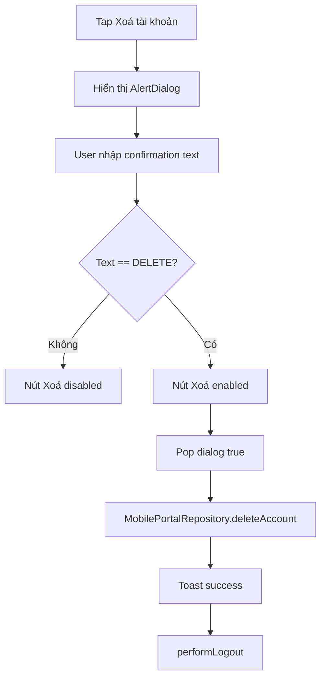

# Hồ sơ người dùng

| Mục | Giá trị |
|-----|---------|
| Tên màn (UI) | Hồ sơ người dùng / Profile |
| Class chính | `UserProfilePage` |
| Module | `packages/supa_foundation/lib/modules/profile/` |
| Route | `/user/profile` |
| Tổng số dòng | 757 dòng `user_profile_page.dart`; 1114 dòng gồm `change_password_page.dart` |
| Cập nhật lần cuối | 2026-06-04 (Thêm xác nhận nhập `DELETE` trước khi xoá tài khoản) |

## Giới thiệu

Màn hồ sơ người dùng hiển thị thông tin tài khoản hiện tại, tenant đang chọn, avatar và các hành động cá nhân như đổi mật khẩu, chọn ngôn ngữ, đổi theme, mở cài đặt, xoá tài khoản và đăng xuất.

Màn được mở từ profile entry của app shell qua `showProfilePage()` hoặc được nhúng trong desktop sidebar với `popOnAction = false`.

## Cây thư mục source

```text
packages/supa_foundation/lib/modules/profile/
├── user_profile_page.dart          # 757 dòng
├── change_password_page.dart       # 357 dòng
└── change_password_success_modal.dart
```

## Route & điều hướng

- `UserProfilePage.location = '/user/profile'`.
- `packages/supa_foundation/lib/extensions/flutter.dart` mở màn này qua `showProfilePage()`.
- Desktop sidebar nhúng trực tiếp `UserProfilePage(onPageRequested: ..., popOnAction: false)`.
- Các action có điều hướng phụ: đổi mật khẩu (`ChangePasswordPage`), cài đặt app (`/settings/app` hoặc `onPageRequested`).

## Widget & component

| Widget / component | File | Vai trò |
|--------------------|------|---------|
| `UserProfilePage` | `user_profile_page.dart` | Màn hồ sơ và danh sách setting tile |
| `SettingTile` | `packages/supa_foundation/lib/widgets/molecules/setting_tile.dart` | Item hành động trong profile |
| `AppUserAvatar` | `packages/supa_foundation/lib/widgets/molecules/app_user_avatar.dart` | Avatar user và upload avatar |
| `AlertDialog` + `TextField` | Flutter Material | Dialog xác nhận unlink / xoá tài khoản |
| `toastification` | package external | Hiển thị success/error khi upload, link/unlink, xoá tài khoản |

## State & data

- State local: danh sách ngôn ngữ `_languages`, trạng thái upload avatar `_isUploadingAvatar`.
- Repository:
  - `PortalProfileRepository` load language và profile.
  - `MobilePortalRepository` upload avatar, đổi thông tin, xoá tài khoản.
  - `AccountLinkingService` link/unlink tài khoản external.
- Authentication state lấy qua `AuthenticationBloc`; sau khi refresh profile sẽ emit `UsingSavedAuthenticationEvent`.

## Logic chính

- `initState()` gọi `_handleGetLanguages()` để chuẩn bị bottom sheet chọn ngôn ngữ.
- Upload avatar dùng `ImagePickerService`, chặn web bằng `kIsWeb`, refresh profile sau khi upload thành công.
- Xoá tài khoản gọi `_showDeleteAccountConfirmation()` trước. Dialog chỉ enable nút xoá khi người dùng nhập đúng `DELETE`.
- Sau khi API xoá account thành công, app hiển thị toast thành công, gọi `performLogout(this.context)`, rồi pop nếu màn đang ở dạng modal.

## Luồng đặc biệt



## Lưu ý khi sửa

- Không dùng `ScaffoldMessenger`; feedback phải qua `toastification`.
- Sau mỗi `await` trong widget, dùng `mounted` hoặc `this.context` theo rule analyzer để tránh `use_build_context_synchronously`.
- Không hard-code UI text mới; thêm key vào `assets/i18n/<lang>/general.json` và chạy `dart run supa_l10n_manager merge`.
- Với action xoá tài khoản, giữ nút xoá disabled cho đến khi nhập đúng `DELETE`; không chỉ validate sau khi bấm.

## Liên kết

- [Của tôi](../cua-toi/README.md)
- Source: `packages/supa_foundation/lib/modules/profile/user_profile_page.dart`
