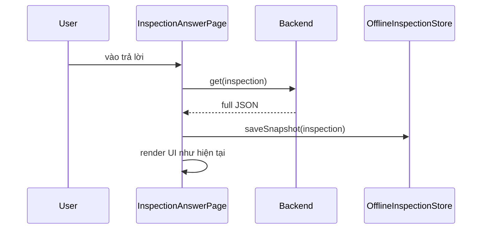
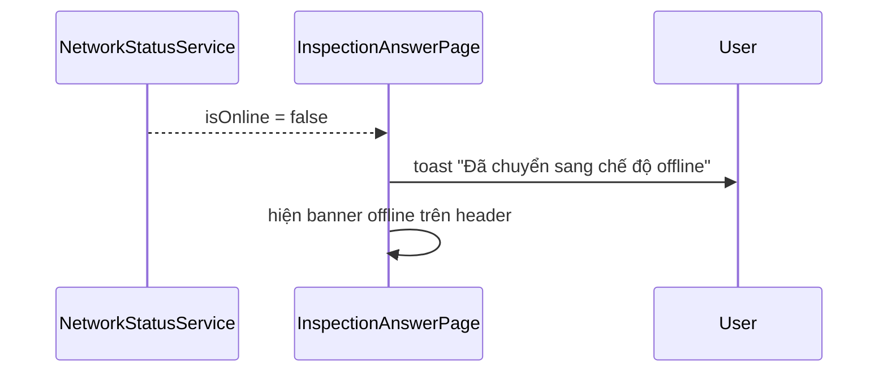
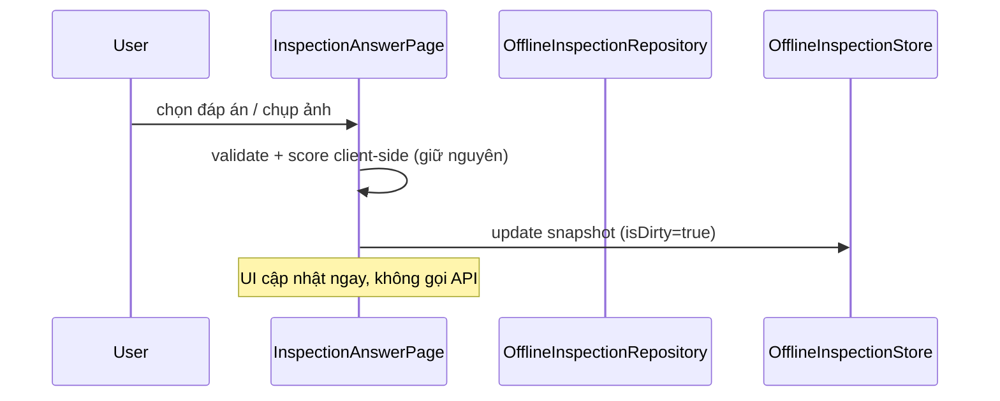
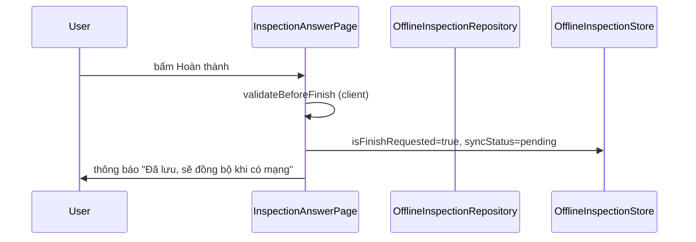
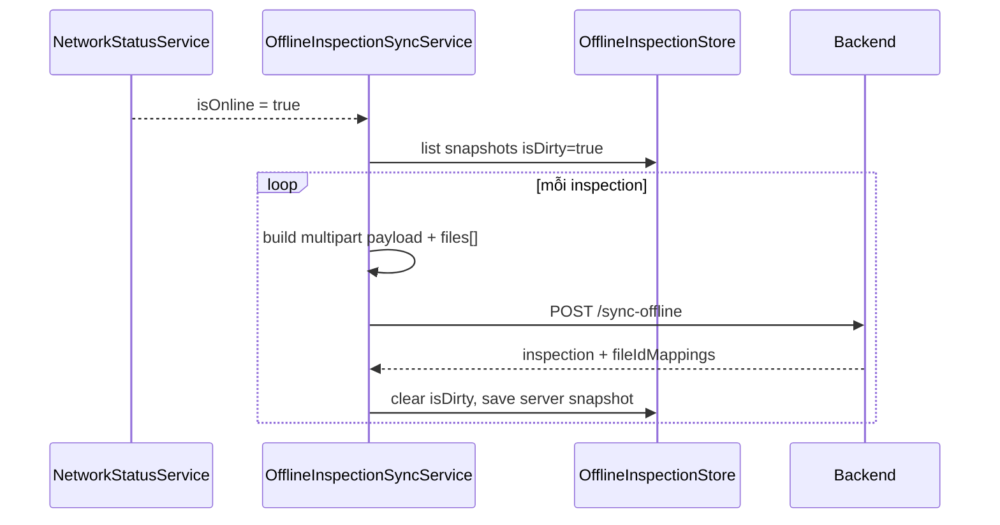

# Trả lời checklist — Chế độ offline

| Mục                    | Giá trị                                                           |
| ---------------------- | ----------------------------------------------------------------- |
| **Tên tính năng (UI)** | Chế độ offline khi trả lời checklist                              |
| **Màn hình liên quan** | `InspectionAnswerPage`                                            |
| **Package**            | `supa_work` → `lib/pages/inspection/` + module mới `lib/offline/` |
| **Route**              | `/work/inspection/answer` (cùng màn trả lời checklist)            |
| **Trạng thái**         | **Đã implement (client v1)**                                        |
| **Cập nhật lần cuối**  | 2026-07-02 — Ẩn SaveStatusIndicator khi offline trên InspectionAnswerPage |

## Giới thiệu

Tính năng cho phép user **tiếp tục trả lời checklist khi mất mạng** trong phạm vi một inspection đang mở. Dữ liệu được lưu cục bộ (snapshot inspection), tự đồng bộ lên server bằng **một API bulk** khi có mạng trở lại.

**Phạm vi:**

- Chỉ áp dụng khi user đang ở màn **Trả lời checklist** (`InspectionAnswerPage`).
- **Danh sách checklist** (`InspectionPage` / `InspectionChecklistPage`): online → `fetchChecklistPage()` lấy `/list`, `/list-by-site`, `/count` rồi **lưu raw JSON** vào Hive (`saveChecklistPageSnapshotRaw`). Khi user bật offline trong khi đang xem list → **persist snapshot đang hiển thị** trước khi đổi tab. Offline → `loadChecklistPage()` từ DB; banner cached list.
- Không thay đổi luồng chi tiết checklist hay các module khác (trừ badge "đang đồng bộ" trên list).

**Điều kiện tiên quyết:**

- User phải **mở inspection online ít nhất một lần** để app tải và cache snapshot.
- Nếu chưa có cache mà mất mạng → **chặn vào màn**, hiện thông báo yêu cầu mở khi có mạng.

## Yêu cầu nghiệp vụ

| #   | Yêu cầu                     | Chi tiết                                                                                                |
| --- | --------------------------- | ------------------------------------------------------------------------------------------------------- |
| 1   | Phát hiện mất mạng          | Khi vào trả lời hoặc đang trả lời mà mất mạng → toast; khi có mạng lại → toast back online; banner icon wifi off |
| 2   | Lưu câu trả lời local       | Mọi thay đổi cập nhật **snapshot inspection** trong Hive (`isDirty=true`) |
| 3   | Ảnh/video không upload ngay | Chụp/chọn file → lưu file local + gắn `localFileId` âm vào snapshot      |
| 4   | Chặn tạo task thủ công      | User không mở form `InspectionTaskAssignmentFormPage` khi offline       |
| 5   | Auto-task giữ nguyên        | Task sinh tự động từ conditional (`AUTO_CREATE_ACTION`) vẫn chạy logic client hiện tại |
| 6   | Hoàn thành offline          | Bấm Hoàn thành → validate local, set `isFinishRequested=true`, đánh dấu **đang đồng bộ** |
| 7   | Sync nền toàn app           | Có mạng → gọi **1 API** `/sync-offline` cho mỗi inspection dirty          |

## Kiến trúc hiện tại (baseline)

Màn `InspectionAnswerPage` (~2974 dòng) gọi API trực tiếp:

| Thao tác           | Repository / API                                       |
| ------------------ | ------------------------------------------------------ |
| Load inspection    | `MobileInspectionRepository.get()` / `startEvaluate()` |
| Autosave answer    | `syncQuestionAnswer(InspectionQuestionHistory)`        |
| Autosave note/file | `syncQuestion(InspectionQuestionHistory)`              |
| Upload media       | `WorkFileRepository.uploadXFiles()`                    |
| Hoàn thành         | `finishDraft()` → `finish()`                           |

Validation, scoring, conditional, auto-task đã chạy **client-side** (`InspectionValidator`, `InspectionScoreCalculator`, `_handleAutoCreateTasks`). Offline mode tận dụng các logic này, chỉ thay tầng persist/sync.

Validation, scoring, conditional, auto-task đã chạy **client-side** (`InspectionValidator`, `InspectionScoreCalculator`, `_handleAutoCreateTasks`). Offline mode tận dụng các logic này, chỉ thay tầng persist/sync.

**Hai chế độ gọi API:**

| Chế độ | Khi nào | Cách sync |
|--------|---------|-----------|
| **Online** | Có mạng | Giữ nguyên API hiện tại (`syncQuestionAnswer`, `syncQuestion`, `uploadXFiles`, `finishDraft`, `finish`) — autosave realtime |
| **Offline → sync** | Mất mạng rồi có mạng lại | Upload file local trước, rồi **1 API** `POST /sync-offline` gửi `items[]` |

## API bulk sync (BE) — contract đề xuất

Endpoint mới trên base hiện tại `POST {baseApiUrl}/rpc/work/inspection/sync-offline`.

### Transport

`application/json`:

| Field | Kiểu | Bắt buộc | Mô tả |
|------|------|----------|--------|
| `clientSyncId` | string | Có | Idempotency key cho offline session |
| `inspectionId` | number | Có | Inspection cần sync |
| `items` | array | Có | Danh sách operation typed (`sync-question-answer`, `sync-question`, `sync-inspection-information`) |

### Request body — `InspectionOfflineSyncRequest`

```json
{
  "clientSyncId": "550e8400-e29b-41d4-a716-446655440000",
  "inspectionId": 322173225877504,
  "items": [
    {
      "type": "sync-question-answer",
      "inspectionQuestionHistory": { }
    },
    {
      "type": "sync-question",
      "inspectionQuestionHistory": { }
    },
    {
      "type": "sync-inspection-information",
      "inspectionInformationHistory": { }
    }
  ]
}
```

| Field | Kiểu | Mô tả |
|-------|------|--------|
| `clientSyncId` | UUID string | **Idempotency key** — gọi lại cùng ID trả kết quả cũ, không apply 2 lần |
| `inspectionId` | long | ID inspection |
| `items[].type` | string | `sync-question-answer` \| `sync-question` \| `sync-inspection-information` |
| `items[].inspectionQuestionHistory` | object | Payload đúng format API online `sync-question-answer` hoặc `sync-question` |
| `items[].inspectionInformationHistory` | object | Payload đúng format API online `sync-inspection-information` |

#### `mappingType` gợi ý

| Value | Gắn vào field nào trong inspection |
|-------|----------------------------------|
| `questionFile` | `inspectionQuestionFileMappings` của câu hỏi |
| `questionAnswerImage` | `inspectionQuestionAnswers[].imageId` (answer type IMAGE) |

Trong snapshot offline, `fileId` / `imageId` mang **giá trị âm** (`localFileId`) cho đến khi BE upload xong và trả mapping.

### Response — `InspectionOfflineSyncResponse`

```json
{
  "syncStatus": "success",
  "processedCount": 3,
  "syncErrors": []
}
```

| Field | Mô tả |
|-------|--------|
| `syncStatus` | `success` \| `validation_error` \| `failed` |
| `processedCount` | Số item đã apply thành công trước khi fail |
| `syncErrors` | Chi tiết lỗi field-level nếu validation fail |

### BE xử lý (gợi ý logic)

1. **Idempotency**: nếu `clientSyncId` đã xử lý → trả cached response.
2. **Authorize**: user có quyền `canUpdate` inspection.
3. **Conflict check** (optional v1): so `baseUpdatedAt` với DB; nếu server mới hơn → `syncStatus=conflict`.
4. Duyệt `items[]` theo thứ tự, mỗi item tái sử dụng handler của API online tương ứng.
5. Nếu item fail: dừng, trả `failed` + `processedCount`.
6. Không xử lý finish trong `sync-offline` (mobile gọi `finish-draft` + `finish` riêng sau khi sync success).

### HTTP status codes

| Code | Khi nào |
|------|---------|
| 200 | Sync thành công |
| 400 | Validation fail (`syncStatus=validation_error`, errors chi tiết) |
| 401/403 | Auth / permission |
| 500 | Lỗi server |

### Lưu ý BE

- Payload `inspection` có thể **lớn** (nhiều page, question, nested task) — cân nhắc gzip request nếu cần.
- Transaction atomic: upload file + merge + finish nên trong 1 transaction; fail thì rollback (trừ file đã upload — có thể orphan cleanup job).
- Không cần implement lại từng endpoint `sync-question-answer` riêng lẻ phía client offline — BE gom logic merge vào handler này.
- Có thể tái sử dụng nội bộ code của `syncQuestionAnswer`, `syncQuestion`, `finish` hiện có.

## Kiến trúc client đề xuất

```text
packages/supa_work/lib/offline/
├── DOCS.md
├── offline_inspection_snapshot.dart     # Model snapshot + metadata sync
├── offline_inspection_store.dart        # Hive: snapshot dirty per inspection
├── offline_inspection_repository.dart   # Online → API cũ; Offline → update snapshot
└── offline_inspection_sync_service.dart # Gọi 1 API sync-offline khi có mạng

packages/supa_foundation/lib/services/
├── network_status_service.dart
├── network_status_toast_coordinator.dart
└── offline_image_cache_service.dart      # Cache ảnh network cho offline viewing
```

### Thành phần

| Component | Vai trò |
|-----------|---------|
| `NetworkStatusService` | Broadcast `isOnline` |
| `NetworkStatusToastCoordinator` | Hiển thị toast khi mạng thay đổi (global) |
| `OfflineImageCacheService` | Cache ảnh network về local để xem khi offline |
| `OfflineInspectionStore` | Lưu snapshot JSON + `isDirty`, `isFinishRequested`, `clientSyncId`, registry file local |
| `OfflineInspectionRepository` | Online: delegate API cũ; Offline: chỉ ghi snapshot local |
| `OfflineInspectionSyncService` | Khi online: lấy mọi snapshot `isDirty` → build multipart → `syncOffline()` |

### Local storage (Hive) — đơn giản hóa

| Box | Key | Nội dung |
|-----|-----|----------|
| `inspection_offline_snapshots` | `inspectionId` | `OfflineInspectionSnapshot` |

```dart
class OfflineInspectionSnapshot {
  int inspectionId;
  String clientSyncId;       // UUID, tạo 1 lần khi bắt đầu offline session
  bool isDirty;
  bool isFinishRequested;
  DateTime? finishedAt;
  DateTime? baseUpdatedAt;   // updatedAt từ server lần GET cuối
  String syncStatus;         // synced | pending | syncing | failed
  Map<String, dynamic> inspectionJson;  // full Inspection.toJson()
  List<OfflineLocalFile> localFiles;    // path + localFileId + mappingType + questionId
}
```

**Không cần** `PendingOperation` FIFO / replay từng API nữa — snapshot luôn là state mới nhất.

### Thư mục file media offline

```text
<app_documents>/inspection_offline/<inspectionId>/
├── -1782811461863.jpg
└── -1782811579888.mp4
```

Tên file = `{localFileId}{extension}`; xóa sau sync thành công.

### Trạng thái sync

| `syncStatus` | Ý nghĩa UI |
|--------------|------------|
| `synced` | Không có thay đổi offline chưa gửi |
| `pending` | `isDirty=true`, chờ có mạng |
| `syncing` | Đang gọi `/sync-offline` |
| `failed` | Sync lỗi sau retry — user có thể retry thủ công (v2) |

## Luồng chính

### 1. Mở inspection lần đầu (online)



### 2. Mất mạng khi đang trả lời



### 3. Trả lời / upload ảnh offline

Mọi luồng chụp/chọn ảnh trong checklist đi qua `AbstractInspectionMediaState` → `_uploadImagesOfflineAware`. Các widget con (`AnswerTypeItem`, `AnswerField`, `AnswerFieldResponseSet`, `InformationTypeItem`) override `offlineUploadConfig` để khi `NetworkStatusService.isOnline == false` gọi `OfflineInspectionRepository.uploadFiles()` (lưu file local + ID âm) thay vì `MobileFileRepository` → `/multi-upload-file`.



### 4. Hoàn thành offline



### 5. Sync nền khi có mạng (1 API)



## Mapping hành vi ↔ API

| Hành vi | Online (có mạng) | Offline (local) | Khi sync lại |
|---------|------------------|-----------------|--------------|
| Chọn đáp án | `syncQuestionAnswer` | Cập nhật snapshot | Gửi trong `inspection` bulk |
| Sửa note / file | `syncQuestion` | Cập nhật snapshot | Gửi trong `inspection` bulk |
| Chụp ảnh | `uploadXFiles` → sync | Lưu file local + ID âm | Part `files[]` + mapping |
| Hoàn thành | `finishDraft` → `finish` | `isFinishRequested=true` | `isFinish=true` trong bulk API |

## Thay đổi UI

### `InspectionAnswerPage`

| Vị trí                        | Thay đổi                                                                |
| ----------------------------- | ----------------------------------------------------------------------- |
| Header                        | Banner "Chế độ offline — sẽ đồng bộ khi có mạng"                        |
| `_initializeInspectionDetail` | Offline + có cache → load snapshot; offline + không cache → toast + pop |
| Save indicator                | Offline: **ẩn** `SaveStatusIndicator` ("Đã lưu thay đổi") |
| `_onComplete`                 | Offline: enqueue finish, không gọi API trực tiếp                        |

### Chặn tạo task thủ công

Kiểm tra `NetworkStatusService.isOnline` trước khi navigate:

| File                                                     | Entry point                           |
| -------------------------------------------------------- | ------------------------------------- |
| `widgets/inspection_answer/answer_type_item.dart`        | Mở `InspectionTaskAssignmentFormPage` |
| `flag_detail_page.dart`                                  | Tạo task từ flag                      |
| `widgets/inspection_flag_item/inspection_flag_item.dart` | Tạo task từ flag item                 |

Offline → `toastification.show` cảnh báo, **không** navigate.

### Badge danh sách checklist

Trên `InspectionPageWidget` (list + grid): mỗi dòng hiện badge sync nếu snapshot có `syncStatus != synced`. Khi `syncing`, icon `arrow_sync` xoay tròn (`InspectionOfflineSyncSpinner`).

Màn chi tiết checklist (`InspectionDetailNewPage`): icon xoay tròn trên app bar khi inspection đang `syncing`; badge text cho `pending` / `failed`.

## Thông báo chuyển mạng (UI)

| Sự kiện | Thông báo |
|---------|-----------|
| Online → Offline | Toast `general.network.offlineSwitched` (mọi màn) |
| Offline → Online | Toast `general.network.backOnline` (mọi màn) |
| Bắt đầu / xong sync bulk | Toast `work.inspection.offline.syncing` / `.syncComplete` |

Banner offline màn trả lời: icon `wifi_off` trên `InspectionHeader`.

Danh sách checklist offline: hiển thị cache lần tải cuối + banner `work.inspection.offline.viewingCachedList`; mỗi dòng có badge sync nếu có snapshot dirty.

## Debug tool (dev only)

- App có thêm nút nổi debug toàn cục `DebugOfflineToggleFab` ở `main.dart` (chỉ hiện khi `kDebugMode`).
- Bấm nút để force online/offline qua `NetworkStatusService.setDebugOnlineOverride(...)`.
- Nút phụ `restart_alt` dùng để clear override và quay về trạng thái mạng thật từ `connectivity_plus`.

## Giới hạn & edge cases

| Tình huống                                  | Xử lý                                                           |
| ------------------------------------------- | --------------------------------------------------------------- |
| Chưa mở inspection khi online               | Chặn vào, yêu cầu mở khi có mạng                                |
| User sửa cùng inspection trên thiết bị khác | Chấp nhận conflict theo timestamp BE (không merge phức tạp v1)  |
| File placeholder ID âm                      | Dùng `-microsecondsSinceEpoch`; rewrite sang ID thật sau upload |
| Watermark ảnh                               | Apply trước khi copy vào thư mục offline                        |
| Auto-task conditional                       | Chỉ local memory + snapshot; BE tạo task thật khi sync answer   |
| App kill giữa chừng                         | Hive persist snapshot; sync tiếp khi mở app + có mạng |
| Retry thất bại                              | Exponential backoff trên **1 request** `/sync-offline` |
| Gọi sync 2 lần (mạng flapping)              | `clientSyncId` idempotency — BE không apply trùng      |

## Checklist triển khai

### Phase 1 — Hạ tầng + BE

- [x] **BE**: implement `POST /rpc/work/inspection/sync-offline` theo contract trên
- [x] Thêm `connectivity_plus` + `NetworkStatusService`
- [x] Thêm `hive` / `hive_flutter` + init box
- [x] Tạo `OfflineInspectionSnapshot` + `OfflineInspectionStore`

### Phase 2 — Core offline (Flutter)

- [x] `MobileInspectionRepository.syncOffline()` — multipart builder
- [x] `OfflineInspectionSyncService` — 1 API per dirty inspection
- [x] Copy media vào `inspection_offline/<id>/` với `localFileId` âm

### Phase 3 — Tích hợp UI

- [x] Refactor `InspectionAnswerPage` dùng facade thay `MobileInspectionRepository()` trực tiếp
- [x] Banner offline + load cache khi mất mạng
- [x] Finish offline + mark syncing
- [x] Chặn tạo task thủ công
- [x] Badge "đang đồng bộ" trên danh sách + chi tiết (icon xoay khi syncing)

### Phase 4 — Chất lượng

- [ ] Unit test: build multipart payload, `localFileId` mapping, idempotency `clientSyncId`
- [ ] Widget test: banner offline, submit offline lưu store
- [x] `dart format` + `dart analyze`
- [ ] GitNexus impact trước khi sửa `syncQuestionAnswer`, `syncQuestion`, `_onComplete`

### Phase 5 — i18n

- [x] Thêm key partial JSON (`work.inspection.offline.*`) cho 4 ngôn ngữ

| Key (gợi ý)                             | VI                                      |
| --------------------------------------- | --------------------------------------- |
| `work.inspection.offline.banner`        | (dự phòng; UI banner chỉ dùng icon wifi off) |
| `work.inspection.offline.switched`      | Đã chuyển sang chế độ offline           |
| `work.inspection.offline.backOnline`    | Đã có mạng — dữ liệu sẽ được đồng bộ    |
| `work.inspection.offline.noCache`       | Cần mở checklist khi có mạng lần đầu    |
| `work.inspection.offline.finishPending` | Đã lưu, sẽ đồng bộ khi có mạng          |
| `work.inspection.offline.taskBlocked`   | Không thể tạo công việc khi offline     |
| `work.inspection.offline.syncing`       | Đang đồng bộ                            |

## Lưu ý maintainer

- Khi **online**: vẫn dùng API autosave cũ — không đổi hành vi hiện tại.
- Khi **offline**: mọi thay đổi chỉ ghi vào `OfflineInspectionSnapshot`; không gọi API.
- Sync offline: **chỉ** `POST /sync-offline` — không replay FIFO `syncQuestionAnswer` / `finish` riêng lẻ.
- `clientSyncId` giữ cố định trong suốt 1 offline session cho đến khi sync thành công.
- Auto-task (`_handleAutoCreateTasks`) chỉ local — BE tạo task thật khi nhận bulk sync.
- Chạy `gitnexus_impact` trước khi sửa symbol dùng chung.
- Sau implement: cập nhật section "Chế độ offline" trong [`docs/tra-loi-checklist/README.md`](../tra-loi-checklist/README.md).

### File sync offline

- `inspection_history_extensions.dart`: các method `toAnswerHistory()`, `toNoteFileHistory()`, `toHistory()`, `toFileHistory()` **không filter** `fileId == -1` hoặc `imageId == -1` — file offline có ID âm sẽ được gửi lên và rewrite sau khi upload.
- `OfflineInspectionSyncService._uploadLocalFilesAndRewriteIds()`: upload file local trước → nhận ID thật → rewrite trong snapshot + operations.

### Cache ảnh offline viewing

- `OfflineImageCacheService`: cache ảnh network về `<app_documents>/image_cache/<hash>` khi tải.
- `AppNetworkImage`: kiểm tra cache khi offline → hiển thị ảnh đã cache; online → tải + cache.
- Ảnh được cache **tự động** khi hiển thị qua `AppNetworkImage` — không cần gọi thủ công.

## Liên kết

- [`docs/tra-loi-checklist/README.md`](../tra-loi-checklist/README.md) — màn trả lời checklist (baseline)
- [`docs/chi-tiet-checklist/README.md`](../chi-tiet-checklist/README.md) — màn cha, điều hướng Tiếp tục
- [`docs/checklist/README.md`](../checklist/README.md) — danh sách checklist
- [`packages/supa_work/lib/pages/inspection/inspection_answer_page.dart`](../../packages/supa_work/lib/pages/inspection/inspection_answer_page.dart) — file chính cần tích hợp
- [`packages/supa_work/lib/repositories/mobile_inspection_repository.dart`](../../packages/supa_work/lib/repositories/mobile_inspection_repository.dart) — API inspection
- [`packages/supa_work/lib/core/models/inspection_history_extensions.dart`](../../packages/supa_work/lib/core/models/inspection_history_extensions.dart) — `toAnswerHistory` / `toNoteFileHistory`
