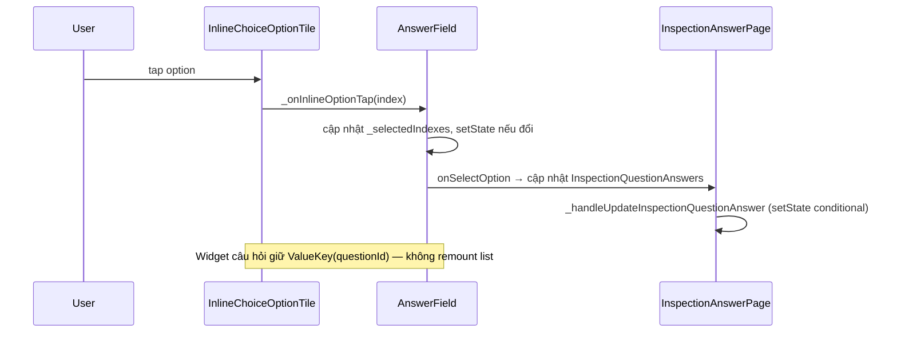

# Trả lời checklist (Inspection answer)

| Mục | Giá trị |
|-----|---------|
| **Tên màn (UI)** | Trả lời checklist / Đánh giá checklist |
| **Class chính** | `InspectionAnswerPage` |
| **Package** | `supa_work` → `lib/pages/inspection/` |
| **Route** | `/work/inspection/answer` (`InspectionAnswerPage.location`), đánh giá `/work/inspection/evaluate` (`InspectionAnswerPage.evaluateLocation`) |
| **Số dòng** | 3296 (`inspection_answer_page.dart`) + widgets `inspection_answer/` (xem cây thư mục) |
| **Cập nhật lần cuối** | 2026-07-27 — Tối ưu mở FastCamera (không Samsung): bỏ chờ `androidInfo` trên iOS, cache manufacturer Android, loading tối + fade preview; Samsung giữ delay 1s + camera cũ. |

## Đối chiếu docs cũ (`docsold/inspections/`)

| Hạng mục trong docs cũ | Có bị ảnh hưởng? | Ghi chú |
|------------------------|------------------|---------|
| Luồng answer (`architecture-overview.md`: Input → `onSelectOption` → `_handleUpdateInspectionQuestionAnswer` → `syncQuestionAnswer`) | **Không** | Vẫn gán `inspectionQuestionAnswers`, gọi `_handleUpdateInspectionQuestionAnswer()` — hàm này vẫn `setState` validation, conditional, scoring. |
| Model SINGLE/MULTIPLE_CHOICE (`answer-types-system.md`) | **Không** | Vẫn set `inspectionAnswerOptionId` / list answers; response set vẫn chỉ set `inspectionQuestionResponseContentId`. |
| Chọn widget ResponseSet vs Options | **Không** | Điều kiện `questionnaireResponseSetId != 0` giữ nguyên. |
| Validation & scoring client-side | **Không** | Vẫn trong `_validator.validateQuestionAnswer` + `_recalculateScores` sau mỗi chọn. |
| Conditional / auto-create task | **Không** | Vẫn `_handleAutoCreateTasks` trong `_handleUpdateInspectionQuestionAnswer`. |
| Bottom sheet khi >5 options | **Không** | `InpectionSelectOptions` / `InpectionResponseSetSelectOptions` không đổi. |
| `GlobalKey` scroll (`_questionKeys`) | **Không** | Chỉ đổi `ValueKey` trên widget choice, không đụng key scroll. |
| Mô tả UI choice trong docs cũ | **Docs cũ thiếu** | `answer-types-system.md` chỉ mô tả modal `InkWell` + `_selectOptions()`; code thực tế **đã có** inline `ListView` khi `options.length <= 5` — thay đổi lần này chỉ tối ưu render inline, không đổi hành vi chọn. |

**Thay đổi chỉ ở tầng UI/render:** ổn định `ValueKey`, tránh `setState` thừa trước `_handleUpdateInspectionQuestionAnswer`, `didUpdateWidget` sync selection bằng `setEquals` thay vì reset mỗi lần parent rebuild.

**Sửa phụ (đúng hành vi docs cũ hơn):** `answer_field_response_set.dart` — single choice inline trước đó thiếu `setState` nên UI có thể không đổi màu ngay; giờ gọi `setState` khi selection đổi.

Tài liệu kỹ thuật cũ (tham khảo, không commit): `docsold/inspections/README.md`, `architecture-overview.md`, `answer-types-system.md`.


Màn làm checklist: hiển thị danh sách câu hỏi, nhập/trả lời theo loại (`TEXT`, `NUMBER`, `SINGLE_CHOICE`, `MULTIPLE_CHOICE`, media, …), lưu đồng bộ qua API và xử lý conditional (warning, auto-task).

Vào từ **Chi tiết checklist** (Tiếp tục / Evaluate), danh sách checklist hôm nay, hoặc preview đăng ký (`SignupInspectionPreviewPage`).

## Cây thư mục (phần liên quan)

```text
packages/supa_work/lib/pages/inspection/
├── inspection_answer_page.dart
├── signup_inspection_preview_page.dart          # preview khi đăng ký — dùng chung pattern choice
└── widgets/inspection_answer/
    ├── answer_field.dart                        # input theo answerType; inline choice ≤5 options
    ├── answer_field_response_set.dart           # tương tự cho response set
    ├── inline_choice_option_tile.dart           # một option inline (extract 2026-06-29)
    └── inspection_question_types/
        ├── inspection_question_type_select_options.dart
        └── inspection_question_response_set_type_select_options.dart
```

## Widget & component — câu hỏi lựa chọn

| Widget | File | Vai trò |
|--------|------|---------|
| `InspectionQuestionTypeSelectOptions` | `inspection_question_type_select_options.dart` | Wrapper câu hỏi choice thường → `AnswerField` |
| `InspectionQuestionResponseSetTypeSelectOptions` | `inspection_question_response_set_type_select_options.dart` | Wrapper choice từ response set → `AnswerFieldResponseSet` |
| `AnswerField` | `answer_field.dart` | ≤5 options: `ListView` inline; >5: bottom sheet `InpectionSelectOptions` |
| `AnswerFieldResponseSet` | `answer_field_response_set.dart` | Tương tự cho `InspectionQuestionResponseContent` |
| `InlineChoiceOptionTile` | `inline_choice_option_tile.dart` | Một dòng đáp án inline; `ValueKey(option.id)` |
| `FastCameraCapturePage` | `supa_foundation/widgets/pages/fast_camera_capture_page.dart` | Camera chụp liên tục dùng `camerawesome` + `flutter_image_compress`; không tự chuyển sang sensor 0.5x; watermark mặc định tắt; hẹn giờ Off / 3s / 5s. |

## Luồng chọn đáp án inline (≤5 options)



## Kết quả debug log (2026-06-30)

Log user gửi xác nhận:

```
rs_322173225971713_0_          → chưa chọn (answersLen=0)
rs_322173225971713_1_0         → sau chọn (answersLen=1, answerIds=[0])
```

- Câu hỏi dùng **Response Set** (`rs_`), không phải option thường (`q_`).
- **`ValueKey` đổi mỗi lần chọn** → Flutter remount toàn widget → hiệu ứng trượt từ trên.
- `answerIds=[0]` = answer mới tạo local **chưa có id từ BE** — app gắn vào key nên key càng đổi rõ hơn.
- **Không phải BE thiếu field** — BE trả đủ; các câu đã có answer hiện `answerIds=[322426706419712]` (id thật).

## Logic chính — tối ưu render

**Vấn đề cũ:** `ValueKey` trên block câu hỏi choice gắn thêm `answers.length` và danh sách answer ID → mỗi lần chọn remount toàn bộ `AnswerField` + `ListView` → hiệu ứng “trượt xuống”.

**Cách xử lý:**

1. **`inspection_answer_page.dart` / `signup_inspection_preview_page.dart`**
   - `ValueKey('q_${questionId}')` hoặc `ValueKey('rs_${questionId}')` — **chỉ question ID**.
   - `onSelectOption`: gán `currentInspectionQuestion` trực tiếp, không `setState` thừa trước `_handleUpdateInspectionQuestionAnswer()`.

2. **`answer_field.dart` / `answer_field_response_set.dart`**
   - Mỗi option: `InlineChoiceOptionTile` với `ValueKey(option.id)`.
   - `ValueKey` ổn định trên `AnswerField` (`af_${questionId}` / `afrs_${questionId}`).
   - **`inline_choice_selection.dart`**: map index đúng cả `option.id` lẫn `option.answerOptionId` (dữ liệu API vs sau khi user chọn khác nhau).
   - **`didUpdateWidget`**: chỉ sync `_selectedIndexes` khi **fingerprint** đáp án đổi — parent `setState` (validation/conditional) không reset list.
   - `_onInlineOptionTap`: cập nhật local trước, sau đó gọi `onSelectOption` ngay bằng `unawaited(...)` để `InspectionAnswerPage` cập nhật local answer và schedule autosave tức thì.
   - Không giữ queue pending ở widget con, vì `_awaitPendingInputAndSaves()` trên page chỉ chờ được debounce timer/API save trong page, không quan sát được queue riêng của child widget.
   - Xóa `didChangeDependencies` gắn index (gây duplicate / lệch state).

3. **Phần dưới câu hỏi** (warning, auto-task từ conditional) vẫn rebuild khi answer đổi — chỉ danh sách option inline không bị remount/reset.

4. **`answer_type_item.dart`**
   - Warning/error có thể xuất hiện trước vùng input sau khi validate, làm index của subtree answer đổi.
   - Container bao quanh `widget.child` dùng `ValueKey('answer_body_${questionId}')` để Flutter giữ đúng subtree input khi warning/error được thêm hoặc bỏ.

5. **Autosave status** (`InspectionAnswerPage`)
   - Không dùng `SaveStatusMixin` cho page này vì `setSaveStatus()` của mixin gọi `setState` toàn màn.
   - Dùng `ValueNotifier<String?>` + `ValueListenableBuilder` để chỉ rebuild `SaveStatusIndicator`.
   - Giữ nguyên trạng thái `loading` / `success` / `error` và auto-hide success sau 3 giây.

6. **Backend finish validation** (`InspectionAnswerPage`)
   - `_applyBackendFinishErrors` match question/sub-question theo `id`.
   - Với câu BE trả lỗi, local chỉ merge phần dữ liệu trả lời từ BE: answers, files/evidence, note, score hiện tại, task/percent và `errors/generalErrors`.
   - Các field cấu hình như nội dung câu hỏi, loại đáp án, required, options, response contents, conditionals, max score, instruction file... giữ nguyên theo local.
   - Vẫn đánh dấu `_clientValidationErrors` từ `errors/generalErrors` để giữ logic navigate page lỗi và scroll tới câu lỗi đầu tiên.

7. **Media upload**
   - `InspectionAnswerPage._uploadMultipleImages` thêm watermark thời gian trước upload; không lấy location cho watermark.
   - `AbstractInspectionMediaState` vẫn mặc định `applyCameraWatermark=false`, nhưng ba answer widget bật cờ này để camera fast watermark ngay sau native compression.
   - `InformationAnswerPage` và các consumer khác không bị đổi cấu hình camera trong thay đổi này.

8. **Camera native compression**
   - `AbstractInspectionMediaState.pickImages` và `pickImagesPreview` sử dụng `FastCameraCapturePage`; `CameraCapturePageNew` vẫn được giữ nguyên để có thể chuyển lại khi cần.
   - `DeviceCameraPage` giữ nhánh tương thích theo thiết bị: Samsung tiếp tục dùng `CameraCapturePage` cũ (bao gồm delay bảo vệ 1 giây hiện có); thiết bị khác và fallback dùng `FastCameraCapturePage`.
   - Camera mở bằng sensor sau mặc định của thiết bị, không gọi `getSensors()` và không chuyển sang ultra-wide trong lúc khởi tạo.
   - Mỗi ảnh được nén bằng native codec của `flutter_image_compress`, mặc định tối đa `1280 × 1280`, JPEG quality `80`, rồi mới thêm vào danh sách ảnh đã chụp.
   - `applyWatermark` mặc định là `false`. Ba answer widget của `InspectionAnswerPage` bật `applyCameraWatermark=true`; các consumer khác giữ mặc định tắt.
   - Watermark camera chỉ tạo từ thời gian hiện tại (`Time: yyyy-MM-dd HH:mm:ss`), không gọi GPS và không chứa location.
   - **Hẹn giờ chụp (2026-07-27):** nút timer góc trên phải cycle `Off → 3s → 5s`. Khi đang bật timer, nhấn shutter bắt đầu đếm ngược giữa preview; hết giờ mới `takePhoto`. Nhấn shutter lần nữa (icon ✕) hoặc đóng camera sẽ hủy countdown. Flash / đổi camera / đổi lens / mở gallery bị khóa trong lúc đếm.
   - **Mở camera mượt hơn (2026-07-27, không Samsung):** `DeviceCameraPage` trên iOS/non-Android mở thẳng `FastCameraCapturePage` (không gọi `androidInfo`); Android cache kết quả Samsung sau lần đầu; loading dùng scaffold `inverseSurface`. `FastCameraCapturePage` có `progressIndicator` khi `PreparingCameraState` + fade ~280ms khi preview sẵn sàng. **Samsung không đổi:** vẫn delay 1s + `CameraCapturePage` cũ.

## Lưu ý khi sửa (maintainer)

- Pop về màn chi tiết với `InspectionAnswerRouteResult` (`didEvaluate` / `didMarkIncomplete`) **không** còn kích hoạt auto-send chat — màn cha đã bỏ logic đó.
- Màn Chi tiết cờ phải phân nhánh theo `questionnaireResponseSetId`: response set hiển thị `inspectionQuestionResponseContent.content`, option thường hiển thị `inspectionAnswerOption.textValue`; luôn fallback đối chiếu cả ID instance và ID nguồn.
- **Không** đưa `inspectionQuestionAnswers.length` hoặc answer IDs vào `ValueKey` của widget câu hỏi choice.
- Khi thêm state vào `onSelectOption`, tránh `setState` lặp (AnswerField → page → `_handleUpdateInspectionQuestionAnswer`).
- `selectedOptionsDefault` truyền từ `inspectionQuestion.inspectionQuestionAnswers.value` — so sánh nội dung bằng `setEquals` trên tập index, không chỉ so reference list.
- Bottom sheet (>5 options) dùng `InpectionSelectOptions` / `InpectionResponseSetSelectOptions` — logic tách biệt với inline.
- Sau sửa widget choice: `dart format` + `dart analyze` trên `widgets/inspection_answer/`.
- Khi chuyển camera implementation, chỉ đổi class trong `cameraPageBuilder`; không sửa trực tiếp widget camera cũ. Kiểm thử trên Android/iOS thật vì `camerawesome` và native compression không thể được xác nhận đầy đủ bằng widget test thuần Dart.

## Chế độ offline (planned)

Spec triển khai: [`docs/tra-loi-checklist-offline/README.md`](../tra-loi-checklist-offline/README.md) — cache snapshot inspection, hàng đợi sync, upload media local, hoàn thành offline, auto-sync nền toàn app.

## Liên kết

- [`docs/tra-loi-checklist-offline/README.md`](../tra-loi-checklist-offline/README.md) — spec chế độ offline (đang lên kế hoạch)
- [`docs/chi-tiet-checklist/README.md`](../chi-tiet-checklist/README.md) — màn cha, điều hướng Tiếp tục / Evaluate
- [`docs/checklist/README.md`](../checklist/README.md) — danh sách checklist
