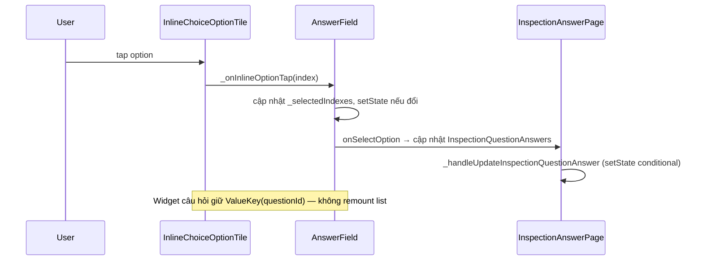

# Trả lời checklist (Inspection answer)

| Mục | Giá trị |
|-----|---------|
| **Tên màn (UI)** | Trả lời checklist / Đánh giá checklist |
| **Class chính** | `InspectionAnswerPage` |
| **Package** | `supa_work` → `lib/pages/inspection/` |
| **Route** | `/work/inspection/answer` (`InspectionAnswerPage.location`), đánh giá `/work/inspection/evaluate` (`InspectionAnswerPage.evaluateLocation`) |
| **Số dòng** | 2974 (`inspection_answer_page.dart`) + widgets `inspection_answer/` (xem cây thư mục) |
| **Cập nhật lần cuối** | 2026-06-30 — Xác nhận qua log: lỗi chính là `ValueKey` response set (`rs_`) gắn `answersLen` + answer row id (kể cả `id=0` khi mới chọn) → remount. Fix: key ổn định `rs_${questionId}` + tối ưu `AnswerFieldResponseSet`. |

## Đối chiếu docs cũ (`docsold/inspections/`)

| Hạng mục trong docs cũ | Có bị ảnh hưởng? | Ghi chú |
|------------------------|------------------|---------|
| Luồng answer (`architecture-overview.md`: Input → `onSelectOption` → `_handleUpdateInspectionQuestionAnswer` → `syncQuestionAnswer`) | **Không** | Vẫn gán `inspectionQuestionAnswers`, gọi `_handleUpdateInspectionQuestionAnswer()` — hàm này vẫn `setState` validation, conditional, scoring. |
| Model SINGLE/MULTIPLE_CHOICE (`answer-types-system.md`) | **Không** | Vẫn set `inspectionAnswerOptionId` / list answers; response set vẫn chỉ set `inspectionQuestionResponseContentId`. |
| Chọn widget ResponseSet vs Options | **Không** | Điều kiện `questionnaireResponseSetId != 0` giữ nguyên. |
| Validation & scoring client-side | **Không** | Vẫn trong `_validator.validateQuestionAnswer` + `_recalculateScores` sau mỗi chọn. |
| Conditional / auto-create task | **Không** | Vẫn `_handleAutoCreateTasks` trong `_handleUpdateInspectionQuestionAnswer`. |
| Bottom sheet khi >5 options | **Không** | `InpectionSelectOptions` / `InpectionResponseSetSelectOptions` không đổi. |
| `GlobalKey` scroll (`_questionKeys`) | **Không** | Chỉ đổi `ValueKey` trên widget choice, không đụng key scroll. |
| Mô tả UI choice trong docs cũ | **Docs cũ thiếu** | `answer-types-system.md` chỉ mô tả modal `InkWell` + `_selectOptions()`; code thực tế **đã có** inline `ListView` khi `options.length <= 5` — thay đổi lần này chỉ tối ưu render inline, không đổi hành vi chọn. |

**Thay đổi chỉ ở tầng UI/render:** ổn định `ValueKey`, tránh `setState` thừa trước `_handleUpdateInspectionQuestionAnswer`, `didUpdateWidget` sync selection bằng `setEquals` thay vì reset mỗi lần parent rebuild.

**Sửa phụ (đúng hành vi docs cũ hơn):** `answer_field_response_set.dart` — single choice inline trước đó thiếu `setState` nên UI có thể không đổi màu ngay; giờ gọi `setState` khi selection đổi.

Tài liệu kỹ thuật cũ (tham khảo, không commit): `docsold/inspections/README.md`, `architecture-overview.md`, `answer-types-system.md`.


Màn làm checklist: hiển thị danh sách câu hỏi, nhập/trả lời theo loại (`TEXT`, `NUMBER`, `SINGLE_CHOICE`, `MULTIPLE_CHOICE`, media, …), lưu đồng bộ qua API và xử lý conditional (warning, auto-task).

Vào từ **Chi tiết checklist** (Tiếp tục / Evaluate), danh sách checklist hôm nay, hoặc preview đăng ký (`SignupInspectionPreviewPage`).

## Cây thư mục (phần liên quan)

```text
packages/supa_work/lib/pages/inspection/
├── inspection_answer_page.dart
├── signup_inspection_preview_page.dart          # preview khi đăng ký — dùng chung pattern choice
└── widgets/inspection_answer/
    ├── answer_field.dart                        # input theo answerType; inline choice ≤5 options
    ├── answer_field_response_set.dart           # tương tự cho response set
    ├── inline_choice_option_tile.dart           # một option inline (extract 2026-06-29)
    └── inspection_question_types/
        ├── inspection_question_type_select_options.dart
        └── inspection_question_response_set_type_select_options.dart
```

## Widget & component — câu hỏi lựa chọn

| Widget | File | Vai trò |
|--------|------|---------|
| `InspectionQuestionTypeSelectOptions` | `inspection_question_type_select_options.dart` | Wrapper câu hỏi choice thường → `AnswerField` |
| `InspectionQuestionResponseSetTypeSelectOptions` | `inspection_question_response_set_type_select_options.dart` | Wrapper choice từ response set → `AnswerFieldResponseSet` |
| `AnswerField` | `answer_field.dart` | ≤5 options: `ListView` inline; >5: bottom sheet `InpectionSelectOptions` |
| `AnswerFieldResponseSet` | `answer_field_response_set.dart` | Tương tự cho `InspectionQuestionResponseContent` |
| `InlineChoiceOptionTile` | `inline_choice_option_tile.dart` | Một dòng đáp án inline; `ValueKey(option.id)` |

## Luồng chọn đáp án inline (≤5 options)



## Kết quả debug log (2026-06-30)

Log user gửi xác nhận:

```
rs_322173225971713_0_          → chưa chọn (answersLen=0)
rs_322173225971713_1_0         → sau chọn (answersLen=1, answerIds=[0])
```

- Câu hỏi dùng **Response Set** (`rs_`), không phải option thường (`q_`).
- **`ValueKey` đổi mỗi lần chọn** → Flutter remount toàn widget → hiệu ứng trượt từ trên.
- `answerIds=[0]` = answer mới tạo local **chưa có id từ BE** — app gắn vào key nên key càng đổi rõ hơn.
- **Không phải BE thiếu field** — BE trả đủ; các câu đã có answer hiện `answerIds=[322426706419712]` (id thật).

## Logic chính — tối ưu render

**Vấn đề cũ:** `ValueKey` trên block câu hỏi choice gắn thêm `answers.length` và danh sách answer ID → mỗi lần chọn remount toàn bộ `AnswerField` + `ListView` → hiệu ứng “trượt xuống”.

**Cách xử lý:**

1. **`inspection_answer_page.dart` / `signup_inspection_preview_page.dart`**
   - `ValueKey('q_${questionId}')` hoặc `ValueKey('rs_${questionId}')` — **chỉ question ID**.
   - `onSelectOption`: gán `currentInspectionQuestion` trực tiếp, không `setState` thừa trước `_handleUpdateInspectionQuestionAnswer()`.

2. **`answer_field.dart` / `answer_field_response_set.dart`**
   - Mỗi option: `InlineChoiceOptionTile` với `ValueKey(option.id)`.
   - `ValueKey` ổn định trên `AnswerField` (`af_${questionId}` / `afrs_${questionId}`).
   - **`inline_choice_selection.dart`**: map index đúng cả `option.id` lẫn `option.answerOptionId` (dữ liệu API vs sau khi user chọn khác nhau).
   - **`didUpdateWidget`**: chỉ sync `_selectedIndexes` khi **fingerprint** đáp án đổi — parent `setState` (validation/conditional) không reset list.
   - `_onInlineOptionTap`: cập nhật local trước, gọi `onSelectOption` qua `Future.microtask` để frame hiện tại paint xong.
   - Xóa `didChangeDependencies` gắn index (gây duplicate / lệch state).

3. **Phần dưới câu hỏi** (warning, auto-task từ conditional) vẫn rebuild khi answer đổi — chỉ danh sách option inline không bị remount/reset.

## Lưu ý khi sửa (maintainer)

- **Không** đưa `inspectionQuestionAnswers.length` hoặc answer IDs vào `ValueKey` của widget câu hỏi choice.
- Khi thêm state vào `onSelectOption`, tránh `setState` lặp (AnswerField → page → `_handleUpdateInspectionQuestionAnswer`).
- `selectedOptionsDefault` truyền từ `inspectionQuestion.inspectionQuestionAnswers.value` — so sánh nội dung bằng `setEquals` trên tập index, không chỉ so reference list.
- Bottom sheet (>5 options) dùng `InpectionSelectOptions` / `InpectionResponseSetSelectOptions` — logic tách biệt với inline.
- Sau sửa widget choice: `dart format` + `dart analyze` trên `widgets/inspection_answer/`.

## Chế độ offline (planned)

Spec triển khai: [`docs/tra-loi-checklist-offline/README.md`](../tra-loi-checklist-offline/README.md) — cache snapshot inspection, hàng đợi sync, upload media local, hoàn thành offline, auto-sync nền toàn app.

## Liên kết

- [`docs/tra-loi-checklist-offline/README.md`](../tra-loi-checklist-offline/README.md) — spec chế độ offline (đang lên kế hoạch)
- [`docs/chi-tiet-checklist/README.md`](../chi-tiet-checklist/README.md) — màn cha, điều hướng Tiếp tục / Evaluate
- [`docs/checklist/README.md`](../checklist/README.md) — danh sách checklist
