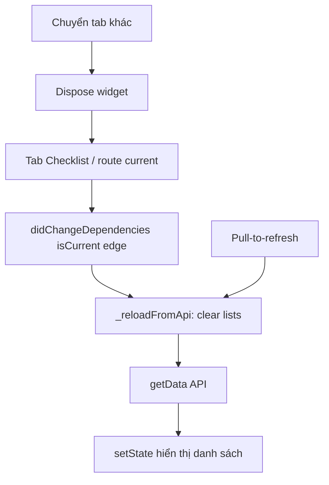

<!-- AUTO-GENERATED by Supa/scripts/sync_docs_to_mkdocs.sh — DO NOT EDIT.
     Edit Mobile_PROJECT/SupaMobileApp/docs/ then re-run the sync script. -->

# Checklist — Inspection (navbar tab)

| Mục | Giá trị |
|-----|---------|
| **Tên màn (UI)** | Checklist (`work.tabs.checklist` / tương đương) |
| **Class chính** | `InspectionChecklistPage` → `InspectionPageWidget(mode: checklistOnly)` |
| **Package / module** | `supa_work` — `packages/supa_work/lib/pages/inspection/` |
| **Route** | `resolveWorkPath('/inspection/checklist')` |
| **Tổng số dòng** | **814** (`inspection_page.dart`) + **288** (`widgets/inspection_checklist_tab_view.dart`) + **197** (`widgets/inspection_applied_filters.dart`) + **60** (`widgets/inspection_list_header.dart`) + **441** (`inspection_filter_page.dart`) + **309** (`work_filter_widgets.dart`) + **14** (`inspection_checklist_page.dart`) |
| **Cập nhật lần cuối** | **2026-07-02** — Sửa regression UI khi chuyển offline ở mode `checklistOnly`: bọc body checklist bằng `SafeArea(top: true)` để banner cached list không đè status bar. Trước đó cùng ngày: Sau refactor tách widget, nối lại đầy đủ header checklist (`InspectionListHeader`) + applied filter chips (`InspectionAppliedFilters`) vào checklist body; đồng thời `checklistOnly` không gắn `AppBar` để tránh khoảng trống top area. Trước đó: **2026-06-15** — Search checklist không còn dùng `inspections.last` của danh sách chính khi render kết quả, tránh crash nếu list chính rỗng nhưng API search trả dữ liệu. Trước đó: **2026-06-12** — `WorkHeaderProfileButton` mặc định mở `showProfileBottomSheet` khi tap avatar, nên header Checklist dùng được action profile. Trước đó: **2026-06-10** — Tách cả header checklist thành `WorkListHeader` trong `packages/supa_work/lib/widgets/filters/work_filter_widgets.dart` để các màn khác tái sử dụng nguyên layout title/subtitle/actions. Trước đó: Tách UI filter mới thành widget dùng lại (`WorkFilterRow`, `WorkFilterSheetFooter`, `WorkAppliedFilterChip`, `WorkHeaderActionButton`). Trước đó: Bottom sheet filter giao diện mới đã bổ sung đủ các filter cũ: Địa điểm, Người dùng, Trạng thái, Biểu mẫu, Ngày bắt đầu, Ngày hoàn thành, Đánh giá, Nhãn dán; sau khi áp dụng hiển thị chip các filter active dưới header. Trước đó: Đổi UI tab Checklist sang header lớn kiểu mock: title/count/view mode + nút filter/search/avatar. Trước đó: **2026-05-22** — Bỏ FAB ở mode `checklistOnly` & tab checklist của `tabbed` (SuSu bubble + `showSupaActionSheet` thay thế). FAB chỉ còn ở mode `formOnly` (biểu mẫu) như `QuestionnaireActions`, luôn hiển thị (bỏ điều kiện `countQuestionnaire != 0`). |

---

## Giới thiệu

Tab **Checklist** trên bottom navbar hiển thị danh sách inspection/checklist (chế độ `InspectionPageMode.checklistOnly`). User lọc, pull-to-refresh, mở chi tiết inspection.

**Vào màn từ:** tab navbar Checklist → `GoRouter.go(InspectionChecklistPage.location)`.

**Kiến trúc tab:** `ShellRoute` + `go()` → widget **dispose** khi chuyển tab → mỗi lần quay lại là instance mới; logic reload bổ sung khi **pop** từ màn con trong cùng tab (route lại `isCurrent`).

---

## Cây thư mục source (chính)

```text
packages/supa_work/lib/pages/inspection/
├── inspection_checklist_page.dart   (14) — wrapper route
├── inspection_page.dart             (814) — state, API, điều phối app bar + checklist widgets
├── inspection_filter/
│   └── inspection_filter_page.dart  (441) — bottom sheet filter giao diện mới
└── widgets/
    ├── inspection_checklist_tab_view.dart (288) — render danh sách checklist/grid
    ├── inspection_list_header.dart         (60) — header checklist (count + actions)
    └── inspection_applied_filters.dart     (197) — chip filter đang áp dụng + clear nhanh
packages/supa_work/lib/widgets/filters/
└── work_filter_widgets.dart         (309) — widget filter/header/chip dùng lại
```

---

## Route & điều hướng

| File | Nội dung |
|------|----------|
| `inspection_checklist_page.dart` | `static final location = resolveWorkPath('/inspection/checklist')` |
| `lib/config/main_tabs.dart` | Tab Checklist → `InspectionChecklistPage` |

---

## State & logic tải dữ liệu

| Thành phần | Mô tả |
|------------|--------|
| State | `inspections`, `inspectionsBySites`, `inpectionFilter`, `isRefreshLoading`, … trong `_InspectionPageWidgetState` |
| API | `getData(inpectionFilter)` — fetch checklist theo filter |
| **Reload khi vào màn** | `didChangeDependencies`: khi `ModalRoute.isCurrent` chuyển `false → true` → `_reloadFromApi()` |
| `_reloadFromApi()` | Xóa list trong state, reset `skip/take`, gọi `getData()` |
| Pull-to-refresh | `_getInit()` → alias `_reloadFromApi()` |
| Filter UI | `InspectionFilterPage` chỉ cập nhật `inpectionFilter` khi user bấm **Áp dụng**; active chips dưới header cho phép clear từng nhóm filter |

**Không có** singleton cache kiểu `DashboardDataCache`. Chỉ `StreamChannelCidCache` (chat) — không ảnh hưởng danh sách checklist.

**Lỗi API trong `getData`:** giữ data cũ trong cùng phiên nếu request fail (không ghi đè bằng `[]`).

---

## Luồng chính



---

## Ghi chú maintainer

- Đừng thêm cache cross-tab cho checklist; user yêu cầu **luôn gọi API** khi vào màn.
- Filter chính của tab Checklist expose 8 nhóm trong bottom sheet giao diện mới: `siteId`, `appUserId`, `inspectionStatusId`, `questionnaireId`, `startedAt`, `finishedAt`, `inspectionEvaluationTypeId`, `scheduleTagId`.
- Nếu sửa `getData` / filter, kiểm tra cả **dashboard** (`dashboard_checklist_section`, `home_inspection_today`) — section nhỏ trên Của tôi, không phải tab này.
- Search checklist render kết quả độc lập với `inspections` của list chính; không dùng `inspections.last` trong item builder search vì list chính có thể đang rỗng trong lúc search có dữ liệu.
- Sau đổi route hoặc mode `InspectionPageMode`, cập nhật doc và `docs/README.md`.
- **FAB**: `_buildFloatingActionButton()` trả `null` cho `checklistOnly` và tab 0 của `tabbed`. Mode `formOnly` (tab biểu mẫu) hiển thị `QuestionnaireActions` (action sheet: từ template / từ trống / AI). Đừng đặt lại `DashboardFloatingActions` ở đây — đã thay bằng SuSu bubble global.

---

## Liên kết

- Dashboard (section checklist): [`docs/cua-toi/README.md`](../cua-toi/)
- Quy ước doc: [`docs/HUONG-DAN-VIET-DOC.md`](../HUONG-DAN-VIET-DOC.md)
