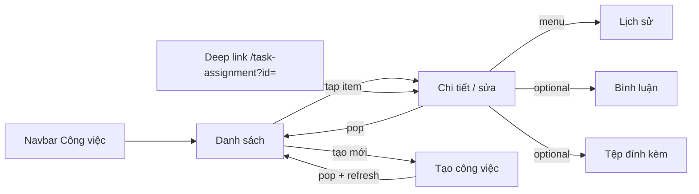

<!-- AUTO-GENERATED by Supa/scripts/sync_docs_to_mkdocs.sh — DO NOT EDIT.
     Edit Mobile_PROJECT/SupaMobileApp/docs/ then re-run the sync script. -->

# Công việc — tổng quan

| Mục | Giá trị |
|-----|---------|
| **Tên (UI)** | Nhóm tính năng Công việc (Task Assignment) |
| **Package** | `supa_work` → `packages/supa_work/lib/pages/task_assignment/` |
| **Entry tab** | Navbar → `TaskAssignmentPage` |
| **Cập nhật lần cuối** | **2026-07-28** — Gom toàn bộ doc vào `docs/cong-viec/` (1 tổng quan + mỗi màn 1 file). |

---

## Giới thiệu

Nhóm **Công việc** quản lý task assignment: danh sách trên navbar, tạo mới, chi tiết/sửa kèm chat GetStream, lịch sử, bình luận, tệp đính kèm.

**Vào nhóm từ:** tab navbar Công việc, deep link `/task-assignment`, notification, section task trên dashboard Của tôi.

File này là **tổng quan**. Chi tiết từng màn nằm trong cùng thư mục `docs/cong-viec/`.

---

## Cấu trúc thư mục doc

```text
docs/cong-viec/
├── README.md        ← tổng quan (file này)
├── danh-sach.md     ← TaskAssignmentPage
├── tao-moi.md       ← TaskAssignmentFormPage
├── chi-tiet.md      ← TaskAssignmentEditPage
├── lich-su.md       ← TaskAssignmentHistoryPage
├── binh-luan.md     ← TaskAssignmentCommentPage
└── tep-dinh-kem.md  ← TaskAssignmentAttachmentPage
```

---

## Bản đồ màn

| # | Màn | File | Class | Route |
|---|-----|------|-------|-------|
| 0 | **Tổng quan** | [`README.md`](./) | — | — |
| 1 | Danh sách (tab) | [`danh-sach.md`](./danh-sach.md) | `TaskAssignmentPage` | `/task-assignment/task-assignment-master` |
| 2 | Tạo mới | [`tao-moi.md`](./tao-moi.md) | `TaskAssignmentFormPage` | `/task-assignment/form` |
| 3 | Chi tiết / sửa + chat | [`chi-tiet.md`](./chi-tiet.md) | `TaskAssignmentEditPage` | `/task-assignment/edit` |
| 4 | Lịch sử | [`lich-su.md`](./lich-su.md) | `TaskAssignmentHistoryPage` | `/inspection/history` |
| 5 | Bình luận | [`binh-luan.md`](./binh-luan.md) | `TaskAssignmentCommentPage` | `/project/comment` |
| 6 | Tệp đính kèm | [`tep-dinh-kem.md`](./tep-dinh-kem.md) | `TaskAssignmentAttachmentPage` | `/work/file` |

**Deep link alias:** `resolveWorkPath('/task-assignment')` — có `id`/`taskAssignmentId` → edit; không có → danh sách.

**Sheet legacy** (không có file doc riêng): `showTaskAssignmentDetailPage` / `showHomeTaskAssignmentDetailPage` trong `task_assignment_detail_page.dart`.

---

## Điều hướng giữa các màn



| Từ → Đến | Cách |
|----------|------|
| Danh sách → Chi tiết | `push(TaskAssignmentEditPage.locationWithId(...))` |
| Danh sách → Tạo | `push` / `go` form |
| Tạo → Danh sách | pop + `TaskCreatedRefreshCoordinator` |
| Chi tiết → Lịch sử / Comment / File | menu hoặc push route tương ứng |
| Dashboard Của tôi | section task riêng — xem [`cua-toi`](../cua-toi/) |

---

## Cây source (nhóm)

```text
packages/supa_work/lib/pages/task_assignment/
├── task_assignment_page.dart            → danh-sach.md
├── task_assignment_form_page.dart       → tao-moi.md
├── task_assignment_edit_page.dart       → chi-tiet.md
├── task_assignment_history_page.dart    → lich-su.md
├── task_assignment_comment_page.dart    → binh-luan.md
├── task_assignment_attachment_page.dart → tep-dinh-kem.md
├── task_assignment_detail_page.dart     → sheet helpers (legacy)
├── service/
├── utils/
└── widgets/
    ├── list/ filter/ common/            → danh sách
    ├── form/                            → tạo
    ├── edit/ detail/ attachments/       → chi tiết / sửa
    └── tag/ answer/
```

Shared panel/chat (edit + checklist): `ChatWithOverlayPanel`, `EntityDetailCollapsiblePanel`, `DetailCollapsiblePanel`.

---

## Shared / quy tắc chung

| Chủ đề | Ghi chú | Doc chi tiết |
|--------|---------|--------------|
| Đổi status | API `singleListTaskChangeStatusActionType`, **không** dùng `canUpdate` cho nút status | [`chi-tiet.md`](./chi-tiet.md) |
| Địa điểm cây | `TaskAssignmentSiteSearchModal` + `filterListSite` | form + edit + filter list |
| Bằng chứng / link | Upload file + `createTaskAssignmentAttachedLink` (sau khi có ID) | [`tao-moi.md`](./tao-moi.md), [`chi-tiet.md`](./chi-tiet.md) |
| Chat overlay | Panel trượt sát ô chat | [`chi-tiet.md`](./chi-tiet.md) |
| 401 / 403 | Xử lý toàn app — không trong page | [`chi-tiet.md`](./chi-tiet.md) |

---

## Lưu ý maintainer

- Sửa một màn → cập nhật **đúng file trong `docs/cong-viec/`**; chỉ sửa `README.md` khi đổi bản đồ / điều hướng nhóm.
- Không nhét chi tiết form/edit vào tổng quan hay `danh-sach.md`.
- Dashboard task section ≠ state tab Công việc.

---

## Liên kết

- [`danh-sach.md`](./danh-sach.md)
- [`tao-moi.md`](./tao-moi.md)
- [`chi-tiet.md`](./chi-tiet.md)
- [`lich-su.md`](./lich-su.md)
- [`binh-luan.md`](./binh-luan.md)
- [`tep-dinh-kem.md`](./tep-dinh-kem.md)
- Dashboard: [`cua-toi`](../cua-toi/)
- Quy ước: [`HUONG-DAN-VIET-DOC.md`](../HUONG-DAN-VIET-DOC.md)
