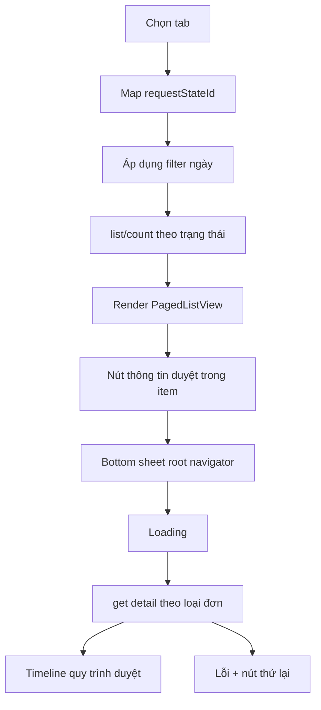

<!-- AUTO-GENERATED by Supa/scripts/sync_docs_to_mkdocs.sh — DO NOT EDIT.
     Edit Mobile_PROJECT/SupaMobileApp/docs/ then re-run the sync script. -->

# Đơn từ

| Mục | Giá trị |
|-----|---------|
| Tên màn (UI) | Đơn từ |
| Class chính | `AttendanceTicketsPage` |
| Module | `packages/supa_attendance` |
| Route | `/attendance/tickets` |
| Tổng số dòng | 4381 dòng (`attendance_tickets_page.dart`, `pages/tickets/widgets/*.dart`, 4 detail page, `widgets/attendance_app_user_avatar_group.dart`, `models/change_shift_request.dart`, `models/leave_day.dart`, `core/models/time_clock_resolve.dart`) |
| Cập nhật lần cuối | 2026-07-14 (hiển thị thông tin duyệt inline trong các trang detail) |

## Giới thiệu

Màn Đơn từ thuộc sub-app Chấm công, dùng để xem danh sách phiếu chờ duyệt, đã duyệt và từ chối. Người dùng vào màn này từ navbar Attendance, có thể tìm phiếu, lọc theo loại/ngày, mở chi tiết từng loại đơn và tạo đơn mới bằng floating action button.

## Cây thư mục source

```text
packages/supa_attendance/lib/pages/tickets/
├── attendance_tickets_page.dart
└── widgets/
    ├── attendance_ticket_item.dart
    ├── attendance_ticket_approval_flow_sheet.dart
    ├── attendance_ticket_filters_widget.dart
    ├── attendance_ticket_action_buttons.dart
    ├── attendance_details_info_card.dart
    ├── attendance_reactive_swap_shift_content_card.dart
    ├── attendance_date_time_picker.dart
    ├── attendance_validated_date_time_picker.dart
    └── attendance_time_field.dart
```

Model danh sách chính: `packages/supa_attendance/lib/models/change_shift_request.dart`.

## Route & điều hướng

Route được khai báo trong `packages/supa_attendance/lib/router/router.dart` qua `AttendanceTicketsPage.location`, tương ứng `/attendance/tickets`.

Khi bấm vào item, `AttendanceTicketItem` điều hướng theo `requestTypeId`:

- Tăng ca: `goToOverTime`.
- Đổi ca: `goToSwapShift`.
- Nghỉ phép: `goToLeave`.
- Đính chính: `goToResolve`.

FAB tạo mới mở các màn tạo đơn tăng ca, đổi ca, đính chính và nghỉ phép. Sau khi tạo thành công, màn chuyển về tab Chờ duyệt và refresh danh sách.

## Widget & component

| Widget / component | File | Vai trò |
|--------------------|------|---------|
| `AttendanceTicketsPage` | `attendance_tickets_page.dart` | Scaffold, tab, filter, paging và refresh |
| `AttendanceTicketItem` | `widgets/attendance_ticket_item.dart` | Card hiển thị thông tin phiếu và mở chi tiết |
| `AttendanceTicketApprovalFlowSheet` / `AttendanceTicketApprovalFlowCard` | `widgets/attendance_ticket_approval_flow_sheet.dart` | Bottom sheet ở list và card inline ở detail để hiển thị các bước duyệt, người đã duyệt, người có quyền duyệt |
| `AttendanceAppUserAvatarGroup` | `widgets/attendance_app_user_avatar_group.dart` | Avatar group dùng chung để hiển thị người có quyền duyệt; bấm để mở danh sách avatar, tên và email nếu có |
| `AttendanceTicketFiltersWidget` | `widgets/attendance_ticket_filters_widget.dart` | Lọc loại phiếu và khoảng ngày |
| `AttendancePendingCountCubit` | `cubits/attendance_pending_count` | Đếm số phiếu chờ duyệt cho badge tab/navbar |

## State & data

`AttendanceTicketsPage` kế thừa `InfiniteListState<ChangeShiftRequest, ChangeShiftRequestFilter, AttendanceTicketsPage>` để phân trang. Dữ liệu lấy qua `MobileClockRequestRepository`:

- Tab Chờ duyệt: `/rpc/clock/mobile/request/list-pending` và `/count-pending`.
- Tab Đã duyệt: `/list-approved` và `/count-approved`.
- Tab Từ chối: `/list-rejected` và `/count-rejected`.

`ChangeShiftRequest`, `TimeClockResolve` và `LeaveDay` nhận thêm các field duyệt nhiều bước để đọc dữ liệu từ cả list API và detail API:

- `subOwnerApprover`: người đã duyệt bước quản lý.
- `ownerApprover`: người đã duyệt bước người sở hữu.
- `pendingSubOwnerApprovers`: danh sách người có quyền duyệt bước quản lý.
- `pendingOwnerApprovers`: danh sách người có quyền duyệt bước người sở hữu.

## Logic chính

Tab hiện tại map sang `requestStateId` trong filter. Tab Chờ duyệt lọc ngày theo `createdAt`, còn Đã duyệt/Từ chối lọc theo `approvedAt`.

Ở cả 3 tab, mỗi `AttendanceTicketItem` hiện nút xem thông tin duyệt. Nút này mở bottom sheet bằng root navigator để overlay che cả navbar. Bottom sheet hiển thị loading trước, sau đó gọi detail API theo loại đơn để tránh phụ thuộc vào dữ liệu thiếu từ list API:

- Tăng ca: `/get-overtime`.
- Đổi ca: `/get-swap-shift`.
- Nghỉ phép: `/get-leave-day`.
- Đính chính: `/get-resolve`.

Trong các trang detail tăng ca, đổi ca, nghỉ phép và đính chính, thông tin duyệt hiển thị trực tiếp bằng `AttendanceTicketApprovalFlowCard` ngay sau cụm action approve/reject/cancel. Card tự ẩn nếu detail API không có dữ liệu duyệt.

Quy tắc số bước duyệt trong bottom sheet/card:

- Nếu cả `pendingSubOwnerApprovers` và `pendingOwnerApprovers` đều có dữ liệu, hiển thị 2 bước.
- Nếu một trong hai danh sách rỗng hoặc null, chỉ hiển thị bước còn dữ liệu.
- Nếu bước đã có `subOwnerApprover` hoặc `ownerApprover`, hiển thị người đã duyệt.
- Ở mọi bước, nếu có danh sách người có quyền duyệt thì vẫn hiển thị avatar group; bấm avatar group mở danh sách chi tiết gồm avatar, tên và email/username nếu model có dữ liệu.

## Luồng đặc biệt



Pull-to-refresh gọi lại `refresh()` của paging controller. Sau khi quay về từ chi tiết phiếu, item gọi `onRefresh` để cập nhật badge chờ duyệt và danh sách.

## Lưu ý khi sửa

- Không dùng `ScaffoldMessenger`; các feedback phải qua `toastification`.
- Text hiển thị phải dùng `translate('attendance...')` và sửa partial trong `assets/i18n/<lang>/attendance.json`, sau đó chạy `dart run supa_l10n_manager merge`.
- Không hard-code màu trong ticket UI; ưu tiên `Theme.of(context).colorScheme`.
- Khi đổi model `ChangeShiftRequest`, kiểm tra các endpoint list/detail có trả field tương ứng hay không.
- Chạy `dart format` cho file Dart đã sửa và `flutter analyze` trong `packages/supa_attendance`.

## Liên kết

- Quy ước tài liệu: [`docs/HUONG-DAN-VIET-DOC.md`](../HUONG-DAN-VIET-DOC.md)
- Router Attendance: `packages/supa_attendance/lib/router/router.dart`
